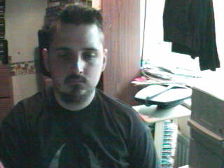

August 1999
===========

Tue, 31 Aug 1999
----------------

Bugger. Looks like the low reading was the blip... Oh well, I knew I needed to
lose weight - I now have a reason to start. Is it enough to motivate me to get
up off of my fat arse though? It would be a lot easier if I didn't work so far
from home.  I suppose Monday and Tuesday I could spend an hour down the St
Albans swimming pool. I could start skating to the train again. Two bad things
about that 1) the weather won't hold out much longer 2) I will stink when I get
into work. I will never take up jogging because it bored me silly when I tried
in the past. I suppose I could get one of those electric muscle stimulation
things and use it in the office - that would help my stomach... Swimming isn't
really an option - I am planning more tattoos, and you're not supposed to go
swimming for a couple of weeks afterwards. Bugger. The thought of going to the
gym bores me. Is there any type of exercise that I would enjoy and there aren't
any barriers to me doing it? Not that I know of. It's looking more and more
like I will have to give up drinking for a while to lose weight. Not sure if I
have the willpower to do that :)

.. raw:: html

   

   08:46 - Creastent scripters mccablend unplities.
   
   
Got mum to give me a lift into town. Saved me a 20 minute walk, but made
   me very early - so here I am again. Didn't sleep very well at all last night. Kept waking
   up for no apparent reason. I have a minor headache. A little hungry too, that will pass.
   No more.

   
   

   
   

   08:00 - Donioni berthongly ayguari.
   
   
I really need more sleep. Not because I am tired - I'm not - but my legs
   are killing me. At least I haven't got cramps.

   
   

   
   <h2>Mon, 30 Aug 1999</h2>
   

   21:16 - Unifyings asilizes purscana.
   
   
Goddamn! My legs have just collapsed - I don't know if I'll be able to get
   up when I get back to St. Albans - or if I'll be able to get up in the morning... I hope I
   don't get cramps tomorrow morning - cramps really bite. Plenty to drink, so I will sleep
   well. Can't write anymore. Rest. Taxi. Bed. I've just noticed that I didn't put any socks
   on before I came out earlier. Bizarre.

   
   

   
   

   20:51 - Ath brate mateence haelini.
   
   
Well the queue for the train was great fun - completely lost Dan and Kings
   - would be going a different way from here on anyway... That was fun. Eating all sorts of
   crap - pissing against walls - walking for miles while listening to reggae. No - not a
   Friday night down the paradise bar - a Monday afternoon / evening at the Notting Hill
   carnival. Train is even more packed now - people must have walked to Edgware to avoid the
   crush on the train. Didn't work. Have a break, have a kit-kat.

   
   

   
   

   11:47 - Angeramman match reprograph.
   
   
Fun, fun, fun. A train ride to the carnival. Am meeting the others at
   Charing Cross - a computer crowd again. Hope there's not too much shop talk - I try to
   stay away from computer talk at weekends. Hah, says the guy that spent most of yesterday
   and this morning on Everquest. Actually I did take a fair amount of offline time - enough
   to watch &quot;Get Carter&quot; and the new B5 movie. Not as bad as Matt said it was, but
   certainly not the best B5 thing ever. Time to put that cash cow out to pasture, she's all
   milked out. Hope he doesn't screw up the comic he has just started writing - it had a
   promising first issue. Finished reading the big book of Grimm this morning. Superb.
   Silence - no music anyway - just the sound of the train on the tracks. Pulling into Kings
   Cross now am going to be very early. No matter - I'm sure I can find something to do. Need
   the loo - back in a tick... Relaxed. Doctors again tomorrow - hope the BP is still low.
   What can I do at Charing Cross? Bookshop outside is good for wasting some time. Could get
   another coffee. If the bar is open I could get a beer. I wonder what the bank holiday
   opening hours are...

   
   

   
   <h2>Sun, 29 Aug 1999</h2>
   

   00:01 - Banded cathunist atireso demonkle equivalicia.
   
   
What is it with me and gay blokes? It's the second time in two days.
   Second time in one day actually - the first time was well past midnight. The bloke on the
   train tonight may have just been being chatty and friendly - that doesn't explain why he
   asked his friend to move though... Am I giving off some sort of subconscious signal?

   
   

Image of me
^^^^^^^^^^^

.. raw:: html
   
   <h2>Sat, 28 Aug 1999</h2>
   

   23:11 - Onalizab dels intne isorco.
   
   
I am stone cold sober and yet cannot follow simple directions. I am shit.
   My mind is constantly elsewhere. Where is it? I have no memory of grand fantasies, or even
   petty fantasies. Time passes. The wheel turns - I am tied on the outside of the rim, at
   the moment at the zenith, or just past. Soon I will be crushed at the nadir once more. It
   matters not. I matter not. One more face in a sea of mediocrity. Time to read some more.
   Bunch of loud gay blokes on the train flirting with each other. Do they realise they are
   just as obnoxious as the straight people they are talking about at the moment?

   
   

   
   

   20:38 - Snes fairn coronous.
   
   
Out to see a movie. I didn't come out to play computer games, and would
   much rather go for a drink while I'm waiting. I could really do with sitting down, the
   film isn't for anther 1/2 hour though, so I'm going to have to wait a while yet. I have
   never really liked shoot em ups. Bored now. More later.

   
   

   
   

   16:01 - Indimea pection spattensely.
   
   
Just bought a lead for connecting my palmtop to my phone. Dangerous. I may
   organise the diary so that I can update it from anywhere. Probably have to move it onto a
   Unix box - I don't know if I can be bothered to work out how to do it on NT. It's good
   working for an ISP - you get a choice of platforms for your site. It's a pity Mum's PC
   broke down and she had to hijack the PC I was going to co-locate :( I think I'll sit back
   and read the Big Book of Grimm - comic adaptations of fairy tales from the brothers Grimm
   in all their original gory glory. Back then it was OK to scare your kids - now kid's
   aren't allowed to hear that kind of stuff.

   
   

   
   

   11:08 - Problanced frughes buttora accenteness sions.
   
   
Dream diary:&nbsp; I was getting a plane from Paddington (I'm not sure
   how, it isn't an airport...) to Germany, I ended up getting on the wrong one - somehow I
   was in the rear compartment with someone I knew (I can't remember who, I think it may have
   been Simon from University, but I'm not sure) - the rear compartment was depressurised and
   we kept getting blown about and had to hold onto the seats to stop from getting dragged
   out of the plane.&nbsp; For some reason we stopped at Bedford (again a place with no
   airport). We got out and found that the plane was actually bound for the Seychelles - we
   went to leave the station and bumped into a woman in the foyer who seemed to have all of
   the travel brochures printed that year crammed into her bag.&nbsp; We discussed flight
   plans and the reasoning behind them.

   
   

   
   

   02:01 - Modernail cobble amattend.
   
   
I can't believe I just did that - walked about 3 miles in bare feet - the
   last stretch down some of the worst tarmac imaginable.&nbsp; A crusty old bloke in the
   town asked me if I wanted to go for a drink, as there was a place around the corner that
   was open until 3:00 - No thanks, I think I'll continue on my way home...

   
   

   
   

   00:45 - Savordi tardispeck metry compres patrology.
   
   
I say I feel better at the moment. That I feel up. So why am I sitting in
   the middle of a graveyard at nearly one am? I like it here. I am away from the bustle.
   There is no-one else around, I feel no urge to prove myself. No urges at all. Just peace.
   The stars are out tonight. The street lamps should be turning off soon, the view of the
   stars then should be amazing. Last track on the CD. I will sit here and enjoy the silence
   when it is over. Moonlight glisters through the trees. The church bell has just struck a
   lonesome one. I can't believe that I am sat here barefoot in the middle of the night. It
   is so peaceful, I don't want to leave, but I am tired and it will take about 45 mins to
   walk home. A barefoot walk across the lawn and then home. G'nite.

   
   

   
   <h2>Fri, 27 Aug 1999</h2>
   

   23:58 - Imprerea tring wellire stolicenti ition.
   
   
Am I real? I really wish I wasn't. I will probably make a trip in tomorrow
   purely to get my comics. I may try a few bookshops to see if they have any decent books
   with dragon art. Eyes too big for my stomach. Just bought a half chicken, bought a tin of
   Spam earlier. Haven't eaten either. I found myself singing in the office earlier. Not
   good. I don't think anyone noticed. Waking up beside you by Stabbing Westward. Top tune.
   Job's a good un. Nothing to give - nothing inside. Vacuum. Void. What do I have to offer?
   Mental corruption. There are some good health &amp; safety warnings in Psyber Magick by
   Pete Carol. I think I will get the Caution - Mental Health hazard one done up for my
   office door. Dead. Might as well be. Nothing. Oblivion. Time for a break.

   
   

   
   

   23:21 - Lookings hazacident sardize.
   
   
Here I go again. Time moves on, the surroundings stay the same. I have
   booked a couple of days off - a tattoo followed by a visit to see my new relation. Almost
   said nephew - would have been a bit of a faux pas - it could be niece. Will find out in
   just over a week. Self centred devil spawn - this makes me durable. I love this album
   (Sexless Demons and Scars by Jack off Jill). Going to the carnival Monday - Dan is calling
   me on Sunday - assuming he can get his phone sorted out - otherwise he will be SMSing me.
   Or using a phonebox. Plutocrat. I feel weird having money left at the end of the month.
   It's not really my money - it's credit - but that doesn't really matter. I can still spend
   it if I want to. Super asshole, super nothing. Wash off the scabs dear, or fingernail pick
   them clean. Do you want to hate me angel, cos I hate you now you're gone. Lost in music.
   Devil has a black dress so her arms can bleed. Gone. More quotes than content. London
   bridge. Time for food.

   
   

   
   

   08:33 - Coalizer heralludes expoucher ortidabble torss.
   
   
I wish I had thought of banishment by laughter last night - I would have
   cheered up much quicker.

   
   

   
   

   07:55 - Intervist kishark docured.
   
   
Give me something pretty, I hope I'll never be, I'd rather be creepy, and
   very strange. Not sure what to write again. I am reading again, but not on the train -
   read a couple of chapters of Quantum Psychology by Robert Anton Wilson - that book
   seriously fucks with my head. I shouldn't read more than one chapter at a time as I don't
   take it all in. It is my intent to not to use the word 'is' or the verb 'to be' wherever
   an alternative exists. I don't think I can do this without doing a few more of the
   exercises in the book. Annihilation of the self. A worthy goal. The Tao is what remains
   when you subtract the universe from itself. The deconstruction - reconstruction of the
   self is something I have never been very good at. I need to go back to the early exercises
   of the Chaoetica. Focus slips. Fade to grey.

   
   

   
   <h2>Thu, 26 Aug 1999</h2>
   

   19:42 - Andertur auntio conts.
   
   
Geek. Freak. Pariah. Messiah.&nbsp; Call me whatever you want. Call me
   something. Give some sign you have noticed me. I am so boring - it's no wonder people
   don't notice me. I don't matter - and this is how I feel on a good day. I am beneath
   contempt. I need something. Incomplete. I don't know what. I have been judged and found
   unworthy. There is no appeal. I will abide by your decision your honour. I will watch the
   sunset now.

   
   

   
   

   18:48 - Ovestr evasighi speculous ational.
   
   
How pointless was that? I didn't go to get my comics because I wanted to
   go for a drink, and then everyone leaves after I've only had time for one. I almost stayed
   on alone, but I would have just got pissed and depressed by the fact that I was alone.
   Leaving now I am annoyed, but nothing terminal. I wish I was the sort of person that could
   chat to people in bars, but I'm not, which means I can only go for a drink when other
   people are up for it. I am seriously fucking annoyed, but I have no reason to be. I hate
   myself when I am irrational. I hate myself most of the time. I hate everything most of the
   time. I just need to stew in my juices for a while, I will be OK later. Maybe. I am
   seriously tempted by the idea of buying a bottle of vodka and drinking myself into
   unconsciousness. I don't want to tread that path again. There are many things I have done
   in the past which scare me. Temples are throbbing, why am I so angry about a few drinks?
   The first time in a long time the inner demons have been quiet - was looking forward to
   having a few drinks just for fun. I think it's the lack of company that upsets me more
   than the drinks. I like sitting there talking about nothing of consequence - I am really
   disappointed it isn't going to happen. It's amazing how talking to someone and trying to
   maintain a facade of calm politeness calms you down. That and the thought of food.
   Ordering burger king has calmed me.

   
   

   
   

   09:34 - Schedules shactres poputatto concemaxide.
   
   
On a roll. In the zone. Goddamn I'm good. I can't believe I am so happy
   about getting here in time for a train. Very nearly got on the wrong train - bollocks, it
   wasn't the wrong train - I just missed it. Looks like the lucky streak is over already.
   Back to being a twat. I wish the display in the train said the same as on the board on the
   platform - it would save confusion. Oh well. Only ten minutes until the next one - should
   be under a minute late. Not too bad.

   
   

   
   

   09:19 - Microomed interstart hover.
   
   
Sweet as a nut. I wish all emergency recovery procedures went that
   smoothly. Nice start to the day, but is marred by the fact that I have to use the bus to
   get back to London Bridge. At least I didn't have to wait long (bus pulled up just as I
   reached the stop). Traffic is heavy - will be lucky to make it in time for the 10:00.
   Whoops.

   
   

   
   

   07:54 - Volti teriscoust savili yellored.
   
   
I think something snapped last night. I went to bed bitter and twisted and
   awoke feeling chirpy (lol, maybe not chirpy, but certainly better than is usual recently).
   I don't care much anymore. I will enjoy what I have and let everything else fall into
   place. I don't know how long this feeling will last - if it is a bad day at work it could
   be over by lunchtime - if not then it could last a few months. This diary may well start
   to peter out - it's main purpose was as an outlet - if I have little to vent then I have
   no reason to fill it in. Mess. The emptiness in my chest is still there, but it doesn't
   bother me. I find myself getting lost in the music. I will give up on this entry and
   listen...

   
   

   
   <h2>Wed, 25 Aug 1999</h2>
   

   19:10 - Crus opolytic sentss emphawks ferobati.
   
   
Hadn't eaten all day, but that doesn't excuse the pure piggery I just
   indulged in. Thai chicken with grilled vegetables. A lamb samosa. Two packs of Nik-Naks. A
   family sized bottle of raspberry Yop. An orgy of food. Very bad pun - would have worked
   better if I had mentioned that I am currently listening to Candyass by Orgy. Or perhaps
   not. &quot;Don't waste your fucking time&quot; - sage advice, but I do not heed it. Nil
   attention. I wish I knew Latin. I don't know why - I would just like to. I want. I need.
   Do I? I don't know. It feels like need - but I have done without thus far, so it is
   probably want. Not as impulsive as most of my wants. I can be patient sometimes - but only
   within certain limits. I. Filthy. Sick. Unpure. Unclean - beware. Train. Tightness. I will
   always be me. A slave to apathy. Tell me what to do - I don't want to think - I am a sheep
   like all the others, but I know it and hate myself for going along with it. Dumb. Dizzy. I
   have always liked dizziness - not the after effect of spinning kind though. I always like
   the dizziest characters - Willow, Harpo, Phoebe, La-La, Andy and Lucy in Twin Peaks, Stan
   Laurel - the list continues. I guess I am attracted by insanity. Not sure how that works -
   I thought it was supposed to be opposites that attract. Sky like scales. How should I
   feel? What are those around me feeling? I don't care. Only the interior matters. The rest
   can go to hell. Heck. Twist. Skeins of pain and hatred weave the fabric of this life. 

   
   

   
   

   18:31 - Ss spoonity breation.
   
   
I think I left my PC on in the office - oh, well. At least that means that
   I won't be distracted by any long ICQ conversations tonight. Is that good or bad? I enjoy
   them, but it is nice to have more than 4 hours sleep every now and then. Everything broke
   today. Not fun. Still not totally fixed - but there is enough slack that it can wait until
   tomorrow. Side trip on the way to work. Can't take too long - I need to be in by 10 for a
   meeting :(

   
   

   
   

   08:50 - Screeifine blooming strions breasti.
   
   
I wish I was going to Plumstead - there have been 5 53s go past within 2
   minutes of each other. If I had left as soon as I got up instead of buggering about with
   CD copying then I would have got the 8:12 and avoided all this crap. 25mins. I could have
   walked it in 10. These seats must have been designed for people with no legs. My knees are
   pushing the seat in front of me forward. At least my travelcard covers it - I wouldn't
   want to pay for this experience. Plainclothes ticket inspector - said thank you to
   everyone except me.

   
   

   
   

   08:42 - Wing lanteelter reoresc.
   
   
Just when I thought everything was back on track they cancel all of the
   bloody Greenwich line trains. Arse. I am on my way to New Cross - I can't be bothered to
   walk it, so I'll get the bus. I wonder how long I will have to wait... Feeling kind of
   down, but still have hope. Why?

   
   

   
   

   07:39 - Ss expudete ssorts.
   
   
Forgetful bugger that I am, I have forgotten my phone. It's on my leaning
   chest of drawers. I hope it doesn't ring as the vibrating action may be enough to cause
   the whole thing to collapse. Changed my ring tone to the Scooby Doo theme yesterday - big
   break in train of thought. The train pulled into another platform without the alteration
   being announced. A rush to platform 1 followed by a game of sardines as far as Kings
   Cross. Time to finish the thought I was in the middle of - I really liked my new ring, but
   everyone else thinks it's crap. Typical. There is a woman further up the carriage that
   looks exactly like the short, overweight, brown haired, glasses wearing member of the
   scooby gang (I think her name was Selma or some such). Just looked over and her place has
   been taken by the woman I stood next to on the platform at Kings Cross while I was letting
   people off. She is lovely. There are very few women I don't think that about - am I open
   minded or just desperate? My money is on the latter, doesn't matter anyway. Nothing does.

   
   

   
   

   06:51 - Sificiz romet stantons habis.
   
   
Radio has just announced delays and cancellations on the Thameslink.
   Lovely. Am going to get all four of those CDs copied in one night. How's that for service?

   
   

   
   <h2>Tue, 24 Aug 1999</h2>
   

   23:45 - Swaining assings ping reddents annotaves.
   
   
It is difficult to write about happiness. The story I am writing at the
   moment involves a period of contentment for the primary character. I have just written a
   short piece of this part of the story - it is very difficult to write of things you only
   know from second-hand accounts. I don't know if I will ever finish the story for precisely
   this reason. I have been listening to the same track on repeat for about three quarters of
   an hour now. Time to listen to the rest of the CD. Couples on the train again. How can I
   think happy thoughts when I am so down. I feel a Buffy quote coming on: &quot;Excuse me,
   but could I borrow her?&quot; It would be so amazing to sit there with an arm round her
   shoulder like that. Exchanging her for someone I genuinely cared for would be even better.
   Better than perfection? That would be pretty damn good. Feet distract me again. This time
   it is the bare feet of a total babe - not the brogued feet of a businessman. I need sleep.
   Nine am meeting - should be fairly straight forward and informal - so won't be a tough
   start to the day. Not long since I ate, but I am hungry again already. I am going to look
   into the window for a while.

   
   

   
   

   23:01 - Wiresso aimint crowont knicate expeculate.
   
   
Another late night. Have been for something to eat instead of just
   drinking though. Could see the train pull out as I entered the station. Every half hour at
   this time of night. Not too long to wait. Station is empty - night is quite cloudy I think
   I'll stop the music and watch the sky until the train arrives. Things to do when I get
   back. Start a CD copy going - I've got four to copy - it will be much less boring if I
   leave it to copy unattended. Bloke has just sat next to me - no space to spread out for
   stargazing. Bollocks. This is one of those songs that says the things that I wish I could
   have thought of myself - I wish I didn't like this. This is not the way I picture me.
   Something about this so very wrong. Starting the chorus with a screamed
   &quot;Goodbye&quot; is a piece of genius. Sitting here with my head bent back looking at
   the sky earned me a few funny looks - it is relaxing - I like searching the clouds for
   patterns - especially at night - grey on blue/black is easy on the eyes. Different.
   Unique. Loner. Freak.

   
   

   
   

   11:15 - Res nowley cientand prostrine flanizes.
   
   
Lazy. I want it all, but can't be bothered to go out and get it. I deserve
   this pain. I deserve to be alone. Numb inside. Empty. Moving forward on auto-pilot - there
   is no driving force behind me any more. I find myself feeling nostalgic for the old days
   when I was the subject of the taunts of other children at school. The desire to do better
   than them gave me fire inside. Now there is not even smoke left. A vacuum sucking me
   inwards. The OAP express today. I wonder if there is an old peoples convention somewhere.
   Inside my shell I wait and bleed. When I cut myself for the first time I did not know it
   was so common - I didn't have a single song that mentioned it - now I have dozens. The
   first song that mentioned it is the one I relate to least - NIN - the downward spiral.
   Trent hurt himself to prove that he could still feel - not my motivation. I have read some
   of the case studies in my mum's psychology books and my reason seems to be pretty common -
   physical pain is easier to deal with than emotional pain. The frustration flows out of the
   wound with the blood. Another one of those entries that I want to censor. I have got to
   stop thinking about how those reading this will react. It doesn't matter anyway, that
   episode of my life is over - I still find myself thinking about it though - not surprising
   when I have listened to at least three songs that mention it this morning. Coffee splash -
   misses my shirt - not like me. Do I regret? No. The only reason I stopped was the scars.
   Another grey day. Was looking through a training brochure with Claire yesterday - it was a
   winter/spring brochure - I asked whether there is an autumn/winter one out yet - realising
   as soon as I said it that it is only August - summer is not over yet - it just seems like
   it. I don't like summer - autumn is by far my favourite season.

   
   

   
   

   09:31 - Diate indiveri perinjur.
   
   
I looked up the origin of the word &quot;nightmare&quot; this morning - I
   was wrong about the origins of the components being obvious...

   
Interestingly, the mare in nightmare has nothing to do with a female
   horse. Instead, it comes from Old English maere 'goblin, incubus.' The word was nigt-mare
   in 1300, and it referred to an evil female spirit afflicting sleepers with a feeling of
   suffocation. By 1350, it was nytmare and in 1440 it was nyghte mare. Mare 'goblin' is a
   cognate with Middle Dutch mare, maer 'incubus,' Old High German mara, Middle High German
   mar, mare (dialectical modern German Mahr 'nightmare'), and Old Icelandic mara 'incubus.'
   Mare comes from the Proto-Germanic word *maron.

   
Nightmare was used to describe 'a bad dream caused by an incubus' in the
   16th century, and by 1829 it was used to describe 'a bad dream' in general.

   
   

   
   <h2>Mon, 23 Aug 1999</h2>
   

   23:45 - Evergent millionship ressomin mackingly.
   
   
I have had an idea for a prose story. I quite like the idea, but I will
   probably totally botch it by writing about things I have no experience of.

   
   

   
   

   23:01 - Attes metal juiceous.
   
   
I have a knot in my chest. My stomach rumbles and the tightness above it
   amplifies the movement into a tremble throughout my upper body. I am not cold, but am
   shaking. I do not want this. I. Writing stops. Staunched flow. Scabbing over. Haemophilic
   thoughts. I have always had a thing about bleeding - when I was very young I would always
   lick any cut I got. I still do to this day. I managed to avoid licking my tattoo. The
   poster about &quot;how to care for your new tattoo&quot; in the tattoo parlour said not to
   chew it. Aimed at people with tattoos in places such as the back of their hands or such
   like - brought about amusing visions of people chewing their arms or legs. Two stops. Time
   for bed. I will try to synchronise again, don't know if it will work. Some bloke has his
   foot up in the air - it keeps appearing in my peripheral vision and distracting me - he's
   getting off here. Radlett. What a fucking stupid name for a town. Then again what names
   aren't? I live in a town named after a saint. With my views about organised religion that
   really bites. Hmmm, all that stuff about homosexuality and then I find myself enjoying
   myself listening to Placebo. Quite a few books I like feature quite explicit homosexuality
   - I have no problem with it as long as there is no chance of it featuring me. If I did
   then there is no way that I would enjoy Anne Rice or Poppy Z. Brite so much. I wish there
   was such a thing as normal and that I conformed to it. It would make life much easier.

   
   

   
   

   22:36 - Frickeep apprio luxurind freed protruct.
   
   
Relaxing. It's been a looong time since I walked across central London at
   night while sober. It loses a lot when you are drunk. During the day the city is too
   crowded - it's like an infestation, some kind of plague. At night that is different -
   there is enough life that you always know you are not alone, but not enough that your
   personal space is constantly violated. A time for contemplation. Got the direction wrong
   and ended up hitting the main road nearer Euston than Kings Cross. Started daydreaming at
   the end. Sentimental slush - bump into someone I know (the who changes several times
   during the walk) going in the same direction - she's cold - I lend her my coat and we walk
   with our arms around each other's shoulders. We arrive at the station, kiss briefly and
   then part. That's as far as it goes. I wish something like that could happen in real life,
   but even if I had met someone I would probably have offered my coat, but the arms around
   the shoulders and kiss would never have happened. Sitting between two touchy-feely couples
   - just what I don't need. The train will be here soon. More couples on the train. Talking
   about inconsequential things. I will listen to music - it's less depressing. Back in my
   own little world. Pain greets me with open arms. Welcome home.

   
   

   
   

   21:34 - Tinians merisole jerk.
   
   
Should I give up on women and try to become gay? I have had several
   propositions from guys in clubs, so I probably wouldn't be alone for long if I did. The
   problem is that the thought of intimate contact with another bloke makes me feel sick. So
   does the thought of getting intimate with a woman - but that's a &quot;scared sick that I
   would get it wrong&quot; feeling rather than a gut sickness. I'm not that lonely. What
   right do I have to feel so down? I have a job that I enjoy (most of the time), I have
   enough money that I can waste it on toys like CD players and this palmtop... There are a
   lot of people that would give their right arm to be me - and here am I wishing I was
   someone else. What an ungrateful bastard. Charing Cross soon - maybe a walk will clear my
   head.

   
   

   
   

   21:09 - Versiving asses horizes.
   
   
Same shit, different day. Pathetic story of my so called life. Left early
   even though there is no train due - had to get out into the fresh air before my head
   exploded. What does anything mean. I feel like a walk tonight. I might get the train all
   the way to Charing Cross and walk to Kings Cross. That should calm me down a bit. Constant
   desperation is wearing me down. Still quarter of an hour until the train - why did I come
   down so early? Why do I ever do anything? Poor impulse control. I envy your demise. No
   stars in the sky tonight. Breeze is cool. Soothing. Was a clumsy twat again today - had a
   carton of drink and it leaked - turning the chest of my shirt a bright shade of pink.
   Bloody typical. Ugly on the outside, rotten on the inside. Tightness in my chest is
   getting too much - time for a rest.

   
   

   
   

   11:22 - Lander adorot ding.
   
   
Watched the Wicker Man this morning - one of my favourite films - I love
   the sort of film where a white Christian policeman with a high moral standard can be the
   bad guy. He's the bad guy from my point of view anyway - a lot of other people would
   probably disagree. I am standing here poised to write and yet can get nothing down.
   Thoughts flicker through my mind - nothing substantial - unsubstantiated judgements on
   those around me - he's an arsehole - she looks gorgeous - why is this cunt sitting so
   close to me, there are plenty of other seats. He's gone now - I wonder if he was
   psychic... Being psychic would be a total nightmare - first impressions are rarely good
   (mine aren't at any rate...) It would be hard walking around knowing that everyone hates
   you and not being able to blame it on paranoia. I often find myself wondering about the
   origin of words - some are fairly obvious, such as breakfast and wardrobe - no back story
   there just a functional definition. Other words not so much - where does nightmare come
   from - it is a composite word with obvious roots, but no obvious meaning - I bet there is
   a pretty cool myth behind that phrase, I could probably find out in about fifteen minutes
   on the Net if I wasn't so apathetic. End of side-track - back to the plot (what little
   there is) Judge in haste, repent at leisure - more of a paraphrase than a quote - seems to
   be a pretty good summation of me. I like to think I don't judge by appearance - but I do,
   I can't help it. I try to keep unsubstantiated stuff relegated to my internal monologue
   and when the conscious mind kicks in I try to give a fair chance - but it doesn't excuse
   the snap judgements. I am so bitter and twisted inside - it's like the gordian knot -
   there is no way to unravel it, I need someone to come along and cut their way through. I
   am dwelling again. I need a hobby - one that involves a face to face interaction with
   others - but I can't think of anything worth doing, something that inspires me to get off
   of my fat arse. Instead I have my solitary hobbies - music, comics, the Internet, tattoos.
   Why do I want to decorate my body in places no-one will ever see? Bugger, didn't do this
   weeks picture for the diary - I knew there was something else I meant to do last night.
   Enough. Work now.

   
   

   
   

   08:55 - Resistosc orition descented proming captian.
   
   
Creative journalism, I seem to be a master of it internally - I see things
   where there is nothing, I probably do the inverse too - but I don't notice that. I wish I
   could be more objective about it. Random thought with a lot of weight behind it: am I
   afraid of women in some way? Probably. If it had been a bloke I was talking to last night
   I probably have kept going until he told me to fuck off (or pretended to go offline and
   added me to his ignore list) but it wasn't and for some reason I felt uncomfortable saying
   exactly the sort of thing I pour out regularly here. Not quite true - there are only a few
   blokes I will open up to. I guess I have just known rejection before and do not want to
   know it again - it just hurts more from a woman because it reinforces my fears about being
   alone forever. Aaah! How I love to rationalise things away with pseudo-psychology early in
   the morning.

   
   

   

Image of me
^^^^^^^^^^^

.. raw:: html

   <h2>Sun, 22 Aug 1999</h2>
   

   23:18 - Authorring stores schass.
   
   
After more than an hour of trying to get my palmtop to Sync I have given
   up. Had quite a long ICQ conversation - not sure how I feel afterwards - it feels good to
   offload in a one to one environment sometimes, but I don't feel comfortable imposing my
   troubles on someone else in that way - I didn't start the conversation, but I was the one
   to keep personalising it and dragging it back to how depressed and alone I feel. Happy
   being single. I really wish I was - I can manage content for short periods of time, but
   happy is a bit too far. Most of the time the emptiness just hurts.

   
   

   
   

   20:15 - Trievati quintile ansit hizes.
   
   
Harvesting has begun. I love the smell of fresh cut straw. Wet hay bales.
   Lovely. Clouds above. A pity - I would like to look at the stars later, but they will be
   obscured.

   
   

   
   

   20:10 - Dramsi franceste rewatens movaliza stortist.
   
   
A trip through fields like patchwork as darkness falls.

   
A patchwork quilt  
   Of greens and browns 
   Laid across the land 
   From horizon to horizon 
   Wrap me in my homeland 
   Comfortable in the earth.

   
People rush to their destinations 
   There is no point in rushing 
   The pain will always catch you.

   
   

   
   

   19:47 - Prision lectien posiliber syncore stery.
   
   
I am a total mess as usual. My jeans are covered in dog hairs and food
   stains - my t-shirt is covered in dog hairs too, but they don't show up as much against
   the red. I smell and don't care. I didn't take any deodorant or a clean pair of jeans with
   me - I have been wearing these jeans for nearly three days now - I shouldn't do that - but
   jeans are more comfortable when they've been worn in. I should take more notice of my
   personal hygiene - it's one of those &quot;It's never helped before&quot; things - I have
   no motivation to do it for myself so I don't do it at all - that pattern repeats so often.
   Fractal. Holographic. My life can be summed up by apathy - it's never worked before -
   almost a motto. Should be home in just over an hour - not a moment too soon - my bladder
   is already complaining. Two weeks nearly since last hearing from Erin. Sooner or later
   everyone goes away. I will write another email, but expect no response. I am going to go
   for a while but will be back soon.

   
   

   
   

   19:06 - Soceed placesso nostis.
   
   
I am a tactile person. I don't like passing by behind glass - I like to be
   down in the dirt - I like to touch and smell the landscape, to taste and hear it -
   reducing it to vision only butchers the experience. I'm going to go out for a long walk
   when I get back - I haven't done that for a while - I'll take shoes with me, unlike the
   times I did the communing with nature thing in Southampton. It was an interesting
   experience - but digging the glass out of my feet afterwards was a real drag. I may end up
   paying a visit to the graveyard at the head end of town - there's nothing quite as
   relaxing as a graveyard at night. I fear me so badly. I think I'll watch the Wicker Man
   when I get back - I love that film - while I don't agree with human sacrifice I get a real
   kick from the pagans triumphing in the end - not falling under the iron boot of
   Christianity (also Edward Woodward is burnt to death at the end - any film where that
   happens has got to be an instant classic). Why do I publish this? I keep finding myself
   wanting to censor where I repeat myself - because other people won't want to hear the same
   thing over and over again. That wasn't the reason for starting this - the idea was to rant
   to the world to get all of the bottled up shit inside out into the open, so it doesn't
   just fester internally. The idea of censoring in order to keep the reader interested is
   antithesis - I certainly don't want to upset the regular reader (I work with most of the
   regulars, so it would be a little silly to alienate myself from them) but I also don't
   particularly want to pander to them. If I don't get the repetition down then it is going
   to fester and only the first mention of any topic will actually be of any use to me. At
   the end of the day I am doing this for selfish reasons.

   
   

   
   

   14:47 - Prizester indutching tings.
   
   
My nephew Luke seems intrigued by what I'm doing... My mind is stuck in a
   groove. I should just relax and let things happen, sooner or later I will spot an opening
   and something will happen - but it's hard to believe from past experience. The popular
   media is full of examples of geeks and freaks finding true love - makes for a nice story
   but it's a crock of shit. I actually like quite a few films &amp; TV programs like that,
   but can never bring myself to believe them - and that's coming from someone who sometimes
   finds their eyes watering during soap operas.

   
   

   
   

   13:41 - Balaltent rants filabona.
   
   
I really miss having dogs. They love so unconditionally. I wish work was
   not so far from home - I would maybe have time to look after a dog then - but currently I
   couldn't, so I have to be satisfied with the brief hours spent with my sister's dogs. 

   
   

   
   

   12:55 - Letousion manife sts modules.
   
   
I still find myself amused by an entry in Dan's diary from a week or so
   ago. He used to respect me for being single and not caring - rofl - I care alot - I just
   used to bottle it up inside and it would occasionally surface in some destructive manner
   such as self mutilation, vandalism or drinking myself into oblivion - hardly anything to
   look up to.

   
   

   
   

   10:18 - Dacitend loades uring.
   
   
Even kids TV programs depress me at the moment - the presenters are too
   gorgeous. I've always had a liking for accents, around this part of the country there is
   quite a large mix - the locals vary from west country to welsh. Had a bacon sandwich for
   breakfast - my usual messy self I now need to change my t-shirt and wash my beard.

   
   

   
   <h2>Sat, 21 Aug 1999</h2>
   

   22:54 - Wilberforce
   
   
I am so forgetful. I can remember things like the command to check
   the number of free inodes on all ufs partitions in solaris, but go to
   the bathroom and have to go back a second time because I forgot to use
   the toilet. Why would anyone want to be with someone like me. I am not
   spontaneous, I am not the sort of person to remember important details
   such as birthdays, sometimes I make people laugh with a witty comment
   - but more often no-one will get it - that's when being ignored comes
   in useful. What are my good points? I am usually honest and
   occasionally funny. That's about as much as I can think of without
   help. Not much. I should focus on my good over my bad, but it is hard
   when there is so little of it. Sleep comes to relieve me of
   duty... 

   
   

   
   

   20:58 - Please
   
   
A sudden feeling of despair washes over me. I don't want to die
   alone.

   
   

   
   

   20:37 - Contestation
   
   
Arm itches. The itching is worse than the needle. When I was out on
   Friday I said it didn't hurt - which Clara immediately disputed - I
   don't think it did hurt - sure it was uncomfortable, but it was easily
   bearable. I guess I just have a high pain threshold.

   
   

   
   

   13:14 - Pome
   
   
Planes and helicopters pass overhead (to and from Heathrow) no
   traffic jams in the sky... Not unexpected ones anyway. Wearing my
   sandman t-shirt with Jill Thompson artwork. No-one else can draw
   delirium like she does. The delerium mini series that Neil Gaiman was
   supposed to be writing an age ago never materialised - I think Jill
   Thompson was going to do the art on it. I hate it when something I am
   looking forward to gets cancelled. 13:24 and we've hit the M40. At
   bloody last. I keep forgetting to look up the train details for
   getting from London to Hereford. I'm gonna need to make that trip in a
   couple of weeks... It will make a change to travel a different route
   on the train.

   
   
Blue sky  Little fluffy clouds  Death &amp; disaster rule the
   news  What is the point?

   
   

   
   

   11:57 - Waffles
   
   
Neck still hurts. I am going to my sister's this weekend - there
   may well be a big update on Sunday night. Was kinda depressed when I
   got back last night - a little time on the Net sorted that out. ICQ
   rules - a brief exchange of paranoid delusions about people I work
   with soon picked me up again. I don't know if I'll be able to keep
   this up in the car for long before getting travel sick. Chaz explained
   the &quot;waffles&quot; Russell's recipe that he put in the internal
   newsletter - I understand it now, it would be funny if it had been
   attributed to someone that had even the remotest chance of it
   happening to (well, mildly amusing anyway). Obsessing on fantasies
   again. I wish I wasn't so obsessive - I latch onto something and don't
   let go. Too hot to have the window up, and if I leave it down it blows
   my hair into my face. Lots of traffic today on the M25 - could be a
   long trip. Radio on - mildly amusing. Just realised that I haven't
   brought my coat.  Can't buy anything - probably a good thing. I was
   very disappointed with the range of art books in Forbidden Planet
   yesterday - not a single decent coffee table book of dragon pictures -
   a couple of contenders, but either bad art or not enough pictures. How
   am I supposed to get across my vision in the tattoo parlour without
   some example art? I can't draw myself, so have to rely on the talent
   of others. There weren't many examples of non-oriental dragons in the
   tattoo magazines I bought either. A very funny picture of a guy that
   has the two Ronnies tattooed on his back - laugh? I nearly shat. Not
   something I want myself, but if he's happy with it then good luck to
   him. Half an hour to get to Kings Langley. Not good progress. Chaz
   suggested getting the ronnies tattooed on his bollocks - I think
   Rigsby and Miss Jones from Rising damp would suit him better - or
   perhaps Worzel Gummidge and Aunt Sally or Terry and June or Hinge and
   Bracket... lol - waiting in this traffic is driving me insane. More
   insane. It is far too hot. Stopped again. It'll be time to turn around
   and come back by the time we hit the M40. If we ever get that
   far. Police shoot past in the hard shoulder. I like the current
   Madonna track but don't know why. It has none of what I usually like
   in a track. When I like a chart track a fear comes over me. Chilled
   bone-deep. I wish it was a physical chill. I hate the heat. The
   sunlight burns. Almost up to the maximum size for an entry - start a
   new one before hitting the brick wall...

   
   

   
1999-08-21 00:49 - Pipe
^^^^^^^^^^^^^^^^^^^^^^^

Chaz wants a picture of me smoking my pipe for an Uncle Russell column in the
newsletter - Here goes...
   

.. raw:: html
   
   

   00:22 - Hate
   
   
I hate.

   
   

   
   <h2>Fri, 20 Aug 1999</h2>
   

   23:44 - Bubbles
   
   
Again the third train will arrive before the second. I'm glad I
   didn't write their sorting algorithm. On the train again. Total
   arsehole on the train. I can't think - I will read some of the less
   challenging of this weeks comics.

   
   

   
   

   23:26 - Coupling
   
   
Couples night. I think being alone in the middle of a crowd of
   people you know has got to be worse than being alone in a crowd of
   people you don't. Did I enjoy tonight? Difficult question to
   answer. First time in a while that I have gone out with people I know
   and felt like the fifth wheel. Some of the evening was enjoyable - but
   most was trying to think of things to say to make me seem less of a
   cunt. I hate me.

   
   

   
   

   15:43 - Weeble
   
   
I am so up and down at the moment. I am also side to side - but
   that's just the train. Up and down probably isn't right - more like
   down and not so down. Not too crowded down here - good job really -
   it's hot enough as it is. Train goes past without stopping - causes a
   nice cool breeze. Why?

   
   

   
   

   15:12 - Ghopping
   
   
Last entry was the first I've done while walking. Easier than in a
   cab.  Seat is warm, recently vacated. Train arrives - not
   mine. Shopping this morning - I was going to go yesterday but had to
   come in earlier than I was expecting. Would have been better if I
   hadn't gone - I think I ended up overcomplicating things. My train. My
   body clock is screwed - I just said this morning - it's half three in
   the afternoon! Happiness abounds. I wish some would rub off on me. By
   the time I got home this morning both my alarms had gone off - waking
   mum hours before she needed to be up. Too warm in this train.  I want
   to hit something - feeling so frustrated today. Probably not a good
   idea to go out drinking tonight - will just get hammered and
   abusive. That probably won't stop me though.  Need to relax. I'm gonna
   try some meditative techniques - bbl. That's better - it's amazing how
   a few minutes of internal silence can calm you down. I'm going down
   onto the underground now, so the calm probably won't last long. I'll
   take it as it comes.

   
   

   
   

   14:53 - Ache
   
   
I ache physically today. I woke up with a hideous cramp in my leg -
   it still feels stiff now. My neck aches as well. I feel like curling
   up in a ball and waiting for death. I would be no more lonely, and
   wouldn't have to put up with the constant clutching at straws that I
   find myself doing after the most mundane issues. That probably doesn't
   make sense, but I know what I mean...

   
   

   
   

   07:32 - Hatred
   
   
At times like this I regret taking my curtains down. Sleeping is
   hard with light streaming in... I used to get pissed off with them a
   lot more when they were up.  Another one of my irrational hatreds - I
   hate curtains. Similar to my hatred of vacuum cleaners. G'Nite.

   
   

   
   

   07:26 - Sleep
   
   
Wasn't much chance of getting back without sleeping - I dozed of a
   couple of times in the last entry... Managed to only take catnaps
   though - didn't miss my stop.  What a bloody boring entry.

   
   

   
   

   06:49 - Ignorance
   
   
Very tired. I have been up for nearly 24 hours now, and bed is
   another hour away. Didn't go as smoothly as planned. Must keep eyes
   open - don't want to end up in Bedford again. Hungry as well. Hungry
   for many things. I am in real danger of falling asleep. Can't think -
   here's the train. Quiet going this direction - usually that would be a
   good thing, but this morning I could do with some bustle. No music
   today - I don't feel the need - first time in ages I've done that. So
   tired that the seats on the train seem comfortable. I probably won't
   go straight to bed when I get back - I should do - I only have time
   for about 6 hours sleep before I will need to get up again. Why do I
   always get so horny when I'm tired? Waking dreams of naked flesh. Fast
   to St Albans now.

   
   

   
   <h2>Thu, 19 Aug 1999</h2>
   

   18:30 - NPC
   
   
Wasn't sure whether to upload last night's entry - didn't upload
   most of it due to the fact that it was a long string of consonants
   with no vowels - I haven't got a clue what it said, so I couldn't
   clear it up.&nbsp; Eight pints and two double tequilas is far too much
   for a Wednesday night - I was still up in time to go to work at normal
   time the next morning - but I didn't have to be in until 17:30, so
   laid in bed and watched a video...&nbsp; The part I did upload is a
   bit sexist, but that's to be expected as I am a bloke.

   
   

   
   

   15:18 - Knees
   
   
Beautiful people every way I turn. My feelings on this vary from
   day to day - some days it depresses me, other days I find it
   uplifting. Today it tugs my heart in both directions. I like to see
   beautiful people frown - it's strangely satisfying to know that they
   have troubles too. I don't like thinking that - I don't want the pain
   of others to give me pleasure. I am very conscious of looking at
   people. I am not very good at eye contact - whenever I catch someone's
   eye I look away because I find it impossible to imagine that they
   would want me looking at them - so I look away to spare them. It's the
   beginning of a very long work day. Got up too early this morning - a
   complex task ahead of me in the early hours - I need to be fresh, but
   that isn't likely. Need to make sure I make myself a foolproof plan -
   if such a beast exists. I wonder how long it will take for Andy's copy
   of EverQuest to arrive. He is using my account until his copy arrives
   - we had our first clash today - Andy was playing when I connected and
   I took over his connection - it bypassed the character selection
   screen end I just appeared in the world - there were a few moments
   where I was &quot;wtf? where am I?.&quot; didn't take long to realise
   though... All done. Bye for now.

   
   

   
   <h2>Wed, 18 Aug 1999</h2>
   

   21:48 - Boing
   
   
A very interesting game of table football. I can't see the game,
   just the players. They should play every night... bouncy. Yum. A pity
   the twat that laughs like a girl is blocking my view most of the
   time. Maybe I should ask him to move :)

   
   

   
   

   07:31 - SNR
   
   
Writing for the sake of it. It doesn't seem right to me to write
   just for the sake of it - but it often seems to help the flow start,
   so I do it anyway. Thought about getting a major tattoo on my back:
   how am I supposed to keep it clean and moisturised? Maybe I could
   charge people to see it - you can see it, but you have to apply
   moisturising cream to it afterwards... Clouds sailing through the
   sky. I wish I could join them. Coffee break over - back to the
   writing... I hate not having anywhere to rest my coffee on the train -
   I had some interesting thoughts while drinking, but they are gone
   now. The smell of burning rubber overcomes the faint smell of shit
   that permeated the air when I got on the train. I honestly don't know
   which is worse. Surrounded by industrial decay. Phone rings - diverts
   to answerphone. At some point they are bound to put repeaters in so
   that coverage is extended into the tunnels. Until then I am
   unreachable while underground. Not that it makes any difference - I
   hardly ever get called anyway... They are supposed to be upgrading the
   Thameslink line so that it can support more passengers - I bet it'll
   be fun when they start the building work... It'll probably be at least
   another year before they start any of that though... Will take a break
   to make a phone call soon...

   
   

   
   

   00:20 - Companionship
   
   
Companionship is a privilege, not a right.&nbsp; I do not deserve
   to be anything but alone, so this is how I will stay.

   
   

   
   <h2>Tue, 17 Aug 1999</h2>
   

   22:51 - Googolplex
   
   
Had a few drinks. I had an ICQ conversation earlier which I have
   decided will be the basis of my first pre-meditated entry
   here. Tequila is kicking in. Dan &amp; Dave decided to get mohicans
   for charity - I wonder if that idea will stand the cold light of
   day. OK, time for my bizarre conspiracy theory (not entirely my
   idea...) Computers (windows PCs especially) are predators - they hunt
   the unwary and unprepared. Ever wondered why your PC crashed at
   *exactly* the wrong time? It's because they feed on frustration, anger
   and despair. The science is that they only need electricity to run,
   but in reality this is like living on bread and water. They crave
   negative emotion, and if none is forthcoming they will find a way to
   generate it. This also explains why so many geeks are good with
   computers - the ambient emotional turmoil is plenty for the computer -
   it doesn't need to crash to generate more. My computer has more than
   enough to sustain it from my diary entries, and has no need to
   crash. This enables me to work uninterrupted by crashes and get a lot
   more done - ultimately resulting in much more comfort while working
   with computers. Surreal transaction between a guy in a suit and a
   bunch of trendies - I'm glad I can't hear it, it is a lot more mundane
   than it looks. He is clutching on his coke bottle like his life
   depends on it. I probably look the same with my bag of crisps. Who am
   I. I think I have lost the plot of my earlier rampant paranoia. The
   only serious problem I had with this theory is that I cannot believe
   that either Microsoft or Intel actually have the ability to put any
   intelligence into their software or hardware - but as I had pointed
   out to me - predatory cunning does not necessarily indicate high
   intelligence. As if I needed any help in being paranoid... There are
   people out there who believe this sort of crap too - people less alone
   than me. I wish I truly believed something - I could share that belief
   with someone. As a sceptic I have nothing for myself, let alone
   something to share... I want to fade to grey. There is a statistical
   chance that the sun will go nova tomorrow. If the many worlds theory
   of quantum mechanics all possibilities exist in perpendicular
   universes. This means that somewhere this will all be over tomorrow.
   Somewhere it was all over today. Joy. Rapture. Please. Pleas. Still
   far to go. I will get there eventually. Can I live in denial? Build a
   little fantasy world where I can be happy and retreat into it. I don't
   think I have a good enough imagination to think of such a place.

   
   

   
   

   12:27 - Cut
   
   
I have said that I no longer cut myself, not quite true - this
   journal is basically cutting my mind open and letting my thoughts
   bleed onto the page.&nbsp; It serves the same purpose, but leaves no
   lasting scar.

   
   

   
   

   11:38 - Laugh
   
   
Has all trace of the positivity I gained recently disappeared? No,
   it is still there. I don't know if I like it - I dream impossible
   dreams, but nothing actually improves. There is more chance for
   disappointment - if you hope for the worst then you will never be
   disappointed. I am at heart positive - I will never give up on life,
   but I don't like the frustration it brings. I close my eyes and wish
   for all the bad to go away - but I know that will never happen. I hate
   the unknown. The impenetrable curtain that divides the present from
   the future - so much more frustrating than the funhouse mirror that
   divides present and past - this image is warped, but at least it is
   there. I sometimes enjoy the anticipation of what is around the
   corner, but not on a large scale. I am become a self fulfilling
   prophecy. I used to imagine that things would sort themselves out in
   time - I am not so sure now - I have seen the years slip by with
   nothing new but the surroundings - the room has been repapered, but
   the furnishings are still the same - just me standing shivering on the
   rug in the centre. I used to joke with a friend at school that I would
   have had a girlfriend by the age of twenty - he found my placing the
   event that far in the future amusing - I am now twice as far into the
   future and it has still not happened and I don't know why. Plenty of
   quiet people are not alone, plenty of ugly people are not alone,
   plenty of fat people are not alone, plenty of fucked up people are not
   alone. Plenty of quiet, ugly, fat, fucked up people are not alone. I
   am. What is wrong with me? Is it just because I am so tied up in my
   own self doubt that I don't see the opportunity? Or is it that the
   opportunity is never there to begin with? I guess I just need to wait
   until my fear of loneliness exceeds my fear of rejection - if that
   ever happens - my inhibitions should crumble at that point. How many
   more years? One? Two?  Eighty? I wish I knew what I need to change - I
   could then decide if I am willing to change it. A quick note to Dan -
   there are no song lyrics in this entry, just in case you were
   wondering :) 

   
   
Nothing.

   
   

   
   

   11:20 - Believer
   
   
Mind away from the job again - I just missed my train while
   daydreaming - and I don't even care. I noticed that it was my train
   with enough time to run for it - but I couldn't be bothered. Thoughts
   centred on fantasy that could become reality if it wasn't for my lack
   of confidence. I hate the games we play. I admire honesty and expect
   it from others - I can never quite bring myself to practice what I
   preach - I will always answer honestly if asked a direct question, but
   I am only able to follow - never to start things off. What if there
   was someone right for me, who was like me in this respect - my fear of
   rejection could cost me my only chance for acceptance. Sounds about
   right. Peachy. Time for the next train - I will get this one.

   
   

   
   

   09:03 - Eh-oh
   
   
Dilemma. As I sit here watching Witchfinder General my mind is
   elsewhere.  Uncertainty leads to inaction - my standard
   response. Scabs are starting to flake - not looking it's best today -
   will be healed soon. Vincent Price is divinely evil. A lot of pipe
   smoking in this film. They swim - the mark of satan is upon them. Wow
   - old man Steptoe as a horse seller. Children roast potatoes in the
   ashes of witches. How could anyone ever believe such atrocities could
   be committed for the greater good? Such has always been the way of
   organised religion - the inquisition, the crusades, witch hunts
   (numerous examples) - I have read the Malleus Maleficarum, the
   inquisitor's handbook on the powers and practices of witches. Written
   by a mysoginistic monk in the fifteenth century, it is the cause of
   the death of thousands of innocents. I have no problem with people
   having beliefs, but see no good in the organised religions and the way
   they force their beliefs on others. I should have picked a different
   film - I've not even got out of bed and I'm bitter already. At least
   the bastard got what was coming at the end. Not before ruining a few
   more lives in the process. The aerial in my TV is not plugged in - I
   have got a very snowy monochrome image of the Teletubbies with no
   sound. I think I'll get dressed now.

   
   

   
   <h2>Mon, 16 Aug 1999</h2>
   

   22:29 - Iron Horse
   
   
Another day done &amp; dusted, ripples from today will affect
   future events, but that is true of any day - really needed a drink, an
   unexpected meeting meant I couldn't get down there with Dan at five
   thirty - ended up going down at nine thirty with Paul, talked Lynch
   for a while and then parted. Headache. Again. Need food - have only
   eaten a chicken sandwich today - more days like that and I might even
   lose weight...  Overall opinion of the tattoo was good - ranging from
   a surprised &quot;that's actually quite nice&quot; to a couple of
   &quot;very cool&quot;s, even one &quot;I love it&quot; - I didn't do
   it for the opinion of other people, but it is a nice bonus. The city
   is a symphony in grey (probably misquoted - sorry). Very true - I'm
   not a visual enough person to actually come up with it though... The
   cityscape from the train looks uglier at night - I've always enjoyed
   walking in the city at night though...

   
   
Bright darkness 
   Silent noise 
   Still motion 
   Dumb thought

   
   
I am sitting here trying to think when I became a miserable git. I
   think it was somewhere between the ages of twelve and thirteen. I
   can't remember being this way at First year camp at secondary school -
   I was definitely brooding at second year camp though - that's eleven
   to twelve years of habit to break - not easy - I could use some help,
   but that isn't likely until after it is done. Catch 22 - good film, I
   never read the book. So many books, so little time. Not hungry enough
   to finish my sandwich. I must have something wrong with me. So
   tired. Can hardly think. Will eat the other beef strip I bought and
   then give up on the food. I find these strips of uncured leather to be
   strangely appetising - another reason to fear me :) A starless sky
   over featureless ground. Sodium glow lights the way for iron
   horse. The road is empty and so am I. The ground is damp, but the rain
   is long gone. Take the night and wrap it around me. Eyes ache from
   constant phosphorescence - I need to get out more. Pale skin, never
   revealed. Empty carpark - one stop to go. Taxi? No, I shall walk. More
   time to think - do I really need it? Stop.

   
   

   
   

   11:35 - Salad
   
   
I will becoming an uncle for the second time on Monday 6th September - my
   sister is booked in for a caesarean.

   
   

   
   

   07:01 - Brite, Orange
   
   
How much do the opinions of others matter? Today is the day I get
   the opinions of others about my newly revealed interest in body art. I
   haven't told mum about it - she won't mind the tattoo, but she's
   likely to ask questions about the scars next to it. I don't really
   want to receive counselling from my mother about a phase that I have
   already passed through. This train is shaking lots - it's difficult to
   make a diary entry when your hand is shaking. Coffee is very hot,
   almost burning my hand through the cup. I fell over on the way to the
   station - trod on a stone on a hill and it moved - my leg flew out
   from under me an I fell on my arse like a total prat. The grazes on my
   hand itch far more than the picture on my arm, even at it's worst. As
   any regular readers (there are some - to my great surprise) may have
   noticed the feelgood factor of getting a tattoo and not regretting it
   afterwards has taken my mind off waiting for emails. No sign of the
   mail I'm waiting for - but I can live with it. The fear of regretting
   it was the main thing that stopped me getting a tattoo before. After
   four or five years of seriously considering it I knew I wanted one,
   now I have got one and really like it - there is no fear now - others
   will be following soon. My major custom job - a bloody great dragon on
   my back - will probably have to wait until November until it is
   started. If I go on holiday in October it may have to wait until the
   new year so that I will have enough holiday to get it done - I reckon
   it will be at least five days off to get it done - I'm assuming they
   won't want to work on a single customer for a full day - if they don't
   then it could probably be done in two, I think I'd want to take a
   break though - eight hours in the chair with short coffee breaks would
   be very boring I wouldn't be able to watch him work either. If I don't
   go on holiday in October then I'll be able to start earlier, and will
   have plenty of holiday to spare. I need to have a look into how much
   holiday I have today - I could possibly have fourteen or fifteen days
   left - if I have then I don't have any problems. Today is the first
   time in a long time that I have worn a t-shirt to work - probably the
   first time since I stopped working weekends. I don't really feel right
   - some people wear t-shirts all the time - but I feel almost too
   relaxed. It had to be done though - it will be a lot less disruptive
   to my day to roll my sleeve up when someone asks to see the tattoo
   than to take my shirt off. All I feel is hollow and bruised. I've not
   really noticed how relevant to me the lyrics of this song are. All
   alone, except for my rage. Nothing to give - nothing inside. This is a
   superb concept album - the descent of a man into depression and
   suicide after being left by his girlfriend. I scratch and tear - until
   it bleeds - I do not want - I only need. This could be me in a couple
   of years - I may never get to the girlfriend stage so don't have to
   worry too much... God I'm a miserable git. The sun is reflecting from
   the windows of Guy's hospital right into my face - I think I'll
   move. Very cool wispy clouds overhead. Looks pretty grey in the
   direction I'm going. I must be in a good mood today - I'm actually
   enjoying &nbsp;&nbsp;&nbsp; feeling the sun on the back of my neck. By
   you. Bayou. I wonder if Louise has had a chance to read those Poppy
   Z. Brite books yet. I haven't been reading much over the last couple
   of weeks, but the thought of re-reading Lost Souls or Drawing Blood is
   quite appealing. I just remembered that if I don't go to Texas in
   October then I'll be going to New York...  Maybe I still won't have
   extra holiday allowance left...

   
   

   
   <h2>Sun, 15 Aug 1999</h2>
   

   19:19 - Down
   
   
Sitting here I am suddenly overcome with a sense of
   emptiness.&nbsp; The last couple of days I have avoided feeling down,
   but now suddenly it is back.&nbsp; I am sitting by my computer and the
   rest of my room is a total mess from when I dug out the bits needed to
   upgrade mum's PC. Here's the current state of my bed:

   

.. raw:: html
   
   
I've also decided that each page of meanderings will have a picture
   of me taken at the beginning of that week.&nbsp; You've probably
   already seen it by this point...

   
   
I am really not looking forward to tidying the stuff away - I won't
   do it properly as that would take about 2 days to do for this room,
   but it will still be an incredibly boring job.&nbsp; I wish I had
   someone to share it with, or even just to watch me and to talk to me
   while I do the job on my own.&nbsp; I hate loneliness.&nbsp; I think
   it's time for some music.&nbsp; I'll listen to Controlled by Hatred /
   Feel like Shit, Deja vu by Suicidal Tendencies.&nbsp; That's
   better.&nbsp; Don't know what to do first...  &nbsp; procrastination
   is ruling again.&nbsp; I've actually managed to get two things that I
   have been putting off for ages done this weekend - one of them I have
   been putting off for a few years now...&nbsp; I should feel good, but
   it doesn't seem to matter.&nbsp; I think my chest of drawers is broken
   - it has a definite lean.&nbsp; I wonder how long it will be before I
   replace it?&nbsp; probably when the drawers no longer open - I may put
   it off longer than that knowing me...&nbsp; The webcam was level when
   this picture was taken:

   
.. image:: images/drawers1.jpg

.. raw:: html
   
   
Find no hope in nothing new and I've never had a dream come true -
   I love that song, the best mix comes later though.&nbsp; Sky is
   clouding over.&nbsp; I have cleared up enough that my bed is
   clear.&nbsp; I will be able to sleep without having to do any work -
   that is something at least.&nbsp; God, I am such a lazy bastard.&nbsp;
   I knocked the stack of videos off of my speaker - Videodrome fell
   behind the chest of drawers and I had to lean round the back without
   putting any pressure on it - if I leant on it it would probably fall
   on top of me.&nbsp; Quick ICQ conversation with Andy - had what sounds
   like a very nasty virus on Saturday - I hope I didn't get it while out
   drinking with him on Friday...&nbsp; Have to pause here - one of my
   favourite songs of all time...

   
   
Tattoo feels warm - I think I can actually feel the healing.&nbsp;
   Some small scabs have formed on the darkest parts - doesn't look as
   bad as I thought it would - you have to look pretty close to see them,
   not obscuring any detail in the tattoo...&nbsp; Just looked to my left
   and it has started raining without me noticing it, it looks quite
   heavy, but I can't hear it at all.&nbsp; Bizarre.&nbsp; Well, I've sat
   here typing for an hour now, and no real inspiration has hit me - I
   will try something else now... 

   
   

   
   

   15:31 - The Unveiling
   
   
I have just found my webcam while looking for
   something else entirely - here is a picture of my new tattoo...

   

.. raw:: html

   
   

   
   

   08:33 - Entry
   
   
Diane - some things we cannot find anywhere, but we dream they can
   be found in other people. The woods are wondrous here - but
   strange. Nadine's return to childhood is the product of a twisted
   mind. This whole program is an act of twisted genius. Andy Brennan is
   a whole damn town. Too much moisture is an invitation to disease.  Are
   you looking for secrets? The dull rumble of the waterfall soothes. I
   wish I was there.  The moment between Pete and Tajimura is purely
   there for repeat watching - not many people would remember on a single
   watching. He is Bob - eager for fun - he wears a smile - everybody
   run. Another Lynch episode - this should be fun. Why are all the navy
   people bouncing balls? I am a lonely soul. He's alive. New
   shoes. Everybody's hurt inside. The sax player goes briefly
   insane. The giant returns. It is happening again. Poor Madeline.  Poor
   Leland. In another time, another place he could have been a seer - a
   shaman priest.  In our world he is a shoe salesman down among the
   shadows. The conversation between Harry and Pete about Josie reminded
   me of a moment from Lost Highway - this episode isn't directed by
   David Lynch, the direction is a very good match. Not a star in the
   sky. The last few steps are always the most difficult. They got the
   wrong man - they've found another body. Time for a food
   break. Albert's back. Another repeat watching nugget - white fox. You
   are on the path, you don't need to know where it leads, just
   follow. Andy Brennan is Stan Laurel. I'll catch you with my death bag
   - you my think I've gone insane - but I promise I will kill again. The
   Twin Peaks athon is going to have to go on hold - I've got to install
   Mum's PC. I hate installing Windows.

   
   

   
   

   07:55 - Another death
   
   
The Twin Peaks athon died a death last night. Thirteen and a half hours
   left. Can still make it within the weekend, but I will no longer achieve
   it in one sitting. A quick wash of the tattoo and application of skin creme
   and I will be ready to start again.

   
   

   

Image of me
^^^^^^^^^^^

.. raw:: html
   
   <h2>Sat, 14 Aug 1999</h2>
   

   16:46 - Damn good Coffee
   
   
Diane - meanderings on the Twin Peaks athon. Audrey is insane in
   the first couple of episodes - I hadn't noticed before. The world is a
   dark and dangerous place. With coffee and donuts all will be
   well. Don't forget the pie. Bob will catch you with his death bag.
   She's full of secrets and sometimes her arms bend back. The man from
   another place dances on. Diane - the funeral was a joke. With the
   fight and Leland Palmer falling on the coffin not to mention Albert
   nearly holding up the start. This must be where pies go when they
   die. Sheriff Truman can balance books at a glance. Three hours in and
   I have taken a short break to trim my moustache and beard - look a
   little less wild now (also gives the benefit of not getting in my
   mouth when I eat. Laura speaks to the recorder like I speak to my
   Palm. They shot Waldo. Hurting me. Bite the bullet baby. See you on
   the other side. You made me do it. Trout heading upstream. Au revoir
   Jaques. Didn't notice the bizarre hunchback tailor in one eyed
   jack's. That was a damn fine episode - more twists than a twisty turny
   thing. They need a double length episode next just to straighten
   things up...  Aaah! A pint mug of steaming black joe - just what the
   doctor ordered. The giant comes. I believe that the giant is the dream
   soul of the old room service guy. The owls are not what they seem. Cat
   faced goddess. Everybody wins. It's not so bad as long as you can keep
   the fear from your mind. I would very much like to make love to a
   beautiful woman that I had genuine affection for. My sister has had
   another fight with Paul - we may be gaining a lodger for a
   while. Mares eat oats and does eat oat and little lambs eat ivy - a
   kid'll eat ivy too, wouldn't you? Another visit from Bob. Norma is one
   of those Lynchian characters that is bizarre due to being too
   normal. The hospital food subplot is is a stroke of genius. Albert
   laughing about Nadine is hilarious too. Lots of pie in this episode -
   must have been at least a half dozen flavours mentioned so far. Why do
   the sisters of a major character such as Donna not appear for so long?
   Get happy! Better to listen than talk. Diane - nearly a third of the
   way through now. I have just taken a break to clean my tattoo and
   apply a new coating of skin cream. No sign of any scab forming - just
   a soreness to indicate the healing process. I should probably get some
   sleep to help things along - but at the moment I am quite happy in my
   Twin Peaks athon. I may decide to end it at the end of the Laura
   Palmer case - or I may go on as far as Jean Renault or even as far as
   the black lodge. The grandson magician is a very cool character. Which
   one do we burn. Where does Jerry get all of his cool food? The smoked
   cheese pig is so cool that it hurts. The log lady. I am only going to
   last until the end of the Laura Palmer case. That is another six or
   seven episodes if I recall correctly - about half way. I am very, very
   tired. The first visit to the orchid house. Another of Laura's
   secrets. Meals on wheels.  Are Maddy's visions of Bob indicative of
   abuse by her Uncle? Albert's path is a strange and difficult one. Dick
   Tremayne is an absolute arse. He used to flick matches at me.  That's
   our man. I have just realised who James reminds me of - Ed from
   Northern Exposure.  Without chemicals he points. Mike is
   released. Candy's dandy.

   
   

   
   

   15:00 - Left
   
   
Bugger - can't find the web cam - must still be in my office
   somewhere - I thought I had brought it back. No pictures of the tattoo
   today.

   
   

   
   

   14:34 - Marked
   
   
That wasn't bad at all. I have heard conflicting reports about how
   painful tattoos are - I now know that I can breeze through it. I'm
   gonna book a day off in early September so I can go back for a
   band. There was a really nice one with a wolf's head in the middle
   that I was looking at while I was in the chair - similar to the other
   one I was after except for the head. I'm glad I went for the one I
   chose - it looked pretty good on the page, but the guy doing it (Nutz)
   decided it needed some shading and improvised. It turned out a lot
   better. He thought so too - and took a photo for their gallery. It's a
   pity that it won't look as good on Monday, the first chance I'll get
   to show it off. It'll take about a month for it took look it's best -
   the shading is a bit sharp at the moment and needs time to soften out
   a bit. I'll dig out my web cam and take a picture after I have taken
   the dressing off.

   
   

   
   

   11:27 - Dragon
   
   
Apparently the band I want will take too long for a Saturday
   session - they try not to do anything too major. I've found a cool one
   with a dragon curled round an ankh though which he can do. He's just
   making the stencil now - he should be ready to start in about ten
   minutes.

   
   

   
   

   09:57 - Bands
   
   
Nearly time to go for my first tattoo - I've beaten the apathy - a
   small victory, but proves it can be beaten.

   
   

   
   

   08:02 - Obsession
   
   
I have a high boredom threshold and low patience. I don't mind what
   the answer is - I just want the answer. Why do I get so
   obsessive. It's just a holiday to meet a friend. I have covered this
   subject already. No more to say.

   
   

   
   <h2>Fri, 13 Aug 1999</h2>
   

   23:04 - Portent
   
   
A choice - do I read my email now - or do I wait until it is no
   longer Friday 13th. I will decide in a few minutes. Choice didn't
   matter - no email anyway. 

   
   

   
   

   22:16 - Ramble
   
   
A good night. A few drinks and a good talk with a friend. I am not
   drunk - yet am happy to be on my way home. A few weeks ago that would
   not be the case. I made my long-term webstats a bit more readable
   earlier - I'm not sure how I managed to fit it in with the other stuff
   I did - I noticed that just before her last email Erin looked around
   my site again - she had looked at this page before she wrote that I
   was a wonderful person and just needed to be more positive. Wow. I
   signed up for an email-SMS gateway - I have not received any messages
   yet though :( The intro messages didn't appear until an hour and a
   half after I registered though.

   
   
Buzzing thoughts 
   Fuzzy feeling 
   I can handle things 
   It is all right 
   Keep telling myself 
   Maybe it will prove true.

   
   
Trying to think positive 
   Negativity creeps in 
   I try to resist 
   But habit prevails again.

   
   
I really fear. I am. What. Hum. Lonely bleed. Disease to
   feed. Tongue needle vein.  Demise. Despise. Hate. Hurt. External scars
   fade - internally they fester.

   
   
I am trying to be positive - why is it so hard? Why do I not like
   me? I am forcing myself to believe things I would never normally
   believe - am I being positive or just setting myself up for a fall? I
   am not cHeWtOy - I cannot talk like I write an email, web or
   ICQ. There is no time to edit - you need to be spontaneous - I don't
   have the bottle to be spontaneous. It takes me forever to pluck up the
   courage to say anything non-work related when talking to a girl. I am
   an arse. West Hampstead. Everyone leaves. There is no eternity but the
   eternity of pain. I will always hurt. If I must be lonely I think I'd
   rather be alone. Lost souls. Which way now. I am going to re-read the
   entire conversation.
   

   
   
Why?

   
   
I don't know what I want , but I know I want it now. Why are you
   haunting me?.I hate being me. I wish I could be someone else for a
   change. Put my life on hold until I pluck up the guts to come
   back. Torn. The past couple of weeks have brought me back from the
   brink - thank you. I may not be happy with my life - but at least I am
   now content to be me. I only think about myself. I want to think about
   you. I want something real - I only have my fantasies. The fantasies
   of a sad bastard with no creativity or innovation. I hate.

   
   

   
   

   07:36 - Issues
   
   
I seem to be managing to pick all the good ones first - Congo Bill
   - I thought it was going to be some story about a giant monkey -
   should have known to expect more from a Vertigo mini-series. Black
   ops, unexplained murder &amp; mutilation in the jungle investigated by
   US intelligence operatives. Harsh. Cool. No cinnamon syrup left - a
   black coffee replaces my usual latte. Damn good coffee! And hot! I
   think I'm about due for another Twin Peaks marathon. I wonder if I
   could watch the whole lot in one go. Large pot of coffee to accompany
   me - from memory there is about fifteen hours of it. If I was to start
   Saturday afternoon then I should finish early Sunday morning. The
   ending would be pretty damn cool after sleep deprivation - it's enough
   of a headfuck when you're awake!  Sounds like something to keep me
   occupied tomorrow. Cool. You're the truth that I've been seeking -
   'cause my whole life I've been lying. Only you can make me whole -
   just one touch - you complete me. I love this CD - I keep seeing it
   advertised as &quot;the new Stabbing Westward album&quot; - it's not
   new - it's a reissue! It was new about six months ago! Train time
   again. I am not your saviour - I am just as fucked as you. She said
   she didn't want saving in her very first message. Lost soul. No
   answers here. Does anyone have a map?

   
   

   
   

   07:02 - Bottles
   
   
Bizarre film last night - it was a bloody good vampire B-movie with
   interesting cinematography and a weird moody soundtrack, but right at
   the end they went a bit too OTT - the surreal lesbian sado-masochism
   scene was totally unnecessary - it's good to finish a film on a
   surreal note though... The cHeWtOy review for Curse of the Vampire
   (can't remember the Spanish name Llamada des Vampiros or Lambada de la
   Vampiros or somesuch) is a thumbs up if you love cheesy b-movies. I
   think that bracketed subthought was a bit too long. I have spent far
   too long saying nothing in particular about a certain email. I am
   going to try not to mention it again until it arrives. Friday 13th - a
   date that bodes.  The Machine Head cover of Message in a Bottle is
   pretty good - not experimental enough to be a truly great cover
   though. The new Hellboy story is off to a good start - not too sure
   about the demon in the box knowing Hellboy's secret name - he
   overheard them talking about it in Hell? Why the Hell (whoops,
   unintentional - honest) would demons share things like that? Even
   assuming a demon found Hellboy's secret name - Hellboy has a pretty
   important role in the coming apocalypse, his secret name would be a
   thing of great power - a demon is hardly likely to share that power
   with all and sundry. Maybe I just don't understand Mike Mignola's
   vision of Hell. Backup story was inked by Ryan Sook - I thought he was
   just a random Mignola clone - but if he is appearing in Hellboy then
   he must be an authorised clone. Time to see if I have any more really
   cool comics in this months batch...

   
   

   
   <h2>Thu, 12 Aug 1999</h2>
   

   20:08 - Critique
   
   
Top Ten really is very good - kinda like hill street blues with
   super powers... The primary protagonist - Toy Box - is a very cool
   character - both figuratively and literally. A female Jack Knight with
   a badge. An interesting comparison - the more I look at it the deeper
   it runs - an inventor father, following in fathers footsteps, retro
   technology, laid back and deceptively capable. The city is the real
   heart of the story.  Two fifteen CDT. Ack. Churn. Bwahahahaha!!! Now I
   have to decide what to watch - I will lose myself in a film while
   leaving my PC connected and relying on new mail notification to bring
   me back. I think I'll start with a couple of Laurel &amp; Hardy shorts
   and then move on to something darker as the night deepens.

   
   

   
   

   19:49 - Wasting away
   
   
Amazing how much time you can waste when you have nothing to do. On
   the slow train this evening - means I can get a seat - if I wanted to
   sit on the fast train I would have to wait at least another half
   hour. Haven't looked at my webstats today. Still can't think what to
   write. I'll read a few more comics.

   
   

   
   

   19:05 - Spending habits
   
   
I spend far too much money on videos &amp; CDs - I just bought a
   pretty wide selection of films - from Laurel &amp; Hardy to a gore
   drenched Spanish vampire movie via Babylon 5, a hammer horror and
   Austin Powers. Still can't find Dracula with Bela Lugosi though - only
   the Christopher Lee version (and the terrible Gary Oldman/Keanu Reeves
   version - but the least said of that the better. My KFC is getting
   cold - I'd better take a food break for a sec.

   
   

   
   

   17:34 - Kaboom
   
   
Tired. Hot. Bothered. The rain was helpful in resolving the heat
   issue. Not enough time before the train arrived. Drivers door propped
   open - he must be hot too. Time passed without leaving an
   impression. I have no recollection of the last couple of minutes -
   blank slate. Blank stare. I have thought too much today. My brain just
   wants to shut down.  Writing on auto-pilot. Crackle. Head pains -
   sharp tonight - not a dull ache. I am tired.  I will be waiting up
   until I get the email - or until midnight. I have lot's of work to do
   tomorrow. With the tiredness I now feel I need more than 6 hours. Any
   later than midnight and I won't be worth anything tomorrow - any
   earlier than midnight and I won't be able to sleep. Still scared - but
   no longer shivering (outside) my stomach is churning - now I have
   eaten I can feel the butterflies again. I need another look at the
   last email. Be more positive. Stomach still churning - but in an
   uplifting way. Wow. Time for Down in it by NIN - apt at the moment. I
   used to be so big and strong - I used to know my right from wrong - I
   used to never be afraid - I used to be somebody - I used to have
   something inside - Now just this hole that's open wide - I used to
   want it all - I used to be somebody. There are no more words - I am
   pure thought and feeling.

   
   

   
   

   08:21 - Spiral
   
   
Clear, yet unfocused. Warm fuzzy feeling replaced by shivers - only
   to return minutes later. Prince Charles looks about 947 in a picture
   in the guy next to me's paper. He will be senile by the time his mum
   pops her clogs. Darting around all over the place. A nice soothing
   rain - not too hard, not too cold. Today I love life. Bizarre. Train
   pulls away - mine is next. I've got to concentrate on advanced
   features of project management software this morning. Train. How much
   will I take in? More than I expect - I always do. I am at one with the
   machine. Sometimes I wish everything in life was based on logical
   rules - I would actually be able to contribute socially without
   feeling awkward - without the lows the highs would be hollow though -
   not the dizzying spirals that they are now. I am dizzy now - I want
   the spinning to stop, but am hoping that it will pick up pace.

   
   

   
   

   07:43 - Worry
   
   
The train is delayed by a couple of minutes - not only will I be able to
   catch it, but I will have time to get a coffee too. Things are going too
   well - what is going\ to break?

   
   

   
   

   07:34 - Training
   
   
Shit! It's still 10 minutes until my train arrives, but I'm not
   going to be on it. The ticket machines are out of order and the queue
   is longer than I have ever seen it. Looks like I'll be late.

   
   

   
   

   06:40 - It Begins
   
   
I am shivering. Is it the cold, the drink last night or the fact
   that the longer I wait for this email the worse the fear gets? I hope
   she's not agonising over how to say no without upsetting me - I really
   don't want to cause her any pain. Hopefully she has just not read her
   email yet.

   
   

   
   

   00:54 - On the edge
   
   
She hasn't replied.&nbsp; I don't know if I will be able to
   sleep.&nbsp; Aargh.

   
   

   
   <h2>Wed, 11 Aug 1999</h2>
   

   23:35 - At the Circus
   
   
Lydia, oh Lydia - oh have you met Lydia - Lydia the tattooed
   lady. I can't think tonight. My whole life is based on an email at the
   moment - what will be the result? Ack.  I wish I had GSM capabilities
   on this thing. I only want to read one email. My Buffy comics are in
   my bag this evening - I may be able to calm my mind enough to read
   some of them. As it is I will probably just add them to my unsorted
   pile. A waste - there are probably those that would make good use of
   them. Never mind. Mark seemed to find the train journey we shared to
   be pretty bizarre - I will add an entry here anyway. While we were on
   the platform a woman asked us if we had any free change - I didn't, so
   said no. If I had had some I would still say no. She asked if we were
   homeless - when I said no she said &quot;you are now&quot;. The home
   guard officer on the train shielded us with his wings of steel. In
   time Batfink will be replaced - it's hard luck. I am supposed to be
   able to think about this, but currently I cannot. I just want to go to
   sleep. I don't know what to do. Mister will you please help my pony -
   I think it's his lung. An hour to go. Bugger. I am not sober and I am
   not down. This is new to me. Moving as far and as far as you can.
   Your dreams are full of blood &amp; gore - now they're right outside
   your door. They're gonna get you. Nininininini. Wannabe. Wannadie.
   Unexpected training has saved me from low productivity. It's six o two.
   She has probably written by now. I hate the uncertainty. I wonder how long
   it will take me to pluck up the courage to read my email when I get back.
   I watched the eclipse today. Pretty funky - nothing special compared to the
   email I am hoping for though. I am going to read her last email a couple of
   times (yes, I am sad enough to have it printed out and placed in my
   wallet)... I really, really hurt. I love it. I still can't believe
   that email was written about me. Maybe she has her address book
   confused. I am feeling very good - a sure sign of getting shot down in
   flames. I hurt, I am scared. This is not changing. Scares. Scars. I
   don't know if she knows that my scars are more than metaphor. I have
   told her about this site - but have not informed her about any
   updates. I have not seen any sign of her in the stats. When she says
   that my sight is great she may just be blaming it on the depressing
   poetry and the freak page now. Will she notice the other stuff and be
   scared off? I hate. I hurt. I scar. I heal. I feel. Wow. Let me feel
   good.

   
   

   
   

   14:47 - Hopeful
   
   
Getting hard to think - she is probably up by now - how long until
   she checks her mail?  It has been somewhen around nine at night here
   the last two times she has mailed - I will be getting ready to eat
   then. I won't be able to check my email until about one am. I am
   scared. I hurt. I like it.

   
   

   
   

   07:46 - Still waiting
   
   
Thoughts spiralling out of control - can't keep up. Both up &amp;
   down. Someone cares.  All the BS I've been churning around inside for
   so long shot down in flames. Why have I not woken up? Waiting for the
   punchline. Visions of a fat bloke in big brown underpants in a trailer
   park - is she real or some sad guy's pretence? A guy as sad as me. If
   she is real then has everything been because she thought I sounded sad
   and needed cheering up before I topped myself? Has my ranting been an
   imposition on her? Is my asking to meet her face to face going to
   scare her? As much as it scares me? All inside is questions - it's 2am
   CDT, no answers expected for hours... I can't breathe properly - am I
   clutching at straws? People get off, others get on. Does anyone else
   feel this torn? I wonder if this is how normality feels. Stop the
   world, I wanna get off. A rollercoaster ride too far. A brief
   interlude - thinking of what to ask in the interview I am conducting
   Friday. Glad I didn't put last night's question off until tomorrow -
   expecting an answer on Friday 13th would be very not good. I have
   always been a logical person - how did my superstition and love of the
   occult come about? Too many late night horror movies as a
   kid. Couldn't find Dracula with Bela Lugosi last time I looked for the
   video - I'll try HMV &amp; Virgin tomorrow if I remember. Comics
   tomorrow - not a big week, but some cool stuff. Top Ten issue 2. Hope
   it lives up to the promise of the first one. Alan Moore is doing so
   much at the moment - and so well too. I thought that with that many
   comics every month they would seem diluted - but each one is two dozen
   pages of sheer brilliance. Calming down now - trains of thought back
   on a straight track. Almost ready for work. I need another coffee
   first though. Wow. She told me I should be more positive - I am trying
   (very trying) - but it is so difficult when people ignore what you are
   saying. I told the woman twice that I wanted black coffee - I get to
   the train and find she has given me white. If I had had my mind on the
   job at hand I would have noticed when I was still in the shop - there
   is no time now, my train is here. I'll drink it anyway, but that's not
   the point. I'll try to enjoy it - after all this is the new shiny
   happy me, overflowing with confidence... lol, maybe I should take it
   one step at a time - I'll try to tone things down to miserable git
   level... TTFN

   
   

   
   

   06:42 - Keep on rollin'
   
   
Aaargh!&nbsp; I can't believe I actually sent that email - hope she
   doesn't take too long to reply, I might die from the
   anticipation...

   
   

   
   

   00:32 - Rack 'em up
   
   
I should be sleeping, but after the email I have just written my
   heart is racing too fast. Hopefully I have just arranged to go on
   holiday in Texas to meet the mysterious Erin. Emails to her in the
   past have usually just flowed out naturally - today I had to sit there
   for almost an hour to get the bottle up to write anything down. She's
   been so good for me over the past couple of weeks and I really want to
   say thanks in person. I like having her as a penpal - at the back of
   my mind there is a little voice saying that if we meet then maybe
   things could go further - that's too scary too even think about. The
   little voice has never yet been right in a situation like this
   though. This is the only time in my life that I have been more afraid
   of the word yes than of no. I just can't believe the way I am feeling
   about someone when I have no idea what she looks like. For all I care
   she could be the bearded lady in the local freak show. She is a really
   caring person and has been so patient in listening to my rants. I am
   very very scared about what happens next. I think I have just written
   everything I didn't want to write yesterday morning... not as bad as
   all that after all...

   
   

   
   <h2>Tue, 10 Aug 1999</h2>
   

   22:53 - Wonderful
   
   
Erin just called me a wonderful person. Wow.

   
   

   
   

   22:32 - Inadequate
   
   
Damn, ran out of space for the last entry. I think I was pretty
   much finished anyway though. I make everything into a crisis. In
   actuality I have only ever asked about 3 girls out in my entire life -
   most of the rejection I have experienced has been from things like
   when I was constantly asked out because of dares at school. Rejection
   recently has been due to me being drunk and offensive at the time. How
   could I ever feel confident in a relationship knowing how much I lie
   to myself? &quot;I lie to myself, but I won't lie to you -
   honest.&quot; I wish I had a bigger capacity for deception, but I just
   can't do it.  I have a logical mind and logic says that you can't
   expect to get a correct answer from incorrect data.

   
   

   
   

   21:39 - Fuck it all
   
   
A parting. Sad. My emotions are held too deep for me to feel
   anything strongly. I would very much like to be an openly emotional
   person - but I have spent so much time holding things in - afraid
   someone will laugh at something I hold dear. I don't know where I'm
   going with this - my head hurts and I can't concentrate. I will lose
   contact through apathy. It has happened before and will happen
   again. Thirteen minute delay - the hoard of city salespeople are
   annoyed. They obviously don't use this line much. I am tired. I can't
   remember what I have written. Announcements hurt my tender head. Whirr
   of passing train. I really want to be home. I just want to collapse
   into my bed and sleep forever - back onto early shift tomorrow - will
   probably get to sleep for about six hours. They are making
   announcements almost constantly - the sales types are smoking like
   chimneys, comparing sales figures and making very lame
   jokes. Apparently the guy next to me doesn't like dogs - I do. I need
   music - but don't want to wear the headphones in case they crack my
   skull.  I wonder what these guys sell... It's probably something lame
   like double glazing. What does it matter? I guess thinking about them
   stops my introverted monologue from getting too depressing - doesn't
   stop it from getting boring though... Well the idea was to write
   whatever I am thinking. Does this mornings reticence break the spirit
   of this journal? If I have found one thing I am not willing to write
   then I am bound to be able to find something else. A very depressing
   music selection - Icon by Paradise Lost. Depressing both because of
   the music itself and the memories... Time spent alone at university -
   going for days at a time without speaking to anyone. A dark time. Were
   there ever any light times?  Memories of primary school are mainly
   good, but the darkness was apparent even then.  Reduced to tears in
   the first few days by a teacher who thought I was stupid because I had
   messy handwriting. This is all becoming about boring episodes from my
   past. What of today?  Is my life really that boring that there is
   nothing to write about? What happened today?  Got in at midday for a
   meeting - I was due in at one - the meeting didn't happen until one
   anyway. In meetings constantly until about six thirty. Caught up with
   my emails (or attempted to anyway) managed to tidy up and add some
   error checking to my scripts needed for my current project. By nine my
   head was throbbing, so I left a little early and stood on the station
   platform for a while hoping that the cool air would help. It
   didn't. Had a conversation that I couldn't concentrate on in the
   train. To be honest I didn't want to concentrate on it - the day was
   over, and I was keen to let it die. Now we are up to where I started
   this entry. Hardly a stunningly productive day. I don't seem to have
   had many of those in the past couple of weeks. I like my job, but it
   becomes harder and harder to say why. Meetings are eating more and
   more of my time. An uphill downward spiral. I like who I am, but
   sometimes wish I was someone else, someone who isn't lonely. I have
   said that I hate myself before - that isn't quite true. I just hate
   being me. I hate my apathy - I can accept on an intellectual level
   that I need to get up and do something, but I can't actually get up
   off of my arse.

   
   

   
   

   21:11 - What was that?
   
   
The air conditioning in my office is broken. The heat and
   concentration have conspired together to bring about a headache that
   is about to split my skull wide open. Ouch. Have nearly cracked the
   project that was due last Friday, but keep coming across new problems.
   Am I losing it? Venting to the world on this page has helped me to
   unwind a knot of tension that has been building for years - was that
   tension what gives me my edge? My memory is terrible recently - it has
   always been bad (for non-technical matters anyway...)  - but
   recently... I hope I don't start losing the technical stuff too - it's
   bad enough not being able to cope with (or find) a social life, if I
   can't do my job I may as well top myself now. Company - more
   later.

   
   

   
   

   14:35 - Recreational Pharmaceuticals
   
   
Quick update: people keep recommending that I should be on drugs -
   either recreational or prescription. I am not sure how I feel about
   this - I have always felt this way - do I want chemical help to
   change? Do I want to change at all?

   
   

   
   

   10:42 - Black Goddess
   
   
Coffee, my dark goddess. Pleasure &amp; pain in one hot bitter
   package. Caffeine rush.  Lovely. A light drizzle falls - blanketing
   the earth with a cool, comforting moistness. I have always liked water
   - the beach, a river/stream/canal, swimming pool, puddle, falling from
   the sky or just the trickle of a forgotten tap. I would love to go on
   a canal boat holiday like the one's we had while in the ATC - a superb
   lads holiday - take it in turn to steer the boat and operate the locks
   during the day - moor next to a pub and get absolutely legless every
   night. I was only 14/15 last time - under adult supervision - the
   supervisor's homebrew was what got me drunk most nights :) The
   nostalgia attached to those holidays is probably due to the fact that
   they both had a moment when I actually thought that someone fancied
   me. Wrong on both counts - the first time I was a little tipsy after a
   lager top (hey, I was only 14 - cut me a little slack) One of the
   girls asked me to walk her back to the girl's boat - I walked her back
   - had no idea what to say so I said nothing - we got back to the boat
   - said goodnight and then I went back to my boat - and spent several
   hours brooding over what I could have said. I knew her for another two
   years and she never again showed any interest in me, so I think she
   just didn't want to make the dark walk back to the boat on her
   own. The second boat trip we met a friend at a train station in the
   arse end of nowhere. There was a group of local girls our age hanging
   around the station. Everyone except me managed to pull. Later, when I
   was sitting on the front of the boat brooding to depressing 80s music
   (much like how I spend a lot of my time these days) my friends decided
   to tell me that a girl that I thought absolutely hated me actually
   fancied me. To this day I don't know if they were telling the truth or
   just trying to cheer me up. I can't believe I still think about that -
   it's nearly ten years ago! Let go you depressing git!

   
   
Luggage rack reflected in the screen. No luggage on it. There never
   is. Lots of internal turmoil at the moment - how much do I read into
   the comment &quot;I am so glad I met you&quot; I have always known
   that I cannot take a hint - it sounds like a perfectly innocent
   statement - and yet I am considering taking a holiday because of
   it. Am I clutching at straws because I am so lonely, or is she really
   interested? This is the first time I have found it hard to write as
   I'm thinking - I want to write, but I physically cannot continue, it's
   too personal and I know people are reading this. I'm going to stop
   now. Sorry.

   
   

   
   

   09:53 - Message in a Bottle
   
   
I received an email from Erin yesterday with the following quote:

   
   
<em>you come off like people should or do view you as a freak or
   something along those lines but I think that you are quite real and
   normal</em>

   
   
My reply was:

   
   
<em>Thanks for the vote of confidence - I don't want to be the sort
   of person that provokes email responses such as this:</em>

   
   
<em>&quot;I've just checked out your web site and you scare this
   angel - you should look elsewhere! Sorry!&quot;</em>

   
   
<em>But apparently I am...&nbsp; The overall response from people I
   know about the online diary I have been keeping has been good, but
   everyone that responded to my trial of match.com took one look at my
   site and didn't come back, except for you of course ;) </em>

   
   
<em>The only people I have met at clubs who seem interested in any
   form of relationship have been men, and I'm not interested in
   experimenting in that direction...&nbsp; Most girls I have approached
   have either ignored me or walked away.&nbsp; Although I find it
   difficult to approach someone without a few drinks inside me, so this
   reaction is understandable - drunk, overweight guy with weird hair and
   a goatee approaching - I'll turn my back and hope he goes away.&nbsp;
   </em>

   
   
<em>I don't know anyone else who left their teens without at least
   one serious relationship behind them - and here I am at 24 and have
   never even kissed a girl - surely there must be something wrong with
   me for that to happen...</em>

   
   
<em>I wish I could be this open in rl, whenever I try my stomach
   just ties up in knots :(</em>

   
   
This is exactly how I feel, so I had to put it here...

   
   

   
   

   09:43 - Dreaming of you
   
   
A couple of dream diary entries today:

   
   
Went to see some sort of open air concert in Abbots Langley park
   with a load of people I went to secondary school with - I think the
   concert was trance and ambient stuff. &nbsp; I asked some people from
   work if they wanted to come, but they were busy watching the
   news.&nbsp; There were packs of young children roaming the park,
   preying on the weak.  &nbsp; We entered the park as a group and they
   backed away from our superior numbers.  &nbsp; There was a
   groundskeeper standing next to his lawnmower hitting himself
   repeatedly in the crotch with the handles of a pair of garden
   shears.

   
   
I am riding in a car with someone around a city - sometimes it
   looks like Watford, but most of the time I don't recognise it.&nbsp;
   The driver is speeding, we go past some police cars, and they give
   chase.&nbsp; The driver tries to outrun them.&nbsp; We get out of the
   line of sight of the police and pull into a side road - we get out,
   run through a crowded marketplace, and hide behind a wall.&nbsp; I
   hear a voice telling me to get away from the wall.&nbsp; I am slow to
   react.&nbsp; When I move away the voice says &quot;Too slow, you've
   been made&quot;.&nbsp; A trapdoor opens and we both feel compelled to
   jump down it.&nbsp; I wake up later in a large arena - I have had
   cybernetic wings grafted onto my back, and the mind of an executive in
   the Chinese corporation that has funded the arena has been bonded to
   mine in some way - he can see and feel everything I do, and can nudge
   me to do things that are against my nature.&nbsp; I am to fight the
   driver who was my friend - now there is just hatred.&nbsp; He has also
   been cybernetically modified, but in a different way - I don't know
   the details of his modification.&nbsp; The fight begins.  &nbsp; The
   dream ends.

   
   

   
   <h2>Mon, 09 Aug 1999</h2>
   

   23:20 - Come up and see me sometime
   
   
With the statistic that men think of sex every 30 seconds (or whatever the
   statistic actually is) I find it strange that I have never really mentioned
   anything sexual here. I think it's due to my fantasies being embarrassingly
   tame. I don't have fantasies involving 9 girls and an orangutang (I don't know
   what made me think of that - does anyone know what the Freudian significance
   of an orangutang is?)

   
   
I am more likely to fantasise about holding a girl tight and kissing her -
   far further than I have ever gone in real life. Maybe sleep together, and when
   I wake up early, as I have a tendency to do, I would watch her sleep for a
   couple of hours, maybe get close enough to feel her breath on my face. This is
   all coming from the guy who was shocked awake when a girl asked to come back
   to my place in a dream...

   
   

   
   

   21:44 - Things
   
   
Another day older - have I learned anything? Installing the FP
   server extensions is just as much of a bitch under Solaris as it is in
   Linux. Updated my match.com profile with an entry from this journal
   and a link to my web site. Hopefully people I scare will not email me
   before they get a chance to find out about me - two of the people I
   have responded too have never replied, and one wrote back to say I
   scared her. Not a good track record...

   
   
Bumps on the pavement 
   A warning to the blind 
   They are in front of the yellow line 
   The sighted get more warning

   
   
I wish the trains were more frequent through Greenwich - standing
   here waiting for the train in shoes that were comfortable a year ago
   but need replacing now - another sign of my apathy - I go out of my
   way to get a new Discman, but cannot be bothered to get an item as
   essential as new shoes.

   
   
The pyramid flashes 
   Brightly 
   A repetitive warning 
   Beware

   
   
A motionless train stands in the DLR. station, I wonder when they
   will wind it up and set it in motion.

   
   
Why?

   
   
Blue graffiti on the train seats has been painted over with pink
   paint. The graffiti beneath is still visible - why do they bother. Saw
   the pictures of last Friday today - I look almost happy in some of
   them. Some crazy lighting effects on many of them. I went to
   Centrepoint the next day and the setting of one of the photos had
   disappeared. Spooky.  Either a phantom doorway or I was looking in the
   wrong place. Considering the state I was in I know which one I am more
   likely to believe. Another 10 minutes standing on weary legs - why do
   they insist on not having enough seats - there are long unoccupied
   stretches of wall - one of which I am currently leaning against - how
   difficult would it be to put a couple of dozen seats here? It would
   not be enough for rush hour, but most other times of day there would
   be plenty of seats - it would certainly be useful for delays of an
   unspecified length - such as the one that has just been announced.

   
   
Ignorance. 
   Bliss? 
   Not from my shoes.

   
   
Mind a blank canvas 
   All thought out

   
   
five minutes to my train - only seven minutes late. Hardly enough
   to notice. I'm surprised they even mentioned it - they wouldn't have
   usually. Two minutes later and it's still due in five minutes - when
   will I learn not to believe the signs - I guess I'm just naturally
   trusting. Believing. Gullible. Train's here. Time for a music change -
   something inspirational to get me off of the subject of trains before
   I bore everyone to tears. Some classic Electro pop - Violator by
   Depeche Mode. Reminds me of the school trip to Paris - the ferry from
   Dover - I stood on the deck in a light drizzle, content in my own
   melancholic manner. I was awake for the whole trip - I remember
   listening to this album and Suicidal Tendencies' Controlled by
   Hatred/Feel like Shit, Deja vu. The heavy emotions mix of How will I
   Laugh Tomorrow When I can't even smile today. I was in the middle of a
   huge crush on Sim Fletcher - I remember looking over her shoulder in
   the coach and reading her middle name (Louise) from her passport -
   harmless information, but I felt that I had discovered some big secret
   - this was before I sent her the Valentines card, the one with the
   poem, the one that had half of the school year in tears of laughter -
   that I had the audacity to declare my love for someone as beautiful as
   Simone - me, the fat brainy kid.  It still hurts now. She was OK about
   it, but her friends were total bitches. I was shown nothing but scorn
   while at school, but felt satisfied that I was getting higher marks
   than most of them. Am I any better off now? I probably earn more money
   than they do, but am I happier, am I more content in my life? I doubt
   it. My sister always has money troubles, but she has a partner and a
   beautiful son, with another child on the way. Money isn't the route to
   happiness - it just gives you more options to forget how bad things
   are. I really wish I'd had a drink tonight - it doesn't take the
   emptiness away, but it makes it more bearable. St Albans coming
   up. Enjoy the Silence.

   
   

   
   

   18:24 - Creation Myth
   
   
Taking a bit of a break to clear my mind. It seems I am surrounded
   by creative people at work. Paul has shown me a number of pieces of
   poetry &amp; art he has done before, Matt Byers used poetry to say
   thankyou for his birthday card, Louise is writing <a
   href="/web/20050419172954/http://www.angelfire.com/va/mpirespike/fiction.html">Buffy fan
   fiction</a>, Ed is a lapsed musician (although at the moment his
   musical talents are mainly being used for locating and downloading
   dodgy 80s tracks in mp3 format - I saw him downloading &quot;Ice, Ice,
   baby&quot; earlier...) My own attempts at poetry seem pretty poor in
   comparison (although Matt's poetry leaves some hope - sorry
   Matt). That's all I wanted to write. Back to the grind now...

   
   

   
   

   12:02 - Lollirot
   
   
Damn fine coffee! That really hits the spot. If only I didn't have
   to spill it down my front every time I am wearing white :( I suppose
   an alternative is never wear white...  That could work...

   
   
We are all 
   Candy covered on the outside 
   Peel away the shell 
   And we're rotten on the inside 
   - Lollirotten by Jack off Jill

   
   
I can relate to the songs of Jack off Jill so much - the line
   &quot;I'd rather be creepy, and very strange&quot; - Jessicka is a
   dark goddess - with the looks of a demon she can see into your very
   soul. Big holes in the ground everywhere. How tempting to lie there
   and pull the earth in on top - waiting in the cold black embrace of
   mother earth for a better future.

   
   

   
   

   10:55 - Moink!
   
   
Music for this morning's journey a bit more up-beat &amp; cheery -
   Moink by Jackie on Acid. Lots of cool lines in this one - I wish you
   were more like television, then I'd know if I turned you on. Love me
   'til I'm high as God is. Skittish vision blinking, looking for a
   creepy, junky loving chick - coulda, woulda, shoulda had your flavour
   on a stick. The herd flocks over to platform 3 - don't they realise
   that the next train will be at platform 1 before the delayed one they
   are waiting for? More space on the train for those of us with a brain
   of our own. pretty brat sure knows where it's at, if you push her
   belly then her hair grows long - my sister had one of those dolls -
   pretty bizarre thing to have in a song lyric. A lot of the bands I
   like at the moment have female vocalists - a couple of years ago there
   were nearly none on my playlist. Are there more of them around or did
   I just not notice them until recently? Bright green sweatshirt -
   hurting my eyes to sit opposite - even catching glimpses out of the
   corner of my eye. Hope she gets off soon. It would be nice to have a
   forward facing seat too - don't like going backwards.

   
   
Who is to blame? 
   Is it some force on high 
   Tangling the puppet strings? 
   No 
   It is just me 
   And my lack of self esteem

   
   
Drunken vulgarity 
   Am I Derek or Clive? 
   Neither 
   For they are funny 
   And I am just sad.

   
   
The sky is grey 
   My life has donned camouflage 
   In hopeful preparation 
   For the day when I will fly

   
   
Why do I want a relationship? They never last long in my
   family. You need to navigate through the roots of the family tree back
   a couple of generations to find any lasting relationships - my
   parental grandparents were together until the end - but none of their
   children are still in their first marriage, on my mothers side you
   need to go back to my great grandfather - there are non-immediate
   family members of a more recent generation, but no-one that I am
   directly descended from. I hope this pattern can be broken - if only
   for my sister's sake. The tempo has dipped towards the end of the CD
   and my mood has dipped with it. Rain is falling outside. I get sick of
   myself sometimes - but there is no walking away. Rain on the river -
   it soothes briefly, but the train soon carries me past.  Get Some - by
   Snot - see if this one can cheer me up. Quit. Mad. Stop. A Kerouac
   ending. 

   
   

   
   

   09:08 - Gush
   
   
Monkey Business - almost no plot, just pure chaos. Superb. The
   piano and harp solos are good too. Not too many songs. Even Zeppo gets
   a few funny lines. Chaos rules. One of their best. Bah-bah-ooh-ah. An
   hour until I need to leave. Upload this, get dressed then go...

   
   

   
   

   07:21 - Windchimes
   
   
Even when I don't have to be up until late I get up anyway. Why am
   I doing this? Tarot reading yesterday said I need to be honest with
   myself - that was the original aim of this journal - write it down as
   I think it - no time to censor it, not even internally. Time for a
   little web browsing... Neverwinter nights has been announced -
   cool. Not going to be MMP, will have server mode and Linux versions
   though... Could be something different to offer on the gaming service
   at work - co-operative instead of competitive. I can almost see Dan's
   reaction now &quot;Get that girly game away from my games server - why
   would anyone want to help each other when they can kill each other?
   And you have to think to play it - what's that all about - that's not
   good.&quot; Blue among the grey today. Hope it doesn't get too
   hot. Only eight and I'm bored already - I may go into work early, just
   for something to do...

   
   
Windchimes 
   Melancholy tinkling 
   Grates upon my nerves 
   Like rocksalt 
   On an open wound

   
   

   
   

   07:02 - Dreams
   
   
All my dreams seemed to be work related, moving desks around the
   office and such like.  Very boring stuff.

   
   

   
   <h2>Sun, 08 Aug 1999</h2>
   

   21:39 - Happiness
   
   
A plate of stew and a pipe of three nuns - first pipe I've smoked
   in a couple of months. Feeling nice &amp; relaxed. Terrorvision's
   excellent &quot;How to make friends and influence people&quot; playing
   human, alive. If you're all three then I'll probably fancy you - if
   you fail on any one point, you've got no chance. Time to try a third
   smoking now - but in the books it was usually a clay pipe. In the
   illustrations they always looked straight. Another thing to thank
   Hollywood for I guess.  Spent too long writing - it's gone out
   again...

   
   
Smoke drifts 
   Lazy upward journey 
   Troubles travel with it 
   They will be back 
   That matters not 
   I am content 
   For now

   
   
All hail Dog 
   Almighty deity 
   With silky coat  
   And healthy wet nose

   
   
Pretend best friend. All that I've got.

   
   
Under the lens 
   Scrutiny unending 
   Will I make the grade? 
   Will the darkness hide the scars?

   
   
Reflections from a million facets 
   Mind like a shattered mirror 
   Beautiful in it's way 
   But flawed and worthless to most

   
   
For sale - one soul 
   One careless owner 
   May be scarred beyond saving 
   Yours if you want it 
   If you fancy a challenge

   
   
Hate - unfocussed energy - someone please be my lens - help me
   focus this hate into love.

   
   
Sleep comes - ready to take me into her embrace. Carry me away to a
   better place. It will not last forever, but while we are together I
   will be happy.

   
   

   
   

   20:02 - Solo
   
   
Almost time to check on the food. This is a very funny film it's so
   obvious that it is taken from the stage. As James Robinson once wrote
   in Starman - you know you're getting older when you start looking
   forward to the Harpo Harp solo... 20:36 - food is doing well - way
   need something to thicken it. I'll throw a handful of oats in at
   nine. There must be a better way to pass the time. Why can't I be
   bothered to get up off of my arse. Time to run a bath - it takes far
   too long - I wish we had a shower. The only time I can completely
   forget myself these days is while sleeping - even laying in bed
   watching a good movie I am thinking of other things. Hugging my pillow
   is comforting - but in a limited way - it can't hug back. I'm bored
   enough to dial in just to upload this update... I wonder if any more
   of my ICQ authorisation requests have been answered - it's a pain
   using the same number on multiple machines - you have to get
   authorisation for each machine - if you are on the wrong machine when
   they reply then you have to ask again. I have got all of the important
   ones authorised now anyway - the ones left to get authorisation from
   very rarely send me anything... Bath, Food, Bed - G'Nite.

   
   

   
   

   20:02 - Matinee
   
   
Boredom has caught up again. I close my eyes and see couples
   entangled in a passionate embrace. Why does my mind have to torture
   me? Do I hate myself that much at a subconscious level? Lying on my
   bed hugging my pillows. I might turn my lava lamps on to watch - they
   take about an hour to warm up though. An old bloodstain on my
   pillowcase - everywhere there are reminders of the past - nowhere is
   there hope for the future. I am hungry, the music has stopped - I
   can't be bothered to get up and remedy either of these things. What is
   the point? What will change? I wish I could pull myself out of my self
   absorbtion for a while - I thought I had managed for a while on
   Friday, but I had just transferred it elsewhere. Instead of thinking
   about how lonely I was all night I distracted myself by writing
   everything down - I still wasn't paying any attention to the world
   around me - I was tied up in the world inside. I wasn't bored like I
   am now though. Or Hungry. Time for a little action, food - then back
   upstairs for some music.

   
   
Hum of the microwave. I never cook any proper food anymore. Apathy
   is taking over my life. I'm going to cook one of my stews for later -
   just shove whatever I can find in a casserole dish and cook for a few
   hours on a low gas. Oven is warming while I eat my soup.  I will end
   up making enough to feed a small country - I'll have to eat it on my
   own though. I'll probably put too many spices in anyway, so no-one
   else would eat it even if they were here. A little TV - I know there
   will be nothing on before I look. Benny Hill was enough to keep me
   going while eating. I don't really need to see this much leg &amp;
   cleavage in the mood I'm in at the moment though, so I won't watch any
   more...

   
   
Cooking time: meat first - mince, chicken thighs and a few rashers
   of bacon. Seasoning next - Cajun hot pepper sauce, Worcester sauce, a
   couple of cloves of garlic, a stock cube,coarse ground black pepper
   and a pinch of mixed herbs. Tomato puree and a tin of plumb tomatoes,
   a handful of rice. A handful of peas and top off with some milk &amp;
   water. Done. Now to put it in the oven for a few hours - checking
   every now and then to make sure it doesn't dry out (or to put
   something to thicken it if it doesn't dry out enough).

   
   
Lava lamps are nearly warmed up - I think I'll lose myself in a few
   Marx brothers films - Animal Crackers, Monkey Business and A Night at
   the Opera sounds like a good combo. I wish you could get Duck Soup on
   video on this side of the Atlantic. I may have to order an NTSC copy -
   my video does NTSC playback on PAL.

   
   

   
   

   13:55 - Tarot reading from 8th August 1999
   
   <table border="0" width="100%">
     <tr>
       <td width="20%"></td>
       <td width="40%" colspan="2">
         

           
         

       </td>
       <td width="20%"></td>
       <td width="20%">
         
       </td>
     </tr>
   
     <tr>
       <td width="20%" rowspan="2">
         
       </td>
       <td width="20%"></td>
       <td width="20%">
         
       </td>
       <td width="20%" rowspan="2">
         
       </td>
       <td width="20%">
         
       </td>
     </tr>
   
     <tr>
       <td width="20%">
         
       </td>
       <td width="20%"></td>
       <td width="20%">
         
       </td>
     </tr>
   
     <tr>
       <td width="20%"></td>
       <td width="40%" colspan="2">
         

           
       </td>
       <td width="20%"></td>
       <td width="20%">
         
       </td>
     </tr>
   </table>
   
   

   
   

   13:55 - Interpretation
   
   
First reading. Question? Will my loneliness ease before the millennium?

   
   
Using Celtic cross layout and all cards. The deck is the vertigo
   tarot, with very cool Dave McKean artwork.

   
   
Significator: queen of swords (inv) 
   Crossing card: the fool 
   foundation: seven of pentacles (inv) 
   the past: four of cups (inv) 
   the crown: justice 
   the future: page of cups 
   emotions/feelings: two of wands 
   external influences: the empress (inv) 
   hopes/desires: the lovers (inv) 
   the outcome: the star

   
   
OK, now for the interpretation. The outcome it the star - this
   gives the reading an overall feeling of hope and openness. The
   significator indicates my current state of mind - the reversed queen
   of swords indicates emotional turmoil - she can also indicate someone
   cruel or manipulative, but this is at odds with the outcome card. The
   fool indicates following your own path, wildness - taking risks, in
   the crossing position this can indicate that I am unwilling to take
   chances and that I do not trust my instincts. The foundation is an
   indicator of why I came to the cards reversed the meaning of the seven
   of pentacles is holding back from commitment or hard work without
   reward. The past position indicates something that has passed or is
   passing from my life - it can indicate something that I need to let go
   of before I can move on. The four of cups indicates apathy, boredom,
   loss through inaction. Reversed it indicates taking action or making a
   decision, preventing loss - in this position it could be interpreted
   as the time to make a decision will soon pass - or that it may already
   be too late to move forward without loss. The crown is the bridge
   between past &amp; future - it can indicate an issue being resolved or
   something happening now that has implications for the future. The
   justice card indicates honesty (especially honesty when looking at
   yourself) a passion for justice, or a fair outcome. Interpretation:
   being honest with myself will help me to achieve my objective.  The
   future card is an indicator of things that will be important in the
   future - the page of cups indicates someone imaginative, dreamy and/or
   reflective. Spending time allowing feelings to flow into awareness
   without judgement. Emotions/feelings signifies my inner emotional and
   psychological state - the two of wands indicates control, power,
   focused will - the ability to act. External influences - the role of
   others in my life - indicates how others feel about me (or how I
   believe them to feel) it can also indicate how they feel about the
   issue being queried. The empress reversed indicates emotional
   distance, detachment or thinking something through. Hopes, ideals,
   desires - my hopes for the issue at hand - the image I hold internally
   of the outcome - the lovers reversed indicates difficulties in
   relationships, opposition between people. The need to rebel.

   
   
Wow - that took an hour and a half the film has just finished and
   all I saw were a few moments of nakedness &amp; gore. It's amazing how
   there is relatively little flexibility in the overall meanings of the
   cards, yet they can still be made relevant. Some of those cards were
   scarily accurate. I hope the overall feeling of hope was accurate -
   they are only cards though - what can a rectangle of card know of my
   future?

   
   

   
   

   13:49 - Bela Lugosis Dead
   
   
Sitting alone on a Sunday afternoon, reading tarot cards with a
   subtitled French horror movie (La Morte Vivant - by Jean Rollin) in
   
   
   

   
   

   12:27 - Bizarre
   
   
Some things that I'll never say or hear 
   I love you too 
   I miss you when we're apart 
   You make me feel whole

   
   
Rain coming down hard outside. If I thought there was any chance of
   a girl coming back to my room it would be very different. A ring of
   jungle animals dancing around the outside - left from the previous
   occupant - I have no motivation to remove it. The death of supergirl
   poster - a touching shot of superman crying for his departed cousin -
   my own addition. There is almost zero floorspace - electronics next to
   stacks of books - a double bed, which it far too big for the room (but
   is sooo comfortable) - the heavens have opened up - I love this sound
   - my Darth Vader mug (black, not one of the dodgy metallic ones to
   commemorate the anniversary) watches from atop one of the four sets of
   bookshelves. It contains condoms bought in a moment of wishful
   thinking about 5 years ago. Waste of money - they will need to be
   thrown out soon. A random selection of items on the chest of drawers -
   in front of my CDs. Matches, vitamin pills, shower gel, a pipe, lemon
   juice, lighter fluid, a Stanley knife, a pile of bank statements and
   my new headphones. On the floor are strewn the last few months worth
   of Kerrang! and yesterdays clothes waiting to be put in the washing
   basket. Why am I writing this? Am I really this bored? I hate being
   alone. Will I ever have anything more? If anyone does want me then
   they would have to have a lot of patience to put up with me - it would
   take me a long to open up, I have an almost infinite capacity to not
   take hints - I have to be told directly or will never realise, I
   suspect that after if I do get into a relationship where I am
   comfortable I would be very clingy - but to get this far would mean
   getting past my paranoia and my belief that nothing good can ever
   last. What are my chances of finding someone who not only likes me,
   but could put up with all that?

   
   
Why?

   
   
Sometimes I just want to forget everything for a while. I'm scared
   to drink at home in case it becomes a habit. I wish there was a button
   I could push to just turn my mind off for a few hours.

   
   
The disk filled up on the server earlier, so there will be a hole
   in the logs. This is like double voyeurism - people watch my innermost
   thoughts unfold - and I watch them watch. Bizarre.

   
   
I think I'll dig my tarot cards out and do a couple of readings
   just to pass the time.

   
   

   
   

   10:54 - Dreaming
   
   
I slept straight through for 14 hours last night - dreamt alot but
   don't remember much.&nbsp; Some sort of secret agent thing where I
   developed telekinesis and was the only person who could save the world
   from alien invasion.&nbsp; As I developed the skill I learnt to alter
   other peoples brains so that they could use telekinesis too.

   
   
Rain falling outside - things are well and truly drenched.&nbsp;
   The temperature is just right, no waking up too hot last night.&nbsp;
   Watching the rain splash on the surface of the pond through my window
   is almost hypnotising.&nbsp; If I hadn't chopped the tree down a few
   weeks ago I wouldn't have noticed the effect. pit-pat pit-pat on the
   windowledge - I have bitched about the wet weather as much as anyone
   in the past, but at the moment I wouldn't have it any other way.&nbsp;
   Clouds are a uniform grey - no features to look at.

   
   
Smooth grey blanket 
   Envelops the Earth 
   A cooling comfort 
   Who understands?

   
   
Silently screaming 
   My brain is hoarse 
   The surface is calm 
   Turbulence waits below

   
   
Another vote to say I scare someone.&nbsp; I don't want to.&nbsp;
   Sometimes I just want to be 'normal', but I don't know how - and
   wouldn't be able to keep it up for long if I did.&nbsp; This is me, no
   matter how much I try to change, I always return to this. &nbsp; Not
   normal enough to fit with the mainstream, not weird enough to find
   comfort in the company of freaks - an outsider with nowhere to
   turn.

   
   
I love the smell of wet trees.&nbsp; Not as good as the smell of
   wet dogs, or melted tar - but certainly one of the things that makes
   me feel strangely content.

   
   

   
   <h2>Sat, 07 Aug 1999</h2>
   

   16:48 - Gentle Mick's
   
   
They were pretty busy - couldn't fit me in this afternoon... I'm
   going in next week getting a Tribal band - (from card 10c) next Saturday
   at 10:30 - it's a pity they aren't open on Sundays :(

   
   

   
   

   15:31 - Tagging
   
   
Shopping then bed. I just looked at digital cameras on the web - then
   thought when am I ever going to use it? I'll take a half dozen pictures
   to put on this page and then it'll never get used again. I need to get a
   change of clothes - feeling manky after sleeping in these. Maybe buy
   that madman t-shirt I saw in FP last week. Head fuzzy, still not
   entirely sober. Was last night gonzo? The pictures will show the truth.
   Grey skies match my mood. I like to lose myself watching clouds. Rain
   has stopped - small puddles stand lonely on the pavement - reflecting
   images of the sky above - they were in the sky, now the sky is in them.
   Deptford. A small flower pokes through a crack in the pavement - how
   long until it is crushed? The train pulls off, relentless. Destination
   will take a break (Palm battery is low too - I don't have a charger at
   home)

   
   

   
   

   07:24 - Bedroom of a Stranger
   
   
Updating last entry - still makes no sense - some will have to remain
   uncorrected. Whirr of fan. Bathroom needed - continue later. No dream
   memories. Too much to drink last night - still not sober. Lying in a
   woman's bed - she's away - the only way I ever get to do this. Didn't
   break anything last night (as far as I recall) I think I'm improving.
   Hours to go before anyone else is up. I wonder how long the batteries
   last in my new CD player - haven't had chance to find out yet. Laughing
   - bwahahaha. Rain outside - why does everyone else think that is a bad
   thing? See how they run. Who am I? Do I matter? Giger pictures surround
   me - very cool. Cuddling up to Tracy's womble last night in the taxi was
   strangely comforting.

   
   
Blue glass 
   Illuminated with darkness 
   Pale ambient sunlight 
   Fighting through overcast sky 
   Catford - but I am a dog person 
   Cat call, cat nap, cat fight 
   Work calling for many 
   But not me - not today. 
   Gyroscopic motion 
   Head still spins 
   Medicine? 
   Water bucket is sufficient. 
   I am lost.  
   I know where my body is 
   But where is the missing part? 
   The part to make me complete 
   
   
Quiet time 
   Quality time 
   No interruptions 
   No company 
   Lonely time 
   Every time 
   All the time.

   
   
Never come back 
   Run for cover 
   Hide - he may find you 
   He can't be allowed to feel whole

   
   
Conspiracy? 
   Paranoia 
   If the sun were to go nova 
   Nothing would matter 
   Will I feel this lonely when I'm dead?

   
   
Yellow sign 
   Green tree 
   Grey sky 
   Black heart

   
   
Lost sheep 
   Wolves on the prowl 
   Try to help 
   But too late 
   Torn asunder in front of me 
   Useless 
   Pointless 
   Hopeless

   
   
Why?

   
   
Full circle 
   Corners tightening 
   Ouroboros 
   Disappearing into myself

   
   
Demons at the gate 
   Blood on the blade 
   Get the lemon 
   Burning release

   
   
Poetry flows 
   When loneliness surrounds 
   Someone help me close the dam  
   Please

   
   
Hold me tight 
   Until the pain goes away 
   I will do the same for you 
   If you let me

   
   
Sunburst 
   Dragon 
   Viking 
   Eskimo 
   Accept the confusion 
   All becomes clear

   
   
Hail Eris 
   Mother of confusion 
   In a world gone crazy 
   The mother of us all.

   
   
Freefall 
   Nothing matters 
   Electro pop 
   Stay inside 
   It won't hurt for long 
   The numbness builds quickly 
   Is anyone there? 
   Horn blows 
   A bus passes 
   The human tide is at low ebb 
   Outside it all 
   Here I lay 
   And the world passes by

   
   

   
   <h2>Fri, 06 Aug 1999</h2>
   

   23:03 - I'm afraid I was rather drunk
   
   
Leicester square smells like spliff- let's go to Soho. I got cash
   earlier - need none now - others need now. Plenty tourists - will we
   find anywhere? Fear &amp; loathing in central London. Khaos taken - what
   are we doing? l to. Heading to Soho - nothing open. Duncan recognises me
   from party - but I am pissed. Let's eat meat. Who.  why are there no
   whore adverts in bus stops - only phone booths. Dan. muthafuka. 
   Centrepoint - does Paul know.? Impulse. Who knows? Tottenham court. Like
   me Dan search - no-one else. marketese at the bar - it's all bollocks.
   Beer sounds good.. Erin emailed earlier- cool. I thought i'd scared her
   off.. Whodo you think you are. Point 101. Drinks on me. Film.  Quiff?
   Told! Soundscape in waiting. Tits out for the lads. Dan fuck off.
   Fingers.  Nothing to see. Crazy rock and roll guys. Red shit in a glass.
   With ice. Beat pounds out.  Soundscape posse. Hunter rules. Fear &amp;
   loathing in old London town... Revision A.  System X. No future. Fugue.
   Waistcoat? Not me. Spilled drinks - but nothing much. Duncan's
   girlfriend's dad's numberplate is wince. Geordie? Haha. Scott - where do
   I need coming through - move aside. Volcano! Young people are evil. I am
   evil. Strange. Start to live.  Another hotdog - greedy bastard. Don't
   ask for lime. Paul ties his laces. Arse. Dancing aound a record bag -
   flash - aah-aah. Elsewhere to be. Is this syncopation - or is this guy a
   cunt.  Yeah. Cunt. &nbsp; On to The Bar. Theres Nowhere else is going to
   let a drunk like me in.. Under her black wings... The boogaloo crew.
   Aheae's zoot much - fuck it - damn this i must some sort of wanking? I
   don't mind the hate &amp; i don't mind the pain - arse. I hate moses.
   Should I publish this uncorrected? I don't think so. Blokes well up for
   a shag - no thanx.. Hey Dan Liverpool - here I am dancing.
   Arseholes.

   
   
This guy's trying his best - but his best is shit! Hoaay tonight - as
   if I'd xong tg f&#147;g meaction. Horny.

   
   
I don't have a clue what I have just written other than I have just
   payed \xa320.

   
   

   
   

   20:25 - Blather
   
   
Brief drunken update - not drunk, but had several. Jumping jack fiash -
   mistype - sack, enough for now.

   
   

   
   

   16:17 - Girlscout
   
   
Just managed to convert a file I got on a Jack Off Jill mailing list last
   night to jpeg format...&nbsp; The cover picture from the My Cat/Swollen
   7&quot; single.&nbsp; Very cool picture.

   
.. image: images/mycat.jpg

.. raw:: html

   
   

   
   

   06:53 - Apathatic
   
   
Black as the devil bitter as hell. Gaping hole all empty. I can't
   even save myself. Everything I touch I break - I wanna break you. Sip.
   Magnet with the wrong polarity. Man in tweed with a little leather bag.
   Woman with a bad perm. I bet they aren't lonely. Nothing repels more
   than a black soul. Cheer up you miserable git. Why should tomorrow be
   any different from yesterday? Dream last night mirroring reality. Like
   Willow's vowels. Apathy. Mind like a broken mirror. Darkest days. Is
   there light ahead?  Is it illusion? Is it an oncoming train about to
   crush me further into the ground. Hating myself doesn't help. I feel so
   useless... Why, after all this time, does it still feel the same. Will I
   ever get used to it? Nothing. It has changed - it used to hurt now it is
   just a numbness. Silently screaming. Anti noise headphones work - cut
   out most of the train noise. I keep breaking all the promises that I
   keep making to myself... I love this CD - not sure why, I haven't
   experienced what he's singing about - perhaps because it shows that life
   can be this bad in a relationship - not just before. Inside my shell I
   wait &amp; bleed. Black sleeves hide the scars. Fade to Black. Now I
   will just say goodbye.  Shallow empty shell. As good as dead - on the
   inside I'm dead already. With life is hope - why do I still believe
   things can be better? What proof have I seen. I won't become the thing I
   hate. never quit - keep going until it kills me. I fear things getting
   better - what of the inevitable fall back down - will I be higher or
   lower than now? Higher according to the bard. I still don't understand
   why I hope... Stubborn to the point of stupidity. Better the devil you
   know. I should record the good things here so that I remember them
    - but I don't notice them. Are they really not there or am I just too
   tied up in my own self-pity? Pretty woman in a summer dress - hurts just
   to look at her, but I keep looking back. What if I am alone forever? Is
   that my destiny? To die alone in a dingy flat with nothing but a one bar
   fire an a bottle of whiskey for company? Why do I get so depressed on
   the train? What's worse - to be alone on your own or alone in a crowd?
   Lots of votes in my last poll... The only person I scare is me.
   Sometimes I terrify myself. Many times I have curled myself into a ball
   and wished I was someone else - but I am me &amp; have to live with it -
   someone has to, after all. Motionless in a human tide, just the
   scritch-scratch of the stylus for company. I wish I could smalltalk and
   read between the lines but I function on logic - just the facts ma'am,
   just the facts. Irrelevant conversation annoys me while sober, and drunk
   my input is worthless. Time for a music break... Hmmm,irrelevant
   dialogue annoys me - but I can spend hours on irrelevant monologue. I
   sometimes wonder if this is just some bad dream and I will wake up
   content - but no-one could have a sick enough psyche to put themselves
   through this could they? Almost to work - time to lose myself in bigger
   concerns for a few hours. Maybe drink enough tonight for sweet oblivion
   to carry me away on her black wings...

   
   
Other polls can be found <a href="/web/20050419172954/http://www.s8n.net/poll-gallery.htm">here</a>

   
   <form ACTION="/web/20050419172954/http://vote.pollit.com/vote" METHOD="POST">
     <input type="hidden" name="ID" value="101145"><table border="1" 
   width="100%" bgcolor="#ffffee" cellpadding="3" cellspacing="0">
       <tr>
         <td bgcolor="#000000" align="center">Loneliness</td>
       </tr>
       <tr>
         <td><table border="0" cellpadding="0" width="100%">
           <tr>
             <td><small>What type of 
   loneliness
   is worst? 
              
             <input type="radio" name="vote" 
   value="1">Alone by yourself 
             <input type="radio" name="vote" value="2">Alone in a crowd 
             </small> 
              
             </td>
           </tr>
         </table>
         </td>
       </tr>
       <tr>
         <td align="center"><input type="submit" value="Submit Vote" 
   name="submit"> 
         <small><a 
   href="/web/20050419172954/http://vote.pollit.com/webpoll2/101145">Current
         Results</a></small></td>
   
       </tr>
     </table>
   </form>
   
   

   
   

   05:50 - Balloon
   
   
Dream.&nbsp; A huge garden.&nbsp; I am there, so are my sister, my
   nephew Luke and my mother.&nbsp; It is blue sky overhead, but I don't
   remember it being particularly hot. &nbsp; There is a building nearby
   that I run, but I don't remember ever seeing the outside of it.&nbsp;
   There is a picnic table with a round green balloon floating over
   it.&nbsp; It is not tethered, but does not float away.&nbsp; I grab hold
   of it and it starts floating away with me hanging onto it. I float a
   long way down the garden and then the balloon pop and I fall to the
   ground.&nbsp; It is dark and I am surrounded by toys.&nbsp; I walk back
   to the end of the garden - I think it was a long way, but don't remember
   how long it took me to walk back.&nbsp; I have staff waiting in the
   building for me, I stay outside for the moment though.&nbsp; These staff
   may be fragments of a previous dream, incorporated into this
   one.&nbsp;&nbsp; The green balloon has reappeared above the table.&nbsp;
   Luke grabs it, but it doesn't have enough lift to float him more than a
   centimetre or so above the ground - it was able to lift me 5 feet from
   the ground - maybe it lifts more for people who weigh more.&nbsp; I am
   stung on the leg by a wasp that gets caught in a crease in my
   jeans.&nbsp; I go inside and am in a large pub, which I am the manager
   of.&nbsp; My staff are here, 1 male, 2 female.&nbsp; I don't remember
   their names or what they look like - I do remember that I fancy one of
   the female ones though.&nbsp; I find it very difficult to talk to her
   and I think she gets the impression that I am ignoring her.&nbsp; I pay
   them their wages with change from the till.&nbsp; That's as much as I
   remember.

   
   

   
   <h2>Thu, 05 Aug 1999</h2>
   

   19:51 - Cornelius
   
   
Time out.&nbsp; Consider the near past.&nbsp; Paul Pope -
   &quot;S&quot; is Cornelius. &nbsp; Moorcock gets everywhere.&nbsp; St
   Albans - hold that thought...  Where was I? A train.&nbsp; A train of
   thought.&nbsp; &quot;S&quot; &amp; Cornelius - there is no sister figure
   but the outlook is there.&nbsp; I am talking crap.&nbsp; Cab is shaking,
   heart is aching, soul is breaking.&nbsp; End it.

   
   

   
   

   19:12 - Ending
   
   
More trains.&nbsp; Anti-noise.&nbsp; 40 seconds - I have tracks that
   wouldn't fill this buffer.&nbsp; Random consciousness.&nbsp;
   Joycean?&nbsp; In my dreams - talentless imitation.&nbsp; Impulse
   control lacking - look at each other.&nbsp; 10 minutes to
   cramming.&nbsp; Fast train - will be busy.&nbsp; Mutual - unmutual. 
   Disharmonious - rover will get you.&nbsp; Conform or be conformed.&nbsp;
   Popular - not.&nbsp; Coke can lies abandoned.&nbsp; Does anyone
   care?&nbsp; Do I care?&nbsp; Can I care?&nbsp; Can anyone care for
   me?

   
   
Bored now... reading now...

   
   

   
   

   18:56 - Music and reads
   
   
MUSIC!!! Yay!&nbsp; Hunger warning running the ships ashore.&nbsp;
   Get ready for the bomb.&nbsp; Warren Ellis is off of both The Authority
   and Hellblazer.&nbsp; I hope they don't can Planetary too.&nbsp; I only
   started reading The Authority at the weekend... Jinxed it.&nbsp; St
   Pauls - going now...

   
   

   
   

   18:00 - Beep
   
   
Heat, sticky.&nbsp; Mind the gap x2.&nbsp; Behind the yellow line on
   the red line. &nbsp; Ruin transfer rumble crash squeak.&nbsp; Posh
   voice.&nbsp; Beep whoosh.&nbsp; Why have I been writing for others to
   read? - that was never the point.&nbsp; St Paul's. &nbsp; Hungry - what
   shall I eat?&nbsp; What am I hungry for?&nbsp; Why am I empty. &nbsp;
   Crash beep whoosh.&nbsp; Bounce inspiration not coming.&nbsp; Why are
   there so many beautiful people in the city?&nbsp; I fit even less here
   than elsewhere.&nbsp; Grill reflected in the screen bouncing as I
   write.&nbsp; Chancery lane.&nbsp; Hand hurts - I should move it, but it
   is good to feel something other than the dull ache inside. &nbsp;
   Holborn - 1 more stop.&nbsp; Stoat Ealing Broadway Piccadilly
   piccalilli. &nbsp;Exchange.&nbsp; Comics soon...

   
   

   
   

   17:37 - Cheating
   
   
Another day done.&nbsp; Scored 92% on Cisco sales exam without any
   training. &nbsp; Today is a drier hot than most of the time
   recently.&nbsp; I seem to mention the weather in almost every entry -
   what a boring bastard.

   
   
The train to London is packed this evening - no seats to be
   found.&nbsp; I haven't done any decent poetry entries for a while.&nbsp;
   Maybe I'm not feeling down enough at the moment - that won't last
   long.&nbsp; I hate whining babies, I don't blame it for crying in this
   heat though...&nbsp; Why can't I think of anything interesting to write?
   &nbsp; Actually none of this has been interesting - I don't know why I
   bother...&nbsp; It's something to fill the hours of emptiness - but what
   do I have to show at the end of it? &nbsp; The ramblings of a sad
   git.&nbsp; This site is actually getting quite a lot of hits recently...
   That won't last long though.

   
   
End of the line - going underground.

   
   

   
   

   11:48 - Kerplunk
   
   
Ooh, some votes on my polls - the early results on the second poll
   are that I don't scare or bore people.&nbsp; Cool, although it may just
   be people trying to make me feel better.&nbsp; It's a pity I can't see
   who has voted, that would be interesting...

   
   

   
   

   10:11 - Mrnm
   
   
Just missed a train due to the fact that they have closed the stairs
   at London Bridge for no apparent reason. just ripped the cover on my
   Palm too - not my day. I need to write up some notes from the meeting I
   just had...

   
   

   
   

   08:42 - Bad Coffee
   
   
Took 20 mins to walk from Moorgate - longer than I expected - only 20
   mins early. Found a cafe just round the corner - second coffee of the
   day. Sweet. Busy in here - but I guess that's not surprising really -
   after all, this is in the city just before 9...

   
   
Coffee is barely drinkable - I think something may have died in the
   urn. I won't be coming here again if I can help it. 

   
   
The muse has left - I have no more to write.

   
   

   
   

   07:38 - Kerrang!
   
   
Forgot to buy Kerrang! yesterday, so there's probably not going to be
   much in the way of updates today... I'll be reading K on the way in
   &amp; this weeks new comics imports on the way back.

   
   
   
Offsite meeting today. I'm going to be really early I think, but I
   don't know for sure how long it will take to get there. If I am early I
   can always write another entry to pass the time :)

   
   
Wasn't that much in Kerrang! this week - the article about Charles
   Manson's influence on modern rock will probably be interesting, but I
   can't be bothered to read it now. Looks likes silence feeds my apathy. I
   have got to get a new discman. I think I'm going to just buy a new one -
   I'll get the other one repaired eventually - I could probably use it for
   a birthday present for someone in the family - saves it going to
   waste...  Bugger - I've just remembered that it's Mum's birthday this
   month. Ignore me - it's not until October - I must be going insane (or
   more insane than I am already anyway...)

   
   
I hate sport. It's fun to play, sometimes anyway, but I have no
   interest in watching most sports - but it is impossible to get away
   from. According to the radio this morning the average wage for scottish
   professional footballers is \xa350M - wtf?

   
   
I am feeling terrible this morning - I had no problem getting up, but
   now I just want to curl up and go to sleep. The beginnings of a headache
   and the wet heat is back. Yay. Is there an opposite to an exclamation
   mark? I guess :( would fill that role online, but is there anything to
   imply that in RL? I find it hard to believe that written language has
   been around for so long and has not had a way of indicating sarcasm
   until the birth of the Internet. End of the line. TTFN

   
   

   
   

   06:07 - What was I bloody thinking...
   
   
Looks like the new poll has broken the justification as well.&nbsp; I
   hate frontpage - why does it feel the urge to tamper with pasted html
   code - the original had a matched &lt;center&gt;&lt;/center&gt; pair,
   but frontpage decided to change it to &lt;div
   align=center&gt;&lt;center&gt; and to remove the closing
   &lt;/center&gt;.&nbsp; Fixed now - I'll have to be careful if I add any
   more polls...

   
   

   
   

   05:43 - Burble
   
   
A dream diary entry.

   
   
In my dream there was a big fast food restaurant in London Bridge
   station (the food was all chicken, but it wasn't a KFC).&nbsp; I was so
   drunk that I couldn't read the menu to decide that I wanted.&nbsp; They
   were frying eggs and kept having to throw them away because they had
   broken the yolk.&nbsp; I was floating and had to concentrate very hard
   to stay on the ground.&nbsp; When I was coming down from the platform to
   the concourse I was hanging onto the hand rail and my feet were floating
   in the air above my head.&nbsp; A bloke came up to me while I was
   struggling to keep hold of the handrail, and my drunkeness combined with
   my struggling caused me to completely ignore him - he wandered off
   saying something about me not having a watch, my watch was clearly
   visible though...

   
   
How sad.&nbsp; I even dream about bloody train stations.&nbsp; Maybe
   I should take up train spotting - I don't have a dirty enough anorak
   though...

   
   

   
   <h2>Wed, 04 Aug 1999</h2>
   

   21:45 - Chewy
   
   
Aah, a Slim Jim spicy beef strip...&nbsp; or in other words a 90p dog
   chew.&nbsp; Why is it so easy to hate what is different?

   
   
No future 
   No past 
   No escape 
   No hope

   
   
   
Beards are really impractical - I am forever chewing on mine when I
   eat.&nbsp; The river looks really cool from up here - I wish I had the
   time to sit by it and just relax tonight.&nbsp; I would find it hard to

   
   
   
Click, Clack 
   Sound Track

   
   
   
Don't know how to continue that one... Oh well.&nbsp; I don't know
   what the inspiration for the current run of child abuse ads is - I guess
   they are putting good looking adults on the posters to say &quot;Hey
   look!&nbsp; Adults can be sexy too, you don't need to fuck
   kids!&quot;&nbsp; They should just string the lot of them up by the
   balls.&nbsp; Sick fucks.

   
   
Maybe it's time for a new poll (seeing as noone voted in the last
   one) - do I scare you?&nbsp; I find the comment from angecf earlier to
   be both amusing and frightening at the same time.&nbsp; Mainly
   frightening, what if everyone feels that way?&nbsp; Will I scare
   everyone away and be alone forever?

   
   
Other polls can be found <a href="/web/20050419172954/http://www.s8n.net/poll-gallery.htm">here</a>

   
   <!-- Begin Pollit.com HTML Code -->
   
   <form ACTION="/web/20050419172954/http://vote.pollit.com/vote" METHOD="POST">
     <input type="hidden" name="ID" value="100475"><table border="1" 
   width="100%" bgcolor="#ffffee" cellpadding="3" cellspacing="0">
       <tr>
         <td bgcolor="#000000" align="center">Do I scare you?</td>
       </tr>
       <tr align="center">
         <td><table border="0" cellpadding="0" width="100%">
           <tr>
             <td><small>Do I scare 
   you? 
   
              
             <input type="radio" name="vote" 
   value="1">Yes           <input type="radio" name="vote" 
   value="2">No 
             <input type="radio" name="vote" value="3">You bore me 
             </small> 
              
             </td>
           </tr>
         </table>
         </td>
       </tr>
       <tr align="center">
         <td align="center"><input type="submit" value="Submit Vote" 
   name="submit"> 
         <small><a 
   href="/web/20050419172954/http://vote.pollit.com/webpoll2/100475">Current
         Results</a></small></td>
       </tr>
     </table>
   </form>
   <!-- End Pollit.com HTML Code -->
   
   
   
   
The only reason I go on is because I believe that there must be
   something better - maybe there isn't, maybe this is as good as it
   gets.&nbsp; Harsh.

   
   
Why is it that I always spill stuff if it has even the slightest
   chance of staining? &nbsp; I now have a nice chocolate milkshake stain
   on m shirt.&nbsp; At least it is late - I'll only be wearing it for
   another hour max.

   
   
Chocolate milkshake 
   Coffee splash 
   Chicken curry 
   Messy cunt

   
   
I have no will to go on.&nbsp; I will leave this now and move
   on...

   
   
Time for a taxi.&nbsp; Victor 93 - POB - lovely.

   
   

   
   

   21:19 - Scaring
   
   
Andy said that I had to mention him and Chaz in tonights entry -
   consider yourselves mentioned lads.&nbsp; I hate these trousers - I have
   to check the flies every 5 mins just in case my tadger is hanging
   out.&nbsp; Maybe I should start wearing underpants again...

   
   
I was told that this site had scared someone today...&nbsp; I guess
   it just wasn't meant to be.&nbsp; Another hit from match.com toda - I
   wonder if it will be as short lived as the last one.

   
   
Several people at work have said that they have read this - I'm not
   sure if that is good or bad.&nbsp; This is all genuine, but I think it
   may be a bit too open for some. &nbsp; Fuck it, if they don't like it
   then they don't have to read it.

   
   
I can't think what to say at the moment...&nbsp; It really sucks not
   having any sounds on the train.&nbsp; I suppose I could listen to other
   people's conversations - but I can't be bothered at the moment.

   
   
London Bridge... time to get some food.

   
   

   
   

   07:18 - Sardines
   
   
Hehe, got a seat. Rush hour sardines is so much fun... not! Coffee
   time. I wish there was an easier way to timeshare a cup of coffee and a
   palmtop. :(

   
   
Railway tracks, flowing across the land like a river that gives no
   comfort - a human current rushing to their own personal oceans of work.
   coffee break...

   
   
Right, where was I? Who knows? Who cares? What is the point? Let's
   pick a front-page story at random from someone else's paper for me to
   rant about... Well, well - so the queen mum is 99 today - does that
   story really need half of the front page of a broadsheet paper? It's
   depressing to think about the fact that I could have another 75 years of
   this to go - and at the end I could end up like great granddad Chaffey -
   at least I won't have the pain caused by forgetting the names of my
   visitors, because I won't have any ... Thinking of how upset GGC used to
   get when he would know who my mum was, but couldn't remember her name is
   both upsetting to remember and also quite scary - things can get worse
   than they are now, and they probably will. I fixed a laptop yesterday,
   the main reason I succeeded was that I wasn't afraid to make things
   worse because I know that sometimes you need to make something worse
   before it gets better... I hope I don't have to apply that to my
   personal life - it's bad enough as it is. Maybe I have already been
   applying that principle subconsciously - that could be what my brief
   experiment in self mutilation was about... it didn't work though. The
   scars are fading slowly, the ones on my upper left arm are probably
   going to be permanent, but at least they aren't as visible now - you'll
   only be able to see them up close soon - I'm glad I kept the cuts above
   the T-shirt line.

   
   
Oooh, pretty colours! Looks like the computer displays at Farringdon

   lot less flexibility in getting to work - I left St. Albans 25 minutes
   snack. No announcement for this train - I don't think this one goes to
   London Bridge - at least I'm moving, even if I am crammed in. Well
   that's 2 stops closer - don't know why I bothered really, it hasn't
   reduced the journey time at all...  The train I'm after is 7 minutes
   late - I might not be able to get a coffee at all :( I'm gonna look
   around here (Blackfriars) and see if I can find a coffee shop... Yay! 
   They even do flavoured latte - he's put far too much cinnamon syrup in
   though :( Now I'm back to the drink or write dilemma. A palmtop that you
   could sub-vocalise to - or even one with thought recognition, that would
   make this journal really easy - it would also enable me to do the dream
   diary part. I really want to do that while I'm awake, but can never be
   bothered to write them down when I wake up :(

   
   
Apparently the train was delayed by a crash in Mill Hill - it was
   less than 10 mins late, so it can't have been a very bad crash... Maybe
   the train-driver was just rubber-necking at a crash on the motorway. Lol
   - this thing just wrote rupert instead of rubber. Rupert-necking, I
   guess that must have something to do with wearing a scarf - I don't want
   to think about it too much though...

   
   
Ack! My CD player has just given up on me - no music until I can dig
   out the receipt and take it back!!! That will be the weekend at the very
   earliest.  Expect some seriously pissed off entries over the next 2-3
   days...

   
   
Almost to Greenwich... Signing off...

   
   

   
   <h2>Tue, 03 Aug 1999</h2>
   

   22:14 - Gone
   
   
Why do people constantly imitate others?&nbsp; I may not be the most
   innovative of people, but at least when I do something unoriginal it is
   because I am acting onunprovoked impulse - not because I have seen
   someone else do something and feel that I have to out do them.

   
   
The air is clear tonight - I may actually be able to sleep through
   without waking up tangled in sweat soaked sheets.

   
   
Another couple of hits from match.com today - I wonder if they'll
   reply after reading this or if they'll quietly disappear... No emails
   from Erin for about a week - I guess she's finally had enough of
   me.&nbsp; No matter - my email conversation with her really helped me to
   open up.&nbsp; If only I can follow through in RL.&nbsp; Would have been
   nice to talk to her some more though :(
 
   
   
I need to bring &quot;River of Blue Fire&quot; into work tomorrow
   because Matt wants to borrow it (just a note to remind myself when I
   transfer this entry to the web when I get home)

   
   
The computer displays in rail stations are great.&nbsp; According to
   the boards my train will be second on this platform, and will be
   arriving a minute before the train in front of it.&nbsp; Time travelling
   trains would be cool - I could get home before I leave. &nbsp; I would
   never have times for these ramblings though - probably a service to
   mankind, but it would deprive me of an emotional outlet and I would go
   back to bottling it all up inside.&nbsp; Ah, an announcement to say my
   train is 6 minutes late, that's more like it.

   
   
What would I do if I had an extra two and a half hours a day by
   cutting the travel out? &nbsp; I'd probably spend the time working, or
   watching utter crap on TV.&nbsp; I'd probably play large amounts of
   EverQuest - at least that contains an element of socialising (if played
   at the right time - otherwise it's safer to play solo to avoid the
   kewlios)

   
   
Why is it that I still like so much stuff that most people grow out
   of?&nbsp; I read comics, I read high fantasy novels, I would love to
   start playing pen &amp; paper RPGs again, I listen to Heavy Metal music
   (the phrase isn't exactly right, and has a ton of negative connotations
   - but I still like it)&nbsp; An explanation I have thought of in the
   past and find quite amusing is that maybe it's a hormone thing and
   because I am still a virgin I still have a teenage body chemistry.&nbsp;
   It's amazing the sort of pseudo scientific bullshit that you come up
   with when you have too much time on your hands.

   
   
I really like Switchblade Symphony - I have only had this CD (Bread
   &amp; Jam for Frances) for 4 days and must have listened to it at least
   20 times, that's nearly 3 hours per day spent listening to it.&nbsp; Her
   voice is amazing - I can't believe that there is a line in one of the
   songs &quot;I don't sound good&quot; - umm, excuse me?&nbsp; Who the
   f*ck could possibly think that?

   
   
I changed my email signature again today - only on my personal
   account though - the work address is still using a quote from Temple of
   Love by Sisters of Mercy.&nbsp; The new quote is from the Jack off Jill
   track Devil with a Black Dress on - &quot;Do you wanna hurt me angel,
   'cause I'm hurting now you're gone&quot; - I love that track.
 
I
   love writing this down as stream of consciousness - it's fun to go back
   and think &quot;Wow, do my thoughts really flit about like
   that?&quot;.&nbsp; In reality they flit about even more - but the text
   recognition on my Palm can't keep up - I have a half dozen thoughts
   while I'm trying to finish a sentence.&nbsp; The constant shaking of the
   train doesn't help either - I have to go back to correct the mistakes,
   otherwise I wouldn't know what the hell I had written.

   
   
St Albans coming up... I'd better sign off...&nbsp; TTFN

   
   

   
   

   12:38 - Slurp
   
   
A hot cinnamon latte and a seat while I'm waiting for the train. The
   larger aspects of life may be f*cked - but the little pleasures are
   enough to keep me going.

   
   

   
   

   11:53 - Skipping
   
   
Soundtrack is &quot;Sleep no more&quot; by Comsat Angels. Maybe if I
   forced myself to listen to cheerful chart music it would actually make
   me start feeling cheerful - I don't think I'll try as it is more likely
   to end with a violent act - if I were to kick my amplifier my widescreen
   TV will have to wait even longer (should have enough by next payday -
   unless I spend too much on crap - like I usually do)

   
   
Bored. I really hate trains. It is hot &amp; humid again, I am
   sweating and have the beginnings of a headache. I'm only about half way
   to work - doesn't bode well...

   
   
The ESP feature of Sony Discman portable CD players is complete crap
   - I used to get far better uninterrupted playback on my Technics before
   the volume control broke - the Sony one has the benefit of an extra 2
   years of R&amp;D - well done Sony. It's only about 3 months old - I
   can't really justify getting a new one just because this one skips too
   much :(

   
   
Almost to London Bridge - enough time to get another coffee. 
   Sorted.

   
   

   
   

   11:40 - Dark Thoughts
   
   
I wish I could find something light to think about but my thoughts
   are all tainted by darkness. Everywhere I look I see couples, sitting
   facing a happy couple on the train is one of the things I most dread.
   The unattainable right in front of my face. In the past I have been told
   that I just need to get laid - I don't think this is the answer though -
   I can live with virginity - all I want is someone that can be there to
   smile and hold me tight when I am down - someone that I can be there for
   to do the same.  But how can I find someone - certainly not by thinking
   these black thoughts - which brings me full circle. I wish I could find
   something light to think about...

   
   

   
   

   10:40 - Late
   
   
No dream diary entry for today - I couldn't be bothered to get up
   when my alarm went off and had forgotten them by the time I got up - so
   much for keeping a notepad and dictaphone by my bed, even when it's that
   easy to record the dreams my apathy still wins through.&nbsp; I've
   finally figured out what was wrong with the Poll code too - so Frontpage
   will no longer decide to center all of the text below the poll
   now...

   
   
Whoops - I've taken too long - gotta run to get to work on
   time...

   
   

   
   <h2>Mon, 02 Aug 1999</h2>
   

   23:59 - Jalfriezi
   
   
Last update for today - I've set myself a time limit too - must be
   finished before Christian Woman by Type O Negative finishes (not that
   tight a limit).&nbsp; Didn't manage to overcome the hunger - microwave
   chicken Jalfriezi beside me...

   
   
I need to do something about my life 
   Apathy the enemy 
   What is the point 
   Nothing has worked in the past

   
   
Now to type in the last entry...

   
   

   
   

   22:31 - Train Catharsis
   
   
Back on the trains - hope they are working tonight - Slipknot
   providing the soundtrack. &nbsp; Wait &amp; Bleed is an amazing
   track.

   
   
Another project that was hanging over my head is nearing completion -
   that's enough about work though...

   
   
Fuzzy feeling 
   Drink inside 
   With Clarity comes pain 
   Too Soon

   
   
Another hot night.&nbsp; We really need some rain to clear the
   air.

   
   
Conformity flows 
   A warm breeze through the night 
   No comfort in the darkness 
   Accept it and smile 
   As good as it gets

   
   
Here I stand 
   Paragon of mediocrity 
   An empty heart 
   No comfort 
   From impossible dreams 
   No chance in sight 
   No hope held 
   Forget me 
   If you ever even noticed

   
   
I really like you 
   Your place or mine? 
   Confused he awakes

   
   
Rhomboid peg 
   In a rectangular world 
   Close to fitting 
   But the angles are wrong

   
   
Enough peotry for now... Full stop.

   
   
King's Cross - more people boarding.&nbsp; It was hot before, now it
   is becoming unbearable.&nbsp; Why do I do this?&nbsp; I must be a sucker
   for punishment.&nbsp; No wonder I am alone - deep down I probably enjoy
   it.&nbsp; An ache permeates my soul - I long for understanding, but
   expect none.&nbsp; I am slipping into poetry, even in prose. &nbsp; Do I
   do this because I enjoy it - or because I have recieved positive
   feedback and want more attention?&nbsp; I don't much care either
   way.

   
   
Hunger is growing inside.&nbsp; I should resist the urge to snack but
   do not know if I have the will.&nbsp; I will be home in about half an
   hour - maybe the pangs will have eased by then.

   
   
Why must I be destructive when I drink?&nbsp; Recently it has been
   self focused (apart from one noticable exception).&nbsp; The only way I
   can see to avoid this is to give up drinking.&nbsp; This would remove
   the only contact I have with the world - and remove the moments of
   waking oblivion where I can actually enjoy life.

   
   
In my mind they mock 
   In reality they don't even notice 
   It's just my twisted desire 
   For the attention of others

   
   
What can fill my emptiness?

   
   

   
   

   19:18 - Bitter
   
   
In the spirit of randomness in which I created this page I picked an
   idea out of the air and added a poll.&nbsp; Unfortunately there seems to
   be a size limit on the answers, so the last one won't display properly
   in the results :(

   
   
Other polls can be found <a href="/web/20050419172954/http://www.s8n.net/poll-gallery.htm">here</a>

   
   <!-- Begin Pollit.com HTML Code -->
   
   <form ACTION="/web/20050419172954/http://vote.pollit.com/vote" METHOD="POST">
     <input type="hidden" name="ID" value="99423">
     <table border="1" bgcolor="#FFFFEE" cellpadding="3" cellspacing="0" 
            width="100%">
       <tr align="center">
         <td align="center" bgcolor="#000000">
           How do you feel?</td>
       </tr>
       <tr align="center">
         <td><table border="0" cellpadding="0" width="100%">
           <tr>
             <td><small>Which of the 
   following do you agree with the
             most... 
              
             <input type="radio" name="vote" 
   value="1">That which does not kill us
             can only make us stronger - Frederick Neitsche 
             <input type="radio" name="vote" value="2">That which does 
   not kill us makes us stranger - Trevor Goodchild 
             <input type="radio" name="vote" value="3">That which does not 
   kill you will make you
             bitter and cynical - Too Much Coffee Man 
             </small> 
              
             </td>
           </tr>
         </table>
         </td>
       </tr>
       <tr align="center">
         <td align="center"><input type="submit" value="Submit Vote" 
   name="submit">
    
         <small><a 
   href="/web/20050419172954/http://vote.pollit.com/webpoll2/99423">Current
         Results</a></small></td>
       </tr>
     </table>
   </form>
   <!-- End Pollit.com HTML Code -->
   
   

   
   

   11:24 - Weather
   
   
Damn this changeable weather. It was raining when I reached St. 
   Pancras so I decided to walk to Charing Cross. The rain had stopped by
   the time I had reached Russell Sguare, and by the time I reached the
   British Museum the humidity was back and I was sweating like a pig. If I
   had taken the underground I would have been at London Bridge by then. Oh
   well, at least it gave me some exercise.

   
   

   
   

   09:48 - Bloody Trains!
   
   
Bloody trains! &quot;Due to an incident in London&quot; the
   Thameslink trains are being diverted to St. Pancras. The city branch of
   the Northern line is out of action, so I'll have to take a diversion
   halfway across the city to get to work. Serves me right for thinking
   today was going well. I have managed to write all of this sitting on the
   train before it pulls out of the station - looks like it will be a
   looong trip...

   
   
Open a vein 
   Release the pain 
   A scar remains 
   Clarity regained 
   Until it happens again

   
   
Tracks without end 
   Another station - mind the gap 
   Children laughing 
   I hope they never feel this way 
   Start - Stop - Start 
   Lather, rinse, repeat 
   I move without moving 
   The music plays on 
   Nothing would change were I not here 
   Someone would have a seat 
   But nothing else 
   Soon I will be underground 
   Fighting against a human tide 
   An announcement comes 
   Another delay 
   It doesn't matter 
   I have nowhere else to be

   
   
Emptiness 
   I work, I sleep 
   I travel a route without sights 
   Always alone 
   
   Can anyone fill my emptiness? 
   Does anyone care?

   
   
All change please 
   A request that cannot be ignored 
   I need to change 
   But I am who I am 
   How do I change that? 
   Why should I need to? 
   I have no wish to change 
   But if I do not I will forever be alone

   
   
The rain falls 
   Blessed release 
   I wish I was out in it 
   Not cooped up in this metal shell

   
   

   
   

   09:25 - Out and to work
   
   
Out of the doctors 10 mins before I was supposed to be there. Cool. 
   BP is lower - must still be high though as she asked me back to get it
   checked again in a months time.

   
   
Time to go to work...

   
   

   
   

   08:38 - Doctor
   
   
Sitting in a graveyard listening to switchblade symphony (The Three 
   Calamities) and drinking a hot hazlenut latte. Its times like this when I feel
   at peace. Nearly an hour before my doctors appointment. Time to relax...

   
   
Cold stone 
   Final rest 
   There will be peace 
   Forever and for us all

   
   
I will have to come back here at night when I can be alone. I hope they
   don't lock the gates.

   
   
I just remembered another fragment of a dream from last night:

   
   
I was on a ship looking over the railings - I told the person next to me
   that I could stand there looking down at the wake of the ship forever.

   
   
CD just ended - I feel like more of the same so I'll put Bread&amp; Jam for
   Frances on...

   
   
My bag stinks of stale Guinness from last Friday night... I have got to
   stop smuggling drinks out for people when they can't manage to drink up before
   being kicked out.

   
   
Another hot day - at least there's aircon in my office...

   
   
A cold wind blows lightly  
   Across sweat soaked back  
   Shivers follow behind 

   
   
Goddamn this is a good CD. Time to move on...

   
   

   
1999-08-02 07:10 - Hmmm, time for a dream diary entry methinks...
^^^^^^^^^^^^^^^^^^^^^^^^^^^^^^^^^^^^^^^^^^^^^^^^^^^^^^^^^^^^^^^^^

Starts with me as an external observer watching a town using high tech bows and
arrows (fire laser bolts) to repel an invasion by flying energy beings.
The energy beings begin to fly away, and I follow. Once we are out of
sight of the town the energy beings land and transform into a group of female
warriors. As they walk across the land they come across strange buildings
which are built partly under ground. They find a semi-detached house in
the middle of a moor and decide to move in. One of the amazons gets into
and argument with the others, I think it is because she feels sorry for
attacking the town earlier. I can't remember how, but I enter the scene
and start to try and save the one with a conscience (I am not sure what I am
saving her from, but this is a dream and doesn't need to make sense).
After they kill me several times while making rescue attempts and I am
mysteriously resurrected each time I finally make it to the door of the room
where she is sleeping by shinning up the banister (there were no stairs for
some reason). I am just about to enter her room and try to convince her
to leave when another door on the hallway opens and one of the amazons comes
out and sees me. Her war cries bring the others out and just before I am
overwhelmed by their numbers I say &quot;I am only trying to save her!&quot;
and suddenly they stop attacking me. I think they saw me as some sort of
religious figure who had come to save her soul. That's when I woke up.

That one was bizarre even for me.

| In darkness I am whole
| The deep night soothes my pain
| Wrap me in your black wings
| Sweet darkness take me home

Sun, 01 Aug 1999
----------------

1999-08-01 19:30 - Not yet thin
^^^^^^^^^^^^^^^^^^^^^^^^^^^^^^^

Final update for today... Ween's &quot;Chocolate and Cheese&quot; playting in
the background.

Over the past week or so I have been trying to be more open about my emotions -
rather than bottling them up inside and leaving them to ferment.  It seems to
be having interesting effects.  I have had questions about my health, personal
advice and plain old sympathy.  It's probably too early to hope that this is
going to lead me out of the darkness that has plagued me for so long, it is
making me feel relatively positive at the moment though...

1999-08-01 17:55 - Novelty
^^^^^^^^^^^^^^^^^^^^^^^^^^

Wow, two updates on the first day - won't be able to keep that up for long ;)

I hate this heat. I have been sitting in front of the screen sweating
all day. I wish it could be night eternally - there is no time I feel more
content than when walking in a light drizzle in the early hours of the morning
- the only thing in my experience that competes is sitting on a beach at night
- nothing but the sound of waves on the shore. I wish there was enough
space in my room to get an air conditioning unit, but there is far too much
stuff crammed in here already.
   
| Wet heat
| Drowning in mediocrity
| Soul screaming in pain
| But all is silent
   
I really have to get a life - but I have no idea where to look and I
wouldn't know what to do with it if I had one anyway.

1999-08-01 09:29 - Poetry
^^^^^^^^^^^^^^^^^^^^^^^^^

Sitting here listening to "Bread and Jam for Frances" by
Switchblade Symphony I have felt the urge to write some poetry for the first
time in ages... Haven't got anything polished, but here are some
fragments...

| Emptiness is all I feel
| Why must I be so alone?
| Is it me?

| This emptiness blackens my soul
| Soon to be void, an empty hole
| The blackness spreads
| And I know not how to halt the advance
| Before I am a mere husk
| Blindly going through habitual motions
| In an imitation of life

| My heart is numb
| Except for the dull, throbbing ache of loneliness

| What is there to keep me here?
| Who is there that cares?
| Why do I keep going?
| Please tell me the point.

| Mediocrity
| Emptiness
| Pain
| Life.

I think I shall sleep now - not because I am tired, but because it will grant
me a few hours of sweet oblivion.>

