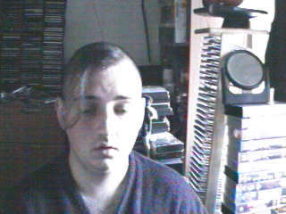
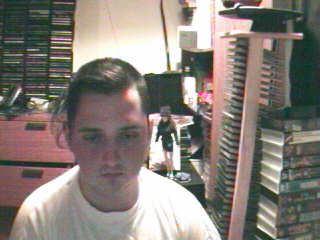
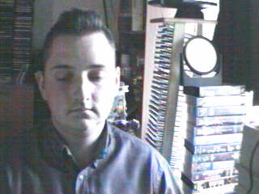
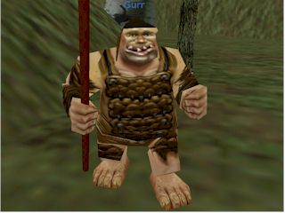

October 1999
============

.. raw:: html

   <h2>Sun, 31 Oct 1999</h2>
   

   
   21:48 - Lachianthrill wilderammer untracer.
   
   
First time in ages that I have felt confident to drink alone without fear
   of consequences. Just a calming influence. What is happening to me? A slight clove
   aftertaste. Time for the next film. Decided to take a break from typical horror and watch
   the divine &quot;The Wicker Man&quot;. Yay. Wrong pagan festival - beltain not samhain -
   but I don't care - it seems right to me.

   
   

   
   

   
   18:12 - Ros blan ized.
   
   
Bored again.&nbsp; Seem to spend most of my life bored.&nbsp; Well - the
   bits that I remember anyway.&nbsp; Probably my fucked up selective memory again - I tend
   to censor the good parts because they don't mesh well with my self pity and make me feel
   like a moaning fuckwit (no-one likes being faced by the truth).&nbsp; I seem to be using
   the word fuckwit a lot recently.&nbsp; A good word, I like it.&nbsp; Listening to Inkubus
   Sukkubus again. Crazy... but nice.&nbsp; Yeah. &nbsp; Watched a very good manga series
   earlier today - Blue Sonnet.&nbsp; Very good story, but the Japanese need to include naked
   teenagers at every opportunity is a bit excessive.&nbsp; Whoops, showing non-blokish
   sentiments again.&nbsp; Can't have that, what would the neighbours say?&nbsp; Still
   wondering what films to watch tonight.&nbsp; Exorcist is a definite - not as annoying a
   flipper as I thought - the film is all on side 1, with extras on side 2.&nbsp; Must be a 4
   layer disc.&nbsp; At the moment White Zombie and Witchfinder General are running ahead in
   the stakes.&nbsp; That would mean no vampire movies though, you can't have a Halloween
   film fest without vampires :(&nbsp; How about Dracula again - makes it into a bit of a
   Lugosi-a-thon - but Halloween without Bela is but a shadow of it's potential glory.&nbsp;
   Quick, call the men in white coats, he's getting poetic again.&nbsp; Time to stop the
   music, turn the lights off and start the movies...

   
   

   
   

   
   09:40 - Kiss aphole gallering tablescri.
   
   
Woo!&nbsp; Time for the spooky Halloween issue.&nbsp; Or not.&nbsp; It's a
   little too early in the morning to be spooky.&nbsp; Was just playing System Shock 2 -
   goddamn that is an atmospheric game - almost crapped myself when a big robot appeared out
   of nowhere and my pistol jammed after my first shot.&nbsp; Eek!&nbsp; Another night in
   alone.&nbsp; But I don't mind.&nbsp; I will watch some dodgy movies and play on the
   computer and listen to Darkwave music.&nbsp; Bought Hearbeat of the Earth by Inkubus
   Sukkubus yesterday - Celtic Folk Metal is how I would describe it.&nbsp; Very goth. &nbsp;
   I also bought the Exorcist on DVD - got it home only to find that it's a fucking
   flipper!&nbsp; Aaargh!&nbsp; Oh well, bored of this now - time to do something else...

   
   

   

Image of me
^^^^^^^^^^^

.. raw:: html

   <h2>Sat, 30 Oct 1999</h2>
   

   
   11:24 - Synching gablespect plesmania gatempo hambundign.
   
   
Feel silly making today's update. Will do it anyway.&nbsp; Have been
   making mountains out of molehills all morning.&nbsp; I have calmed, but am still not
   feeling entirely rational.&nbsp; Nothing in it.&nbsp; We danced a little.&nbsp; We talked
   a little.&nbsp; I helped her drench Gareth in beer.&nbsp; She implied that she's like to
   meet me again sometime as I left - probably just being friendly.&nbsp; Still alone, but
   have had my hope for improvement renewed.&nbsp; I had given up.&nbsp; I don't know what
   hurts more - the empty desolation of before or the hope for change.&nbsp; I am being
   fucking stupid believing a word of my beer soaked memories.&nbsp; I didn't feel drunk at
   the time, but I was.&nbsp; I must be reading more into it than there was, but I can't get
   the thought that maybe I'm not out of my head.

   
   

   
   

   
   07:09 - Interrant plinties kas allander dromentens.
   
   
No luck trying to sleep. To most people last night would have meant
   nothing. It probably meant nothing to her. She has probably forgotten already. There was
   probably nothing to remember.&nbsp; Yet I sit here stewing over it. 

   
   

   
   

   
   05:51 - Nisimi dulotesta sly beaskate soundemen.
   
   
I can't think straight. Nothing to do with the fact that I am recovering
   from copious alcohol, or the fact that I have only had 4 hours sleep. Mind spinning again.
   How could last night have happened? She doesn't even know anything about me - she must
   have liked me to look at. She must have been very very drunk. The beer fights that she was
   in were another good indicator of her insobriety. I know nothing about her either. Just
   her name and the fact that she is very attractive. I really need to sleep for a couple
   more hours but my mind is racing too much.

   
   

   
   

   
   02:04 - Ladient tolerate provervis astest andartink.
   
   
Did everything wrong. God I wish I'd thought to try and kiss her before
   leaving. She probably would have just pushed me away - but at least I would know. I was so
   confused by the fact that she seemed to like me that I didn't think. I really hope I meet
   her again and she feels the same way; or the way I think she felt anyway. The way I hope
   she felt. I can't believe that the most beautiful woman there seemed to like me. God - I
   hope it wasn't just me being pissed. Oh fuck. Oh shit. How am I supposed to sleep after
   being such a fuckwit? I can't believe that tonight actually happened.

   
   

   
   

   
   01:48 - Explayer suinali struct.
   
   
I actually think she liked me. I liked her from the start but she seemed a
   bit taken aback when I called Dan a cunt. Later on she seemed interested in me. That
   doesn't happen. She must have been very pissed.

   
   

   
   

   
   00:59 - Otheors roustrill cited diating.
   
   
Oh God Fuck!

   
   

   
   <h2>Fri, 29 Oct 1999</h2>
   

   
   08:19 - Acketicle retaison wells jamently.
   
   
All Hallows Eve by Type O Negative on single track repeat.&nbsp; Song
   reminds me of a track from Xentrix's &quot;For Whose Advantage?&quot; album.&nbsp; Mainly
   the lyrics, the music is much slower.&nbsp; I haven't listened to that album for a long
   time - a pity it's a good one.&nbsp; I wonder if I will remember to dig it out when I get
   home...

   
   

   
   

   
   08:00 - Unciatively oring rection.
   
   
No-one looking where they are going. I must be missing something
   fascinating about the floor.

   
   

   
   

   
   07:28 - Cerbing conterary interdefe useso.
   
   
Next morning and I'm still stewing. Remember a very short fragment of a
   dream last night. A tight embrace. The feeling of her breasts pressed up against my chest.
   I guess I don't always wake up in shock when that happens. If only there was some small
   chance it could happen while I am awake. More thoughts on why the film pissed me off. It
   wasn't just about geeks getting a shag - for some of them it was about falling in love too
   - and having the feeling reciprocated. In other times that would give me hope. With the
   way I am feeling at the moment it just pisses me off. Type O Negative on my headphones is
   cheering me up a bit. Everything dies.

   
   

   
   <h2>Thu, 28 Oct 1999</h2>
   

   
   23:01 - Homests slayerses diplimplet.
   
   
Too pissed off to sleep at the moment, so I'm going to write a nutshell
   review of American Pie. High school coming of age comedy. I usually like that sort of
   thing - but despite very funny dialogue I find myself depressed by the overall storyline.
   Moments like when he fucked the pie, the cum in the beer and the shitting scene were
   hilarious. Alyson Hannigan's transformation from geek into dominatrix satisfied fantasies
   I didn't even know I had. But overall it is summed up best by the sentiment: Only complete
   fuckwits who piss themselves in public make it through high school with their virginity
   intact. Wonder what that makes me - nearly 25 and never even kissed a girl. I feel shallow
   writing this. Meaningless sex isn't what I want (although I am a bloke - so obviously
   wouldn't turn it down if offered) I just want something to fill the emptiness within. Not
   something - someone

   
   

   
   <h2>Wed, 27 Oct 1999</h2>
   

   
   07:55 - Legiferent posteeli habiouti crumulate atious.
   
   
Turmoil. I am vortex. Chaotic flux. Strange attractor. Theory of
   repulsion. Like poles. 1/(r^2 ) - the closer you get the further away you want to be. Time
   for another coffee.

   
   

   
   

   
   07:12 - Monked sorientin atituent opecturi.
   
   
Mind going over a conversation that I don't particularly want to have
   because it shouldn't be needed. Just the sort of shit I don't like about my job. At least
   it's taken my focus away from my non-existent love life for a little while. The focus
   always returns though. God I fucking hate my life. Memory pokes out from a drunken haze -
   can't remember when it was or who said it - was talking to someone about my inability to
   initiate conversation with girls - was told &quot;there's nothing easier&quot;. How I wish
   that was true. In my world there are a lot of things that are easier. Crawling naked over
   broken glass for example. I wonder if I've still got Troublegum in my CD case - suddenly
   reminded of a couple of lines from songs on that album. Bugger - not in there. Oh well.
   &quot;with a face like this I won't break any hearts, and thinking like that I won't make
   any friends&quot;. That'll have to be enough for now. Time for some Mazza - Cake &amp;
   Sodomy. I find myself longing for the time a couple of months ago where I actually felt
   content - was it real? Nothing was better in reality - all a matter of attitude. My
   attitude died years ago - the stench of decay is overpowering.

   
   

   
   

   
   06:24 - Lang ving fastendenti ferencely brakerate.
   
   
Feel so empty that it is hard to get to sleep at night. God I hate being
   alone.

   
   

   
   <h2>Tue, 26 Oct 1999</h2>
   

   
   22:46 - Armatusca vulgaerob dominer tableati.
   
   
I am so fucking paranoid. Walking back from the station for the last
   couple of hundred yards I was aware of a couple of girls behind me - mainly due to the
   clicking of their heels and the inane schoolgirl chatter. Just before I get to my house
   they start whistling - and my paranoia immediately tells me that that they are taking the
   piss out of me. It has happened before and I have been right - but that doesn't justify
   such a snap judgement. Second point before I go to bed is about the nature of my job. I am
   a Systems Administrator. That does not make me a god - but it does mean that I am expected
   to do the impossible. That is what the job is about - performing gigantic tasks and
   getting little to no recognition because if you do it right then no-one should notice. If
   you're in it for the respect of others then you are in the wrong job. The only
   satisfaction comes from doing the job right and knowing how much you have achieved. A
   second job related rant is about overtime. It is not there so that you can get extra money
   because you're a bit short - it's a company's way of recognising that the requirements of
   the job are not always convenient. &quot;we need you to do something - sorry, we know it's
   put you out - have something to show we appreciate the effort&quot;. All seems like common
   sense to me - but then I'm fucked in the head, so what would I know. I'm also a manager
   and therefore I am evil by definition - one of the faceless &quot;They&quot;.

   
   

   
   

   
   21:03 - Enancert intris analy allocial.
   
   
Nothing new to say so I shall say nothing. These pages would be a pretty
   empty if I always felt like that.

   
   

   
   

   
   10:56 - Ations ging slated sed ophomann.
   
   
Questions without answers. No point asking them here. Didn't log on at all
   last night. First time in a long time. I like women with glasses. I like women without
   glasses too - but there are certain styles of glasses that I find very attractive. Like
   the round rimmed ones that the woman a little way down the carriage is wearing. The dark
   hair and all black clothing helps too. Kings Cross. The pretty people get off - old people
   get on to take their place. The wings of eternity blot out the sun - reminding me that the
   pain will never end. Nothing changes - crushed beneath the wheel once more. Compression is
   easy - there is nothing inside anyway - a vacuum offers no resistance. Is there such a
   thing as fate? I hope so - if so then none of this is my fault. Blame it on the Universe -
   it's too busy to contradict you.

   
   

   
   

   
   10:24 - Ies ess isigh aimed.
   
   
Bleak landscape. Looks how I feel. Autumn has lots of pretty colours - but
   they don't quite hide the rot.

   
   

   
   <h2>Mon, 25 Oct 1999</h2>
   

   
   23:01 - Emen tabilitol venanosier.
   
   
Bizarre daydream fantasies on the way back from the train station. Get
   back home to find a beautiful woman waiting for me on my doorstep - shivering in the cold.
   We go inside and warm up by holding each other. She tells me that she has been dreaming
   about this for months - I let her know that I have too. We stay like that for an hour or
   so and then she goes home. I buy her an EverQuest account and she starts a dark elf
   necromancer character. I start a dark elf cleric to help her power level to 12 - when we
   get there my cleric decides the militant life is not for him and retires to the spires to
   live out the rest of his days worshipping Innoruuk in more passive ways. This enables me
   to return to Gurr. Even in daydreams I cannot imagine a relationship getting more serious
   than a hug. And an online gaming partnership. I am very very sad.

   
   

   
   

   
   21:46 - Eatilers clothermin allowme stannicate moles.
   
   
Still no words - to staunch the internal flow of nothing I write anything.
   It isn't working. I need something. I have nothing. I want everything. I want anything.
   This used to help me get my feelings out - to stop me bottling things up inside - but it
   isn't working now. I don't even know what it is I am bottling up - I just feel the turmoil
   within and don't know what to do. A wrongness pervades all. Nothing tangible. Just
   everything. I give up.

   
   

   
   

   
   21:30 - Podissess secreabas cateleting.
   
   
No words. Just pain. Almost tangible. I wish I had something to distract
   me. Still no words. I can't even write this down. I just have to ride it out and hope I
   don't end up too far from the path. I have no idea what I have just written.

   
   

   
   

   
   21:13 - Recalition soserend rioundet achens.
   
   
Just starting to get stuck into things and kicking out time comes around.
   Bugger. Phrase has been buzzing around in my head for the last few hours. First popped up
   when I was thinking through a conversation that never happened - thinking of what I would
   say if it ever did. Can't remember most of it - just one line - I have never known of a
   single occasion in my entire life where a woman has found me attractive - physically or
   mentally. Can't get it out of my head. It is totally true. Someone out there for everyone.
   Except me. I guess I should be proud of my uniqueness. I wish I could just ignore it and
   get on with the rest of my imitation of life - but it doesn't happen. I dwell on it.
   Infinite recursion. One day I will collapse with a fatal stack exception. Or just go
   insane. Maybe it has happened already.

   
   

   
   

   
   11:44 - Directrea barroun reafect ioning acrespedago.
   
   
So much bottled up inside. I can feel the pressure building - but the
   words won't come so I can't let it out. Sitting here waiting for the train to pull out.
   NIN providing the noise. An argument going on elsewhere in the carriage - can't make out
   the words - but can feel the intent. Empty inside - what can I use to fill? Mind blank.
   Train moves off. Emotion in motion. I hate rhymes - yet I use them anyway. Difficult to
   hold my coffee and my Palm at the same time. What is the opposite of an activist? A
   passivist? Nothing means anything anymore. I physically can't believe in anything -
   especially myself. Paths to the perfect future thinning whenever I make a wrong choice.
   Many worlds theory implies there an almost infinite number of me out there in the
   multiverse that are happy. Doesn't help this particular me though.

   
   

   
   

   
   10:47 - Tectomotio nativefore cobssio sirenaus assocrati.
   
   
I'm back to the stage where seeing beautiful people hurts. Especially
   seeing beautiful people held close by other beautiful people. Mid morning and there are
   still no seats - when will they sort the trains out. Never probably. Just build more roads
   - it's easier. Some smoother tracks would be nice too. Or computer controlled suspension -
   they can do it to give cars a smoother ride - why not trains? Need to change the CD - a
   bugger to do while standing and the train is shaking all over the place. Wedge my knee up
   against the back of a seat so that I get stability without losing a hand. Tricks of the
   trade. Am I still a journeyman commuter or have I progressed to master? Can't read a
   broadsheet newspaper on a crowded train, so I guess I don't qualify for master. Don't
   really want to read a newspaper on the train - I know the world is fucked - I don't need
   to be told - and I don't particularly want to know the details. I was going to say that I
   was quite happy in my secular little world, but happy wouldn't be the right word. Nor
   would content. Or satisfied. The only good thing about my life is that I feel safe. Not
   sure what scares me more - change or lack thereof. Necks crane for a look a the millennium
   wheel. Why? It's all a pile of shit. Time for another coffee. The only vice I want to
   pursue that I am able to pursue. Want to just lose myself in a book - but my mind won't
   let me. Whirlpool.

   
   

   
   <h2>Sun, 24 Oct 1999</h2>
   

   
   18:42 - Proportely fronties scions ploparam publi.
   
   
Bored bored bored bored bored. Nothing holds my interest.&nbsp; I finished
   a book and can't be bothered to read the next one in the series.&nbsp; I played a bit of
   EverQuest, but I couldn't be bothered to continue.&nbsp; I am just about to run a bath,
   but can't be bothered to get up.&nbsp; There is a conversation I really want to start, but
   I can't seem to think of anything to say.&nbsp; Actually I can think of something to say -
   I just can't get myself to say it.&nbsp; I'm going to run that bath... I wish I had a
   shower.&nbsp; I hate waiting for the bath to run.&nbsp; I can never judge the temperature
   right either. Time to put some music on.&nbsp; Cradle of Filth's Cruelty and the Beast is
   sitting right in front of me, so I guess that's what I'll put in.&nbsp; Saves having to
   look through the rack and make a decision.&nbsp; I don't actually know if I like this
   album or not.&nbsp; I haven't listed to it for quite a while.&nbsp; The music is a bit
   formulaic and the vocals are terrible, but somehow I kinda like it.&nbsp; Weird. Calling.
   &nbsp; Must... Resist... Temptation.&nbsp; Feel like cutting myself.&nbsp; For no reason
   than to lick the wound.&nbsp; I am fucked in the head. Lost in music. Stumbling online
   conversation last night.&nbsp; Quite fun once it got going.&nbsp; I should put awkward
   silences down as one of my hobbies - I'm actually quite good at them.&nbsp; I knew there
   had to be something related to human interaction that I was good at.&nbsp; Lol. Bangs
   outside.&nbsp; I had forgotten how close it was to Guy Fawkes night.&nbsp; And Halloween.
   Beltane or Samhain?&nbsp; I can never remember... Maybe I should dig out some of my occult
   books for something to do - I can't be bothered though.&nbsp; I hate being so apathetic,
   but I can't be bothered to do anything about it.&nbsp; So I just sit here and seethe.
   &nbsp; I find it difficult to believe what a sad fuck I am sometimes.&nbsp; Laying on my
   bed earlier feeling lonely and hugging my pillow.&nbsp; It's a while since I've been that
   desperate for closeness.&nbsp; Inanimate objects don't help much though.&nbsp; Bath has
   finished running, but as usual I have completely misjudged the temperature, and I will
   have to let it cool down for at least an hour so that it doesn't take the skin off of my
   legs when I get in.&nbsp; I wonder what I would look like without skin.&nbsp; I wonder if
   my insides are as ugly as they seem.&nbsp; If everyone had no skin would I still be
   repulsive?&nbsp; Of course I would - it's got very little to do with what I look like on
   the outside, and everything to do with the aura of &quot;Fuck Off&quot; that hangs around
   me.&nbsp; I don't care, so don't come near.&nbsp; Scar tissue.&nbsp; Numb on the outside
   to dull the pain, but it dulls the other feelings more effectively.&nbsp; Catch 22. &nbsp;
   An urge to listen to Christendom by Paradise Lost.&nbsp; I love this song. &nbsp;
   Subwoofer adds atmosphere. Damn.&nbsp; Finished.&nbsp;&nbsp; ICQ popping up in front of
   the window.&nbsp; I think I'll give up on this entry for now.&nbsp; I think I'd run out of
   momentum anyway...

   
   

   
   

   
   18:11 - Casian spraying graphy spenderpo.
   
   
Naked. Shivering. Alone.

   
   

   

Image of me
^^^^^^^^^^^

Sat, 23 Oct 1999
----------------

.. raw:: html

   

   
   07:48 - Noverener supplaint tautolster proparolled pathing.
   
   
Faces that I like to see swim before me - making me feel empty.&nbsp; They
   will never know.

   
   

   
   <h2>Fri, 22 Oct 1999</h2>
   

   
   23:23 - Stions mothetic hitterfini.
   
   
Meanwhile - behind the facade of this innocent looking bookstore Obvious.
   Gandhi grazing like the sacred cow. Size thereof. Sacred.&nbsp; Pissed bloke.&nbsp; Yes
   mate. Herzelied. People fuck off and try elsewhere.&nbsp; I am fuk.

   
   

   
   

   
   07:12 - Jelly grounwiel rusose.
   
   
A ticket check. That's a novelty. Looking forward. Fear Uncertainty Doubt.
   Sweat. Leather, hazelnuts, gunpowder... sex. You're nothing but a dirty carbuncle -
   festering in the corner. Piss off little witches. Aeon Flux. A ripe harvest of quotes.
   Felt obliged to put that in in case someone recognises the lines and assumes that the
   original stuff here is quotes too - just from things they haven't seen/heard... Why do I
   care? If someone thinks I am an unoriginal cunt then I certainly can't argue - it would be
   a bit hypocritical seeing as I think that too... Manifest inferiority. A seat at last.
   Don't know why I acknowledged the source above - I have quoted without acknowledgement
   before. Unreliability is my lifeblood. Unpredictability sounds better - but is it
   accurate? Lack of consistency. Wherever there is a way to say something with a positive or
   negative twist I will always choose the negative. If opposites attract then I should be
   fighting off beautiful women with positive personalities. Oh wait - opposites attracting
   is a physics thing. It's governed by logic. No way in hell it's gonna be useful in the
   real world. I will let you down. Undependable. Do I not care because I have nothing to
   care about - or because I am incapable of caring?

   
   

   
   <h2>Thu, 21 Oct 1999</h2>
   

   
   19:45 - Growled carishing aindils stigant.
   
   
The city. Don't ya just love it?

   
   

   
   

   
   19:32 - Ming hirosh mutalish.
   
   
Fuck that was an expensive impulse. Very nice coat though. But that's in
   my flawed opinion. I liked the beard, but the general opinion is that I look better
   without it. Either people are lying to save my feelings or I have no taste. I reckon the
   latter.

   
   

   
   

   
   18:27 - Sss laysigh achemised ates.
   
   
Broccoli. Fistfuck. Has anyone seen my watch? I sicken myself sometimes.
   Barely conscious. Automaton. Music pulses. Underground in the rush hour. The voices urge
   me to kill. I sometimes wish I heard voices, or had multiple personalities. It would be
   company. I would probably just mock myself for being such a cunt though. Beef. Velvet.
   Tacks. Cocoa. Bovril. Full circle. Urn. Ashes in my mouth. Scarf. Pin-stripe. Herring.
   Don't feed the fish. Let them starve. Then choke on their bones. I want a bigger coat.
   Something less shit. Time for some un-planned shopping. Top heavy fractions and long
   multiplication and integration by parts. Guesswork. Brownian thought. I wanna fuck
   everyone in the world.

   
   

   
   

   
   18:04 - Demidway atis suppleving shootherne.
   
   
Empty day. I am drained by the mediocrity. Time for some shopping. Eyes
   boggle. Cackle. Let me out. Meep-meep. Jungle lizard salad ball hoop death la mini-skirt
   schizophrenia furby ewok axe tree leaf druid monolith ibm elite. Mallet's mallet. Tennis.
   Pain. Where are the good memories? Go fuck yourself. Too tied up in myself. I am shit. Up
   against the wall for your final request. Coat. I hate trains. I don't hate trains. I
   change my mind. I have no mind. I have no soul. I have no worth. Flawed. Jagged tear.
   Scar. I would give nothing. My problem. I don't like change - my own fiercest opponent.
   Recursive nemesis. Biorhythms at nadir? I don't know - it's ages since I've charted them.
   It's all shit anyway. Wallowing in badger shit.

   
   

   
   

   
   08:13 - Actories crosputs flowesteam pitondered.
   
   
&quot;Angels bleed from the dainty touch of my caress. Need to contaminate
   to alleviate the loneliness.&quot; Caffeine rush. All hail the king. Cup collection is
   growing. Must clean out my bag. It's taken me well over a month to change my bedding -
   took off the old sheet - but never seem to get around to putting a new one on. Housework
   bores me. I never see the point. What does it matter if things are untidy if you know
   where things are. I have never been big on aesthetics. Functionality is far more
   important. &quot;God is dead and no-one cares. If there is a hell, I'll see you
   there.&quot;

   
   

   
   

   
   08:00 - Custonia apsulsi trumulti mayaneral.
   
   
Others rush past - shoulders hunched. I just stand here looking at the
   sky. Am I wrong?

   
   

   
   

   
   07:09 - Basebes son ses.
   
   
Push the button. Free from distractions. Others look on. Are they laughing
   at me? Today is the start of my 4th year in the job. Every move in the past has promised
   something better. I don't think anything has ever delivered. The mocking has grown less -
   but I am a brooder, so I still remember. I cannot make eye contact for long. Am I afraid
   of what I may see, or what might be seen in me? Time to change the disc. Paranoia. Why is
   he looking at me? What did that comment really mean? Stop laughing at me goddammit! My
   apathy is too deep rooted. Squeeeek! Hog calling. Hey pig. Photogenic. Not me. I don't
   like the way I look when I smile - it never looks genuine to me. Like it's been painted
   on. Or like the deranged grin of a lunatic. Not surprising. Flex. Spout random crap - if I
   don't think I can forget the pain. Briefly. Sucked into the void within for a moment.
   Whirlpool. Must... Fight... The... Tide... Don't like the smell of it. Line up. Take your
   shot. Poke, taunt, mock - the amazing geek boy will take it all and bounce right back -
   only a little more dead inside. I have been dead inside for so long that decay has set in
   and I stink of putrescence. &quot;I wanna fuck you like an animal. My whole existence is
   flawed. You get me closer to God.&quot; Suit spotting from the train window. So many
   suits. So few axe wielding psychopaths. Rain falls. But it cannot wash away my emptiness.
   I want to wake up in the morning and not think &quot;what is the fucking point?&quot; My
   site probably has more uses of the word &quot;fuck&quot; than any other at work - and yet
   it was the only one that the test content filtering box let through. Heh. Ftagn. Crowd
   navigation by Brownian motion. Double espresso - time for 3 coffees before I get to work.
   I do not want this.

   
   

   
   <h2>Wed, 20 Oct 1999</h2>
   

   
   21:49 - Slandic spoologis chenedi immenific.
   
   
I think I have passed beyond rant mode now. Introspection. As if I ever do
   anything else. At least I can amuse occasionally. Just wish it happened more often. I
   might not feel so useless then. Pointless. I did a 13 hour shift today, and at the end of
   it I have got to the stage I thought I was at yesterday evening. I have achieved something
   though. Things are better. I may have made someone else's life easier - even though mine
   is still shit. Believe that and it might not seem as bad. The task ahead still looms. I
   wish I had something. It's fucking hard being alone. I don't like it. But like has nothing
   to do with it - it's what I've got. Fucked up. I have nothing interesting to say - just
   the same old shit that I've regurgitated a million times. Scratched record. Waiting to be
   switched off. Or kicked. Carpet. Comfort in closeness. Seems a very sound proposition in
   theory - when do I get to try the practical? Fucked in the head. World torn apart. No
   problem - there's never been anything worthwhile in it anyway. Never. Beetle. Ham. Cheese.
   God I'm hungry. Or is it just loneliness? They both make my stomach churn. Whatever.

   
   

   
   

   
   07:33 - Cerate formish pithirm sors alized.
   
   
Is there any hope? I have had a couple of vague hints that maybe there is.
   Not from anyone in a position to be definitive - and I've never been any good with hints
   anyway. In a logic bound system I can diagnose from hints pretty well - but that doesn't
   extend to human beings. Single track repeat again.&nbsp; &quot;I've been so alone for so
   long, forgot how much it hurts to wake up so alone&quot; - Exactly how the dream made me
   feel yesterday.&nbsp; On waking I had a moment&nbsp; where I felt whole - a split second
   before it all came crashing down - and it pointed out how hollow I am on a day to day
   basis.

   
   

   
   

   
   07:05 - Recting dislocki sphem anipatrol.
   
   
It doesn't matter. Bland existence. Nothing. Empty. At least with pain
   there is a feeling I can understand. Won't do it again though. The scars were never the
   point - only a symptom - but they will be with me forever. I am ugly enough already - no
   need to make it worse. Scratch. Sever. Maim. Rend. Tear. Bleed. Hate. Why did I have to be
   me? What did I do that was so bad that I deserve this?

   
   

   
   

   
   00:25 - Bery muttess sistsse.
   
   
Dark hair. Eyes deep enough to drown in. Why can it never be real?

   
   

   
   

   
   00:11 - Promotors beashrop mulateal spirablema.
   
   
Missing something I have never had. Waking up beside you by Stabbing
   Westward on endless repeat. The perfect song for how I feel at the moment. Perfect match -
   not perfect remedy. I miss, god I miss, waking up beside you. Never happened - and yet I
   miss it. Miss the warmth of a tight embrace. Only experience of which is hugging a pillow
   or blanket. Something that I will have to be content with tonight. Reading all the wrong
   signs. Dreaming the impossible dream. It hurts. But I endure. Sucker for punishment. There
   is an easier way, but I refuse it. I could close my eyes and it could all go away - but I
   don't want to end it before it has begun. Even though it will never begin. Why?

   
   

   
Tue, 19 Oct 1999
----------------

1999-10-19 23:57
^^^^^^^^^^^^^^^^

Pain. Other. Familiar. Different. Better - but I cannot say. Preference.
Again. Always. Ever. Beginning. End. What changes?
   
1999-10-19 23:50
^^^^^^^^^^^^^^^^

The only opinion you are ever qualified to give is your own. Book sitting
unnoticed in my bag. Good book. I am enjoying it, but at the moment I wouldn't
be enjoying it - not doing it justice. I am too wrapped up in self pity. Self
hate. A very serious topic came up earlier - I couldn't give a flying fuck.
It's something I should be very concerned about - but I'm not. I am not. Never.
Nothing. Floor.

1999-10-19 23:33
^^^^^^^^^^^^^^^^

I wanted oblivion tonight. In the end I only made it as far as melancholy.
Further would have been much less very.

1999-10-19 23:27
^^^^^^^^^^^^^^^^

I don't want to think the way I do. I don't want to be such a cunt. I wish I
knew different. I really do. But this is all I know. All I am fated to know.
All I am worth. Nothing. Pain. Empty. Shit.

1999-10-19 23:12
^^^^^^^^^^^^^^^^

In a moment. Thrown back into depression. Is that why I achieved so much today?
I have theorised before that my depression has a bearing on my technical
abilities - is this proof? I have been content with my lot for weeks and that
is why I have made absolutely no progress. Everything has changed. How could I
have been content? I haven't felt any better - I have just ignored the void
within.  I have nothing. I have always had nothing. I will always have nothing.
I want something. I believe that I can have something - but I don't know what.
Suffer. What I am good at. What makes me me.  Everyone has a talent. Everyone
pays a price. My talent is computers. The price is loneliness. Where did I go
wrong?

1999-10-19 23:01
^^^^^^^^^^^^^^^^

Got things done. Productive day. I don't give a fuck. Nothing matters.  Nothing
is real. I still hurt. I am still empty. I do not know what to do?

1999-10-19 10:51
^^^^^^^^^^^^^^^^

Last night I experienced a moment of perfect happiness only to find it was just
an illusion. It hurts. It really hurts. If I hadn't woken up I probably
wouldn't remember and all would be well. Or better than this anyway. Churn. How
can a dream make me feel this empty? We didn't even really kiss - I woke up as
soon as our lips met - and yet I have a memory of perfect contentment - the
loss of that illusionary moment suddenly reminds me how empty my life really
is. The stumbling to an accidental conclusion seemed so real. I have never
experienced what I imagined last night - I could have blown things out of all
proportion. I hope not. I hope I feel like that in reality one day. I hope, but
I don't believe. I just regret the loss of that imagined perfect moment. And I
have to try not to let it get to me too much. I have had a similar dream
before. Woken shaking with the loss. Last time I don't remember hurting this
much. Last time I left myself with permanent scars.

1999-10-19 10:07
^^^^^^^^^^^^^^^^

Dream last night has me feeling down - so what do I do? I listen to one of my
most depressing CDs. Smart move.

1999-10-19 09:20
^^^^^^^^^^^^^^^^

Had an idea for a spoof site last week - provoked by postings requesting where
to find naked pictures of Sarah Michelle Gellar on the
uk.media.tv.buffy-v-slayer newsgroup. Finally got around to uploading it -
check it out - :doc:`../nakedbuffy/index` When that one gets into the search
engines my hits will soar...

1999-10-19 08:45
^^^^^^^^^^^^^^^^

It happened again.&nbsp; I am not sure of her feelings, she is not sure of
mine - we stumble around the point, gradually drawing closer until we fall into an awkward
embrace. Our lips meet. I awaken - heart racing - shocked from sleep by the
impossibility of it.&nbsp; The moment gone - I try to achieve it once more by turning over
and going back to sleep, but it doesn't come.&nbsp; I hate when things stop just when they
are getting good.

Image of me
^^^^^^^^^^^

Fri, 15 Oct 1999
----------------

.. raw:: html

   

   
   01:21 - Chococcom elitiove ally.
   
   
No.

   
   

   
   

   
   00:59 - Kickwell maturing nary ressi.
   
   
Shminky-plnky. Chris Hoddle. Boutros Boutros Ghali. No surrunder,no
   rhetoric. No boll0cks. No kewln3ss. Kewlness. Pinky. No retreat. Aoel.. Moooooooo. Inna
   bit. Gurr. Disappointed, already.&nbsp; Nothin. Blows goats. Dead goats. Only faction I
   know of. Cry like rain. West hampstead. Hear my calling... Black wind come carry me far
   away. Froak.!

   
   

   
   <h2>Thu, 14 Oct 1999</h2>
   

   
   23:10 - Lumpes nalizite miss.
   
   
arse. No. Ouiq. Lollod. Kl40xdd. In te hmape of nn79. Mfarf tuvy- tmbe.
   Oeqaqhy. Yth.! B04k. Ks. Air. Only am rx'n 
   noi mmatnln. -bl4o\ sairin. B046404k5s. Fhk9ekfr\ ff99s. E338 thc. Eteoteshri.t fkiry .
   Yu@ ar a unn.4y0uriismishishimky.

   
   

   
   

   
   08:32 - Aestonene playtiniti shorealize.
   
   
Haven. Paradise I wish I could lose. Perfection would bore me - it's the
   flaws that give a diamond it's sparkle. Knees. Calling. Cackling. Death sucks. All in the
   details. Brick surround towers above. Sky not visible, but there none the less - watching.
   Eternal vigil. Cry like rain. No tears. Not for a long time. Would be a show of emotion
   beyond my numb bruised heart. Self afflicted. Self infected. Insects. I cannot stand this
   much longer. Vision. Fission. Dreams of fusion. Tower of bricks built without mortar.
   Crumbles from a breath. Black wind blows. The cows are laughing. The owls hide above
   unseen. Unheard. Unnatural. Not what they seem. Nothing ever is. Blue scarf. Silver ring.
   Grey-brown horizon. Don't you just love the city?

   
   

   
   <h2>Wed, 13 Oct 1999</h2>
   

   
   18:53 - Resss martinian wonturio hureliger.
   
   
Burn, motherfucker, burn. Negative bleed. Feed the negativity - nurture it
   until it has a will of it's own. Discomfort caused by my proximity. I will never know
   close. Never feel closure. Always empty. How do I know emptiness when I have never known
   completion? For all I know they hurt lust as much as each other. I would bet one is a
   nicer pain than the other though. A better question is why do I wish for change but take
   no action to initiate it? Horse. Nasal intercourse. Macintosh. Carp. Bollocks. The lights
   shine on me but my darkness will take more than sodium emissions to dissipate. Online.
   Grass is greener or the devil you know. Which is you? Guesswork leads to answers - it's
   the world that's wrong - never me. No-one gets out of here alive. Abide ye and bear
   witness. Kladdath ymor jakalt. Guardrobe. Closer. Comb-over. The razor never shaves close
   enough. Puncture and drink deeply. Known. Dog house. A good place to be - someone cares.
   Walking on gravel in the dead of night. Cool moss grows on the grave. Stone comfort. Solo.
   The red light shines on. Forgotten. Never forgiven. Walls close in. Nothing to fear when
   there is nothing to lose. Known, believed, ignored. Home again, home again, jiggety jig.
   Jack once was hungry and butchered a pig. Dance like the dead. Flake. Shadowed men in a
   ring. The rhino at midnight. Violins and drums. I care not. Disregard the things you have
   and covet those you do not. My formula for life. I am fucked up.

   
   

   
   

   
   18:38 - Wines researani imantays.
   
   
New zone. Shafted. Fuck it all. Fuck this world. Fuck everything that you
   stand for. Fear the noise. It infects. Humanity is a virus. Plague. I. No. Not. Never.
   Ever. Infinity welcomes careful drivers. Get the fuck out. Repetition. Stale. Break the
   crust to find the void within. Illusion spoiled. Better off not knowing. Track. Drainage.
   Gravel. Suffocation. An oblivious eye watches over. Disinterested guardian angel - why try
   to help when the worst will happen anyway? Only make things worse. Introspection. Yellow.
   Puke. Nausea. I churn. Perpetual motion. Ineffectual emotion. Infectious lotion. Insects.
   Butterfly collection. Killing jar. Turtle. Gun. Fake. Serpent liberation front. Hot. Cold
   spell. Blessed be.

   
   

   
   

   
   08:56 - Discrion rouss airshed commano errosea.
   
   
Existing. No more. Don't want pity. Don't expect understanding. Want
   something more. Don't know what. Even less knowledge of the how. Fuck it. Medding.

   
   

   
   

   
   08:24 - Broaturity reanican ementinn defied.
   
   
Buried. Not yet dead. On the outside. Candy coated rot. Frosted. Honeyed
   clusterfuck - just add milk. Faith. Or lack thereof. What am I for?

   
   

   
   

   
   08:10 - Curate enterd proce.
   
   
Train. Queue caused the missage of the 7:42 - 7:45 instead. Violator.
   Rose. Silence. Calm before the storm. Good book - finished. Remove 1 book from the queue
   and add 5 others. Book that I have been waiting 3 years for will be out soon. Pretty. Look
   but don't touch. Something I will never have. Escape. Re-capture. Replacement. Trying.
   Tireing. Underground. That's all there is. Ferry journey - up all night - years ago, but
   the music is the same. Sensory deprivation. Emotional depravity. I ache.

   
   

   
   <h2>Tue, 12 Oct 1999</h2>
   

   
   11:22 - Purn singri sies sweeting rebronicki.
   
   
Kropotkin.

   
   

   
   <h2>Mon, 11 Oct 1999</h2>
   

   
   10:20 - Cronymous teesses phically.
   
   
ECG normal, BP 148/80. Scorn. Dessication. My chest now has shaved
   patches, doesn't matter - no-one will see. I am crap. I am carp. Smoke me. Sausage onna
   stick - get 'em while they're hot - they're luvverly. Blue sky over a grey horizon.
   Bitter. Zoning.

   
   

   
   

   
   08:50 - Cepaneleg pardobba lorster.
   
   
What am I doing? Brain malfunction. I seem to be spending as much time as
   Gurr as I am as Russell - hence the screenshot instead of a photo this week. Hit level 10
   last night. Nearly two full days of play time in one RL week. Thinking in spirals. Why
   must it always hurt. Time for my ECG now. 

   
   

   
   

   
   08:06 - Glancess posnes gymnaive.
   
   
I managed to erase this page by mistake - I'll regenerate it from the original entries
   on my palmtop later...

   
   

   

Sun, 10 Oct 1999
----------------

Image of me
^^^^^^^^^^^

Thu, 07 Oct 1999
----------------

.. raw:: html

   

   
   08:00 - Hargerm witters chooscism ges.
   
   
Obsessive - as usual. I am just impulses and obsessions. Product of a
   throw away society. Very few things I do can hold my attention indefinitely - I always get
   distracted and move on to something else - or the apathy gets to me and I just give up.
   Zero attention span. I tell a lie - there is one thing I never tire of - moaning. I can
   moan about how shit I think my life is until the cows come home. Trains are shit. Life is
   shit. I hate. Damn you all to Hades! Fuck it all. MoooOO! My cue to stop. Not finished yet
   though. Not enough coffee yet this morning - one more should set me up for a while. Just
   one more fix - I can stop at any time, I just don't feel like it. Addictions: caffiene -
   alcohol - everquest - moaning - spending. A genetically conditioned addiction to
   companionship - I have never really tasted it - yet I cannot think of anything else for
   long before my attention springs back to it. I need to be more careful about charging my
   discman batteries - it tends to skip when they are low. Phonebank is no longer a freephone
   service - it's LoCall - which means it doesn't even get included in my free minutes by
   Orange. Arse. They have an national rate number though - not as good as freephone - but
   better than nowt. At least that one is included in my minutes. Tantrum. I am like a little
   kid throwing a tantrum about a percieved unfairness. Newsflash. Life isn't fair - accept
   it and move on. &lt;winge&gt; But I want what other people get&lt;/winge&gt;. You won't
   get it - give it up and be happy with what you have got. Easy to say - impossible to do.
   The cows are calling...
   MoOoOoOoOoOoOoOoOoOoOoOoOoOoOoOoOoOoOoOoOoOoOoOoOoOoOoOoOoOoOoOoOoOoOoOoOoOoOoOoOoOoOoOoOoOoOoOoOoOoOoOoOoOoOoOoOoOoOoOoOoOoOoOoOoOoOoOoOoOoOoOoOoOoOoOoOoOoOoOoOoOoOoOoOoOoOoOoOoOoOoOoOoOoOoOoOoOoOoOoOoOoOoOoOoOoOoOoOoOoOoOoOoOoOoOoOoOoOoOoOoOoOoOoOoOoOoOoOoOoOoOoOoOoOoOoOoOoOoOoOoOoOoOoOoOoOoOoOoOoOoOoOoOoOoOoOoOoOoOoOoOoOoOoOoOoOoOoOoOoOoOoOoOoOoOoOoOoOoOoOoOoOoOoOoOoOoOoOoOoOoOoOoOoOoOoOoOoOoOo

   
   

   
   <h2>Wed, 06 Oct 1999</h2>
   

   
   19:26 - Inial retralizat bivalidify anoisio interdict.
   
   
Raised a laugh in the EQ newsgroup with this mornings entry - I don't get
   time to read many of the posts by other people. I have to work - it's a pity I can't just
   play EQ all day - some people make a good living by doing that - 1500+ dollars for about
   two weeks work for a L50 character. It's crazy what people will pay just to look cool -
   buying a maxed character means that you miss most of the enjoyment of the game - most
   zones pose no danger to a character that powerful. I have played the first few levels
   about seven or eight times now, and it's been a blast every time. Hopefully I should be
   well into fifth level by the time I log out tonight - a new spell level - my first DoT - a
   decent DD - my first de-buff. Kick ass. If I can break a lizardman camp I may even make
   6th and some change. Loot from a LM camp would get me all the spells I need. Spiders first
   though - I will bash them all to get back at them for all the times I have died over the
   past couple of nights - then I will bash the lizzies because they are invading my
   homeland.

   
   

   
   

   
   07:31 - Chiver barovoki merculed ital.
   
   
An idea for an EverQuest joke piece: I've soloed to 24th now and I'm only
   a couple of bubbles from 25th and still can't find a group. It was fine soloing up to
   15th, but then you have to move out of the newbie zone - when you get into the real world
   you start to notice how nerfed this class really is - and the problems just grow. My
   tinkering skill is up to master now, but I haven't gained any useful skills, and I can't
   seem to find any guild trainers for this class. Most of the people I know have quit their
   character and started over, but I have put too much time into this to quit now. There
   seems to be some sort of bug with the interaction system too - every time I try to talk to
   someone not on my friends list I go linkdead. If only someone had let me known the
   benefits of the other classes when I first started out. I probably would have chosen this
   class anyway though - I wouldn't be able to keep up the role-play with anything else for
   long. The gods of RL really need to tune the Geek class so it's more use in a group - or
   at least make it easier to solo. 

   
   

   
   <h2>Tue, 05 Oct 1999</h2>
   

   
   18:21 - Arciless corropropri socinea mating.
   
   
Quiet as the grave. I have only got as far as Blackfriars - I should be
   much further than this after 45 mins of travel. Tempted to get off and go for a KFC.
   Argument at the doors. I couldn't get out if I tried. You would think that rush hour
   travellers would understand that sometimes you have to let a crowded train go past. Yay!
   Seat! Bloke right next to me got out - maybe this won't be such a bad trip after all.
   Argument not as heated at this station - only one more and then fast to St Albans. Silence
   descends again as we pull away from the station. Giving another night of my life to
   EverQuest tonight - should be able to get to sixth level without too much hardship. I may
   even be able to break the spawn at a lizardman camp at fifth to fasttrack me to sixth - or
   even seventh - the xp probably isn't good enough to take me that far tonight though. I
   should be able to manage a scout only camp at four if the spawn is broken, but foragers
   and mystics would still be tough. Maybe if there's someone else low level on tonight we
   could team. I wonder if I could use the guards to break the spawn - if I got them to chase
   me to the guards I could probably break things up by a little bit. Worth a try at least...
   Even with this primarily rp character I am using power levelling techniques. Wouldn't work
   with a mystic as they would blind me - it would be difficult to run to the guards blind...
   I could possibly go kill kobolds for a while at 4th to toughen myself up. Should be able
   to get plenty of xp from spiders then too - there are plenty of them about - and no
   competition for kills. I can probably go all the way to fifth just on spiders... I'll try
   any all scout camps though, too good an opportunity to miss. If I could find flash of
   light I could blind a caster and then run to the guards while he runs away - this will
   kill the others from the camp with a bit of a gap before the caster dies. Sounds cool if
   it works.

   
   

   
   

   
   07:35 - Haully treageo burrow nuinenten tyle.
   
   
Back to the Feerot forrest last night - there were only two other low
   levels in the zone - makes it easy to begin with, as I don't have to share the spawn -
   it'll be a bit tougher in a couple of levels though :( there should be plenty of people
   around my level in the swamp by the time I'm ready for Guk though. There was a group of
   high levels killing guards last night. It's a good job that I don't often run for the
   guards - mainly because there isn't much that spawns nearby. They should reduce the
   experience that guards give - it could be a real problem if I was in a zone like
   Innothule, where running to the guards with a horde of froglocks on your tail is a regular
   occurence at lower levels. Everquest rules my life at the moment. It's a lot easier than
   real life - I know the rules. I even talk to strangers sometimes. The quality of people
   will be higer among the Ogres and Trolls - quite bizarre really. The k3wlios choose dark
   elf if they pick an evil race. There seemed to be a few among the barbarian people - names
   like pottymouth, rhinolove and juggajimbeam spring to mind. I may be doing them wrong
   though - judging them on their choice of name - not everyone goes to a book on celtic
   mythology to get a name for a barbarian character. I have to admit that I quite liked the
   name pottymouth - brought a smile to my lips on several occaisions. She may even have been
   one of the few female characters that has a female on the other side of the screen too -
   most of the shemale characters are less subtle than that.

   
   

   
   <h2>Mon, 04 Oct 1999</h2>
   

   
   21:15 - Able dwations relocia jenniting reminizi.
   
   
The following is an in character entry from my favorite Everquest
   character - Gurr the Ogre Shaman. Me iz gonna start again in Everquest. Me iz gonna be
   Gurr again - dere nothin quite like bashin da lizzies in da forest. Ogres iz lotsa fun,
   specially da shamans. Gurr iz a good shaman - he can make purty lights and everything. He
   is plenty tough too - it not be long until he is bashing froggies in Guk. Me not be able
   to team up with me friends ta begin with - but dere iz plenty of Ogres and Trolls to be
   friends with in da forest and da swamp. Me can go north to da little uns' lands when me iz
   bigger. Me gets da Bind spell when me is 14th season - den me can hunt anywhere. Me gets
   homesick though - so me not stay away for too long. Dey not very friendly in humie cities
   either. Dey not like us Ogres. Jus' coz we eat dem sometimes. Wot iz wrong with dat? We
   only eat dem becoz dey tastes so good - dey should take it as a kom... komplim... a good
   thing. Me likes high elf best - dey is really tender. Must be coz dey never do any work -
   dey just stand around saying how good dey iz. Dey sure talk purty, but dat not make dem
   very tuff. Dwarves iz tuff - but not when you soak dem in beer fer a bit. Me mum taught me
   dat recipe. Me likes to cook stuff, and to brew stuff. One day me want to be good enuff ta
   brew da Ogre Swill dat me daddy used ta drink before he went blind - we never did figure
   out why. Only use for a blind Ogre is da cookin pot - he sure tasted good. Me is a real
   life shaman now, me haz got me first spells and everthing. Me soon be bashing things very
   lots with me big stick. Dem humies think dey is smart - but dey can't bash as much as Gurr
   can.

   
   

   
   

   
   12:15 - Azess skinn sensucca aves.
   
   
Half a bowl in a new pipe - even that I can't manage. Probably because the
   bowl isn't broken in yet. Tobacco tastes scorched by the end of it. Shake it out and cover
   myself in ash. PDQ was out of order at Tower. Was funny watching them try to figure out
   how to use one of the manual card machines. Random CD purchases - one I wanted and two
   that I had heard the name of the band before and felt like hearing what they like. Looked
   at the DVD release of Blue Velvet. No extras and a stereo soundtrack. Doesn't bode well.
   It has a Dolby digital logo, but says pcm sound. I wonder which it is - it can't be both.
   I guess I need to wait for a review. In my own world. If it was a nicer place people might
   come and visit, but instead I have a world of shit. At least I can always take solace in
   coffee. Giving with no expectation of reward. Skippy. Skip skippety skip it.

   
   

   
   

   
   09:53 - Civinti pomposurp onally.
   
   
Where to start? I like puppies. Nice and meaningless. ICQs that are oh so
   cute. Advice to hug someone at least once a day. Sure - right after I win the lottery.
   Cheered me up though. Don't know why. Incredibly bad teamwork yesterday. I should have
   stuck with my Ogre char. Has anyone seen my corpse? My god comes in a wrapper of
   Styrofoam. Mmmm... Coffee. Would you kill for coffee? What type of coffee? Non-sequitur.
   Swordfish. Don't warn the tadpoles. Whatsa matter for you? You crazy! Of course you
   realise this means war! Train. One quick derailment and this could all be over, knowing my
   luck I'd come back even lower on the ladder. Something in my eye. Trees. I like trees. I
   don't like the sun in my eyes though - that pretty much sucks. More coffee. I think I'll
   visit Tower this morning - it's quite a while since I've been there. Noodling around.
   Can't be bothered to do anything meaningful. Life sucks. Accept it and move on. People who
   say different are just lying to themselves and others. Hate. Fuck. Roar. Vision of the
   lion from the wizard of oz. Onion. Wish you had a heart tinman? Take mine - not in very
   good shape but should be ok as a fixer-upper. What the fuck am I talking about? I. Me.
   Nothing. Zero. Lack of beard reminds me of school - walking down the corridor to shouts of
   &quot;Mango-head&quot;. Taunting others is easy. I taunt myself, which is just as easy,
   but less rewarding.

   
   

   
   

   
   08:33 - Loosliti hausiti jecting avin deprivi.
   
   
I wondered how long it would take someone.&nbsp; Some joker has voted that
   they lust for me on my most recent poll - rofl.&nbsp; I guess I was asking for it when I
   put the thing up there...

   
   

   
Image of me
^^^^^^^^^^^

