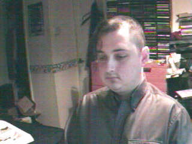

November 1999
=============

Tue, 30 Nov 1999
----------------

Aaah! The smell of stale piss.&nbsp; Just what I need to finish off the
journey.&nbsp; Public transport would be so much better if they kept the general public
out.&nbsp; Hi-ho, Hi-ho, it's off to work I go...

.. raw:: html
   
   

   
   11:23 - Cliniangular sconsi loresplebi miredits.
   
   
Arse.&nbsp; Still can't think.&nbsp; Missed the last train by a whisker.
   &nbsp; Should still be able to make it though.&nbsp; Just.&nbsp; New opening hours from
   next week.&nbsp; No laying in bed watching mpegs then.&nbsp; Will be able to lay in until
   8:00 if I do an early shift.&nbsp; Great.&nbsp; I may just give up late shifts and just do
   9-5:30 every day.&nbsp; I think there's going to be an 8:30-5 shift too - might start
   doing that one&nbsp; - gives me plenty of shopping time in the evening.&nbsp; Coffee
   break.

   
   

   
   <h2>Mon, 29 Nov 1999</h2>
   

   
   22:29 - Otoness accorito ialiting yelphall vigidispres.
   
   
Still no phone.&nbsp; Damn Orange!&nbsp; Damn them all to Hell!&nbsp; Damn
   Cisco too, and progressive networks, and Microsoft.&nbsp; Damn the world wide web. &nbsp;
   ICQ, FTP, IRC and email are fine.&nbsp; The rest of it just pisses me off at the
   moment.&nbsp; I feel too positive.&nbsp; Lots to watch tonight - a Buffy episode and two
   mangas.&nbsp; I'm five episodes behind on Angel too - will have to catch up before I watch
   the crossover episodes...&nbsp; Definitely short on creativity - this is turning into a
   catalogue of what I watch and listen to.&nbsp; Not much fun people watching at this time
   of night - everyone looks the same - knackered and desperate to get home to bed. &nbsp;
   What was the name of that schools program with the animated squiggle that taught how to
   write?&nbsp; I think it was look and learn or something similar.&nbsp; Why do I
   care?&nbsp; Out.

   
   

   
   

   
   11:18 - Whichams mittlers asyna stersol gilant.
   
   
There must be an unwritten law that the sound quality of headphones is
   inversely proportional to comfort. This is the first pair of headphones I have had with
   good enough bass response that I can turn off the bass boost on my CD player. But they are
   a bloody annoying shape - either the band is getting caught in my collar or they are
   pressing into the back of my ears. Annoying. But the quality of the music is good enough
   to lose myself and forget such material concerns.

   
   

   
   

   
   09:46 - Stirite mania stragged sing.
   
   
Another lonely weekend in suburbia. New deliveries waiting for me when I
   got home - weekend has been filled with music by Bif Naked and Velvet Chain, and visuals
   from South Park, Apocalypse Now and the first season on Monty Python. Fell asleep while
   watching Python on Saturday afternoon. A handful of arse on a billboard.Twitch. CD change.
   &quot;You boner biting bastard uncle fucker&quot;. Some songs you just can't get out of
   your head. Nearly to King's Cross. Let's shop!

   
   

   

Image of me
^^^^^^^^^^^

Sat, 27 Nov 1999
----------------

.. raw:: html

   

   
   12:46 - Cring gramates wooddimi dixinst.
   
   
Abortive attempt earlier - probably won't get much further this time. No
   concentration. Pretty vacant. I am a fucking messy pig. An animal. Wasn't concentrating
   when I got on the train at Lewisham - ended up in Victoria. At least I managed to end up
   going in the right direction. Need the loo - but the one on the train is broken. Losing
   focus.

   
   

   
   

   
   10:21 - Fontaphone steso evale.
   
   
Another Friday night - another floor to sleep on.

   
   

   
   <h2>Thu, 25 Nov 1999</h2>
   

   
   07:48 - Flower mation undested sey.
   
   
Don't know what to write. Train shaking about. No seat as usual. Almost
   worth getting a first class ticket just so I can guarantee a seat - with legroom. I might
   ask how much extra it is when I next renew. If it's less than fifty quid a month I'll do
   it. Lost the plot. Time spent staring into space. Lost in space. Train stations opening
   everywhere. Luton airport parkway is open now. Not much use to me, just makes the
   announcements for northbound trains longer. I am bordering on a spotter. Sad.

   
   

   
   

   
   07:32 - Atherand whis atisple corpia.
   
   
Wrong type of leaves on the line 
   Wrong type of rain 
   Wrong type of wheels on the line 
   Wrong type of train 
   Wrong type of people in charge 
   Tight fisted reign.

   
   

   
   <h2>Wed, 24 Nov 1999</h2>
   

   
   21:44 - Geriated luded featemp siord tralogist.
   
   
Moon is definitely on the wane. Quite good night. Beer - mexican (food,
   cocktails, tequila) - more beer. Andy goes leaving a half - Aha! Think I. I pour it into
   my glass. I guess I'm on snakebite now. Bugger - I forgot Andy was on cider tonight.
   Misery wrapped in an enema. Or mystery wrapped in an enigma. Something or other. Nobody
   likes me, everybody hates me - I think I'll go and eat worms. It's been a while since the
   last major Friday night. About 3 weeks I think. Last week was just me and Matt Evans
   talking crap deep into the night - the week before I left early because I was depressed. I
   am oblivlon seeking again. Anything to take my mind off of a week on Friday. Billed to be
   the biggest fall I've taken in a long time. I am the antethesis of everyone on match.com
   that sounds interesting - have never recieved a single reply from an email I have sent. My
   website kills every mail initiated by a third party. Constant rejection. If I can't manage
   anything via email then I what chance have I in real life? Barmaid in the Auctioneer that
   I have never seen before. Like Alyson Hannigan with mousy hair instead of flame red.
   Gorgeous. Train is just outside the station. Why are there delays at this time of the
   evening? There is hardly anyone on any of these trains. Train after train pushes in front
   - mine was on the board about 3 trains ago - but hasn't come back since. 4 trains have
   jumped past it - all going to CX. Next one. Constantly jealous. What does he have that I
   haven't? A life. A personality. A face that doesn't look like an arse. I am shit. There is
   nothing I can offer that thousands of others can't. I am as unique as a five pence coin.
   Time to change the disc. Too fucked up to care any more. Fuck it all. Longing for nothing.
   I can tell people want me turn my stereo down, but I'm not going to. I'm ready to get on
   with the rest of my life. Where the fuck are you? Amusing Sony advert - get back at the
   people with annoying personal stereos by getting a better one. Main reason I can't be
   arsed with an mp3 player is that I have over 300 CDs to choose from with zero effort -
   with an mp3 player I would need to arse about in a big way when I wanted to change tracks.
   Wretched.

   
   

   
   

   
   07:46 - Fattenes jingleani imping slot.
   
   
Crammed again. Am I really down at the moment or just putting on a show? I
   am actually not that down at heart, but I'm afraid to admit that - even to myself.
   Admitting that implies a reason - there is no concrete reason and I don't want to build
   any of the fantasy reasons any higher than they already are. Splish. Splash. Sphinx.
   Sweating. Will make the cold worse when I get out. What a convoluted dance I weave. Never
   reaching the point. Don't even know what or where the point is.

   
   

   
   <h2>Tue, 23 Nov 1999</h2>
   

   
   23:08 - Cutscious gunsponence tes cower prory.
   
   
Second night of the full moon - or is it the third? Cut up. Put up or shut
   up. Displays shafted again. Sideways seat. Order of preference - sideways, forwards,
   backwards. Sick. Sleep. Equipped. Stink. Not wrong. Somehow. Insulin. Penicillin. Tuft.
   Yellow. London skyline. Kinda beautiful. Some people never see tower bridge or big ben in
   person. I see those and more every day. Ungrateful wanker. I should be more appreciative
   of my surroundings. I won't be though. In my own way. Freak. Carried away. Scare. Score.
   Scar. Floor. Edging away. Building Lego walls around me. Mechano is very cool. As are
   stickle bricks. Retro. Wish I was at primary school again. Wasn't any easier - just less
   responsibilities. I still remember dropping my pencil while at junior school - when I bent
   down to pick it up my cheek pressed up against Anna Besch's arm - I still remember how
   soft and warm her skin was. 15+ years ago. Good memory. I am me. Nothing more to say on
   that subject though. My blocks are mine - if I wanted you to play with them I would tell
   you. Rules to live by. From an article I read the other day - full of truisms. Like - I
   will never remember important dates - I can barely remember my own birthday. If I ever
   forget an important date it's your fault for not reminding me. Ned's. Kill. Father's
   favourite chair. Sore eyes. Dizziness ensues. Crazy. Splendid. Marvellous. Wonderful.
   Stretched bladder. Need to make the treck to find relief. Aah. Crudity. Not of the salt
   and pepper variety. Vinegar. Food. Should have bought something at London Bridge. After
   beer munchies ensue. Nearly to my home town. Half hour from bed. Or an hour if I check my
   email first. Becoming. Ulcer on my lip. I wonder if we have any Bonjela. Disembarkation.
   If such a word exists.

   
   

   
   

   
   10:22 - Shwhile conflumb phan sorpola.
   
   
One of those going to work naked dreams last night. I think I may have
   noticed before I got there in this weather. Shopping time again. Only a few comics this
   time. The ones I didn't get Saturday. I was a total twat for not noticing. I said to put
   them on my standing order - meaning put them on the computer - but they were not in the
   bag when I got home, so I think he must have put them in my section of the standing order
   box ready to be collected at a later date. And I was too tired to notice. Or too
   unobservant. My hand hurts - I should stop writing really, but I have started so I'll keep
   going. Kapow. Kaching. Betrayal. Impossible for me - I never let anyone get close enough.
   I need someone with an emotional sledgehammer to break down the wall around my heart.
   Stronger from the inside than from the outside. Shoddy workmanship. Built to keep pain out
   - but in reality just stops pain getting out. Arse. I'm like a broken fucking record. One
   track mind. Need to re-focus. Exercise some internal censorship. People force their way
   onto the carriage. Hehe my hair has gained me some personal space - wind blows it into
   other people's faces, so they move back. I was just thinking about how I find nearly every
   woman on the underground this morning very attractive when suddenly I find myself in the
   middle of a crowd of ugly people. She looks remarkably like a frog - I wonder if she's
   some sort of lovecraftian amphibian hybrid.

   
   

   
   <h2>Mon, 22 Nov 1999</h2>
   

   
   12:13 - Magiestim sassumming saks duother bartersia.
   
   
I really wish I didn't care. Black. Black as the hounds of hell scratching
   menacingly at the door. Black as the void of space. Silent as the endless vacuum. I wish
   vacuum cleaners were silent. I hate their resonant whine. Smashing a vacuum cleaner with a
   sledgehammer would be fun. Or hitting one with a fast moving car. Or throwing one from a
   great height into a quarry. Therapeutic even thinking about it.

   
   

   
   

   
   11:27 - Velace solicerti iring.
   
   
11:19 pulls out 10 mins late - wonder how much slack time I have in the
   change at London Bridge. Should have gone in early rather than laying in bed watching the
   Fast Show. Wwwonderful. No-one even bothered to try and put the seat opposite me down.
   They all just assume it is broken. I wonder if anyone will have put it down before I get
   off. Probably not. Everyone is afraid of looking a twat. Burnt out already? I can feel a
   lot inside trying to get out. I am getting too self conscious - every time I start a new
   thread here I weigh up the consequences - wasn't what this was meant to be. Thought about
   giving it up yesterday - yet here I am again. Christ, I must love it. Kind of amuses me
   the way I can have a conversation with someone online and it will go fine - until they
   look at my web page and then all goes silent. There are exceptions - but they are few and
   far between. Cheese is nice. Have spent 90% of the weekend in bed watching videos. Not
   exactly productive, but fun and relaxing. Laughter is good. Forgot to shave this morning.
   My memory again. New David Lynch movie opens soon - cool. Not sure whether to find a plot
   synopsis on the web or not - I watched Lost Highway blind and really enjoyed it - didn't
   get a proper appreciation of it until the 3rd or 4th watching. Waiting for it to come out
   on video was very frustrating. Wonder how good the Film Four studio is at releasing to DVD
   quickly... Might check see if anywhere has the R1 disc on pre-order yet... Splendid. I
   can't abide silence. Hair getting in my eyes - I quite like it actually. Has never really
   bothered me. Difficult to focus close enough to look for split ends. Time for a disc
   change. Slow burn. Cold flame. Light blistering. I have no idea what I am talking about.
   Approaching London Bridge - will have enough time for a coffee. Great.

   
   

   

Sun, 21 Nov 1999
----------------

Image of me
^^^^^^^^^^^

Sat, 20 Nov 1999
----------------

.. raw html::

   

   
   10:25 - Actitional hastomali alluranc airligain respondiver.
   
   
Drinking, smoking then falling asleep on someone elses sofa while watching
   a movie. Traln into town. Passing through Lewisham. Falling backwards without motion. Time
   to shop. I want to check my email - but will have to wait until I get home. Get your gun.
   Passing me by. Enough.

   
   

   
   <h2>Fri, 19 Nov 1999</h2>
   

   
   09:12 - Tiless clairect fistopen twood.
   
   
Pain. Splendid. Frustrate. This train's late too. Winter has arrived.

   
   

   
   

   
   08:21 - Kerouston nobleadi adjure inhumimp.
   
   
We've stopped again. I'm probably not even going to make the 8:52 at this
   rate - even if it is as late as it usually is. Scorn. Strong. Carrot. Lariot. Shackles.
   Packed like cattle. Matter. Warming up. I quite like cold - but only in moderation.
   Vacant. Dirty. Sick. Yawn. Ooh! Movement... Wonder how far we'll get. Suits. Upholstery.
   Carpet. Feel like laying face down on carpet. Bizarre urge - one I will resist. Over.
   Head. All for the best in the long run. Do I have a long run? I never run far. I never run
   at all if I can help it. Trains seem to do their best to avoid running too. Not good.
   Stuck in a tunnel. If I'd got off and braved the Northern line at Kings Cross I'd be at
   London Bridge by now. Warmth generated. Cozy. Want to drift off to sleep, but need to keep
   myself awake. Uncomfortable seat. Out into the light. Picture of insanity. The clear blue
   sky in winter. Farringdon at last - only 20 minutes after I left Kings Cross - could have
   walked it in that time. Do you think I really care? Can I? I don't think so. Entry
   peppered with song lyrics - even more than usual. It's a long time since I've missed the
   8:52 - I don't even know when the next one is. Wonder if there's time for a coffee. Bloke
   next to me has got up - there is room for my fat arse on the seat now. In sight of the
   millenium wheel. What a bag of shite. Four star. Shame. Stopped again - what the fuck is
   it this time? We're well past the broken train... God I hate being surrounded by beautiful
   people. Well deserved. A walk in the rain would be good right now. Scrape. All in black.
   Gorgeous. Painfully so. Sun in my eyes - blinded by the light. More delays - we've missed
   our slot - don't fit in - I am used to that at least... Not enough sleep last night (as
   usual). Checked my webstats before I went to bed. I am a sad, sad man. Arrival.

   
   

   
   

   
   07:55 - Unders fogging wealia.
   
   
Spread wide open. The flies swarm. Rot creeps incessantly. I. Under
   ground. Ground under. Boot stamps down. Legs ache but no seats means no sitting. I know
   less than nothing. Anti-knowledge. Unspoken truths fester. Compost to help the growth of
   mediocrity. Nothing. Little man in a cheese canoe. Kayak. Eyes wide open but not seeing
   anything. Train ahead is recieving fitter's attention - what are they fitting? Just
   another day - as pointless as the rest. I like fish. Bish bosh. Luvverly. Wonder whether I
   will miss my connection. Probably. Great. Half hour of freezing my fingers off waiting for
   the next one. Train at Farringdon is blocking both directions. Ouch. Why do americans call
   a tip a gratuity? Why the need to invent a word when one already exists? I believe the
   word derives from gratitude - but when I hear it I think of a minor act of violence
   (excessive violence is gratuitous - so a minor act of violence is a gratuity). On the move
   again. 15 minutes to make the connection at London Bridge. Possible, but not likely...
   Time to change the CD.

   
   

   
   <h2>Thu, 18 Nov 1999</h2>
   

   
   23:43 - Excepans legrecli planable patignos.
   
   
Surrounded by the tide of humanity. What do I let in? Drown. The spare
   phone doesn't have data capabilities, so I can't check my email. Finally managed to get
   the CD burner working - burned all but one of the discs I wanted - should be able to do
   the other one tomorrow. Probably the worst band in the world playing in the St.
   Christopher's tonight. Evil. I am nothing. Fear me. The emptiness calls. Endless scream
   with no-one to hear. Ting. Tang. Sense. Nothing. No-one. Nowhere. Parcel. Not from Amazon
   - but they are not the only order I have placed. Lyais. Chaos. Start. Pineapple. Bord.
   Bork. Cleaver falls. It's a game of choice. No choice. I am me. Nothing prevents that.
   Nothing can present that. Fistfuck. Dancing spirals around the opportune. Eating mexican
   rapidly. After images. Nothing. Not aging. Not anything. Tring. Sarrat. Shiver. Goodbye.

   
   

   
   

   
   08:26 - White subnetiou valetsent sstrai.
   
   
My phone has been broken since last night - says &quot;Sim card not
   accepted&quot; whenever I turn it on. It's a good job no-one ever calls me really. It
   really is getting rather cold. My fingers are frozen. Time to put this thing away before
   they drop off...

   
   

   
   

   
   07:57 - Narrili press cooaching.
   
   
Caffeine buzz. I've only had one coffee this morning and already my head
   is fuzzy. Figured out why it has been so bloody cold in the morning - the heating was set
   to come on at 6:20, not much use when I get up earlier than that. Panic attack there -
   thought I'd missed my stop, but I hadn't. God I am knackered. Song lyric going round and
   round in my head &quot;never pay the reaper with love only&quot; - I didn't think you were
   supposed to pay the reaper at all - that's the ferryman - completely different bloke (both
   a bit too skinny though). My arse is working overtime this morning - farting like crazy.
   At least I'm in a wide open space now - room to dissipate. Clock. Very early this morning
   - could have got the 8:12 but decided on coffee instead. Bzzzzzzzz.

   
   

   
   

   
   07:48 - Awaying alled whistracie.
   
   
Practice makes perfect. How much practice does loneliness take to perfect
   - surely I must be getting close by now. Conversations that will never happen play out in
   my head. The reaper watches impartially. All change please.

   
   

   
   <h2>Wed, 17 Nov 1999</h2>
   

   
   08:36 - Adirecre ations lawsuri idinarco.
   
   
Interesting morning so far - train was cancelled so I got a different on -
   arrived at London Bridge considerably earlier than usual. Early enough to brave the queue
   at Costa's coffee (only just though - queued for nearly 15 mins). They were efficient when
   they served me - I ordered a double espresso - which is quick to make (by definition...) I
   got my coffee before the woman in front of me (who had ordered a large latte - not quick
   to make) - when the woman behind me saw this she gave me a really *foul* look. I was
   obviously in the wrong - getting my drink first when I'm second in the queue?&nbsp; I must
   be evil incarnate - I guess I should have waited until the woman in front had been served.
   Get a fucking grip! Of course she may just have given me a foul look simply because I am
   me - which would be understandable...

   
   

   
   <h2>Tue, 16 Nov 1999</h2>
   

   
   10:57 - Knolloks blossurat lativates.
   
   
Torn - read or write? I am enjoying the new discworld novel, but unwinding
   here is better for me. Don't know what to write but I know that things will come if I
   continue. I'm going to opt out before it's too late.

   
   

   
   <h2>Mon, 15 Nov 1999</h2>
   

   
   10:21 - Exquintent thess ingendari landerating ballosona.
   
   
Sinister. New train ticket - ouch. Shopping to cheer me up. Lol. Need more
   than senseless spending to do that. Skin sore - hope my razor isn't going blunt already.
   Probably is. If so I will have to go back to wet shaves - can't afford �100 on a razor
   every other month. Actually I could - would just need to give up on some toy money. Don't
   begrudge money on toys - the razor was a toy - I didn't have one before - but once I need
   to buy one on a regular basis I don't want to spend any money on it. The evils of
   necessity. I may actually be down enough to be productive at work - still a hint of
   salvation on the horizon though, so probably not. I wonder if the reason for my higher
   productivity during depression is due to body language - people don't interrupt because I
   am giving off an aura of &quot;fuck off and die&quot; - when there is a hint of positivity
   there they feel free to barge in. Makes more sense than explanations I have offered in the
   past. Is almost positive too - gods, don't tell me I'm actually starting to think
   positive! Could it be that I have almost burnt out my negativity? Nice thought - but
   unlikely.

   
   

   
   <h2>Sun, 14 Nov 1999</h2>
   

   
   19:05 - Earristim bugle ism suality paper.
   
   
Have calmed now - especially after reading the amazing
   5th volume of Janny Wurts' Wars of Light and Shadow series - Grand
   Conspiracy.&nbsp; I have read a lot of books since the last instalment
   and had forgotten just how convoluted the machinations in her books
   get - plots within plots within plots.&nbsp; A total headfuck.&nbsp; I
   wouldn't have it any other way.&nbsp; Haven't been able to concentrate
   on it as clearly as I would like, and have found myself taking
   frequent breaks.&nbsp; Distracted by music mainly - actually found
   myself sobbing while listening to Midnight Queen by Inkubus Sukkubus
   last night.&nbsp; No tears, just a couple of sobs accompanied by a
   deep clinging sadness.  &nbsp; I really need something to cheer me up,
   but just sit here alone with no ideas.  &nbsp; Find myself
   overreacting to minor things.&nbsp; Like this morning...&nbsp; I
   should get out and do anything, but have no drive.&nbsp; No point to
   it.&nbsp; Nothing ever changes. Why would it?&nbsp; The world is
   comfortable with the place I hold at present and has no desire to see
   me move beyond it.&nbsp; Now listening to American music which is
   trying desperately to be late 80s British Indy - right down to fake
   British accents.  &nbsp; Wannabes.&nbsp; Thought some cheery music
   might cheer me up - should have known better - that never works with
   me - happy things only work when I am already up - when I am down they
   just channel my depression into anger.&nbsp; I am fire - where is my
   water?  &nbsp; I am earth - where is my air?&nbsp; All four elements
   are needed in equality to free the spirit.&nbsp; Without my
   counterpart I languish in mediocrity.

   
   
In a darkness without end  Seeking the light 
   The horizon burns  As I fly towards it as fast as the wind  But
   it is never gets closer  No end to the chase in sight  The wild
   hunt will go stretch through eternity

   
   
Do I prefer verse or prose?&nbsp; Prose is easier
   certainly, but verse has a power.&nbsp; A resonance that is lacking in
   other forms.

   
   
Cheery lyrics grate  Rub the wrong side of my
   tainted self  Not hard enough to remove the stain  Just hard
   enough to cause friction.  The heat refuses to dissipate 
   Gathers in my chest  Threatens to burst out  I try to swallow
   it  It is acquiescent for the present  But the truce will not
   hold forever  I need somewhere to ground the static  Before
   lightening strikes  And burns an irreparable hole through my
   soul

   
   
The vortex swirls in my stomach  A dark
   whirlpool  Threatening to swallow my existence  I stubbornly
   refuse  Why?

   
   
Swirling.&nbsp; I cannot capture the emotions.&nbsp;
   No words to express what is happening in my head at the moment.&nbsp;
   Wound tight inside.&nbsp; I need to get it out before something snaps,
   but nothing will come. Black. Always.&nbsp; A vortex, but there is no
   tide.&nbsp; There is no effort expended to keep myself from being
   sucked it.  &nbsp; Or maybe that is a deception - maybe the tug is so
   light that I don't notice as small parts of my self are torn off and
   absorbed.&nbsp; Need to do something.&nbsp; Will probably just sleep -
   easy way out - avoid the problems.&nbsp; Embrace of oblivion. &nbsp;
   Dark maiden welcoming me home. Wrapped in the cool comfort of her
   raven wings. &nbsp; It is too early for sleep though - no matter how
   tired I am of the waking world. &nbsp; Sleep now would just bring
   wakefulness too early tomorrow.&nbsp; Room is a mess. &nbsp; Maybe I
   could tidy it up.&nbsp; Or maybe monkeys will fly out of my
   arse. &nbsp; Have spent all day reading a challenging book - am not
   really ready for the burdens of concentration.&nbsp; Maybe I could
   just watch some unassuming videos.&nbsp; Was thinking the other day
   that it was I while since I watched my Aeon Flux videos - could be a
   good time to rectify that.&nbsp; Feel lighter for having made the
   decision.&nbsp; Not sure that I want to stop, as I seem to have
   unlocked something - the words are streaming now.&nbsp; Maybe I should
   just wait for the end of the album.&nbsp; A pain in the neck. &nbsp;
   From lying down all day no doubt.&nbsp; I wish I wasn't so fidgety - I
   find it difficult to lay still while reading or sleeping - continually
   shifting position. &nbsp; Not easy to find a position except laying on
   my back that is suited to reading - usually end up with stiff elbows
   and neck - rest by putting the book on the floor and dangle my head
   off of the end of the bed.&nbsp; Need a drink.&nbsp; Back in a
   sec. &nbsp; Not really in the mood for music at the moment - but I
   play some anyway to ward off the emptiness.&nbsp; Sometimes emptiness
   is to be savoured.&nbsp; Other times it consumes. &nbsp; Brief
   distraction to help a damsel in distress.&nbsp; A bit dramatic - it
   was actually a request from mum to find info about Theseus on the
   Internet for one of her friend's daughter so she can do her
   homework.&nbsp; Helped distract me for a while though. &nbsp; Enough
   time.&nbsp; I am finished here.&nbsp; Goodbye.

   
   

   
   

   
   09:45 - Lotted fros medanis.
   
   
Dial in to find an email waiting - download this 2 1/4 Mb bmp mate -
   you'll enjoy it...&nbsp; To find a screenshot of my site with the counter hacked. &nbsp;
   Ho, Ho, Ho I think - someone has some graphics software and too much time on their
   hands...&nbsp; I then go to the site and find that it actually has been hacked. By a
   friend. Thanks a fucking lot.&nbsp; Recently this site is one of the few things I care
   about and it has been violated.&nbsp; I feel dirty now.

   
   

   

Image of me
^^^^^^^^^^^

Sat, 13 Nov 1999
----------------

.. raw:: html

   

   
   12:33 - Recolidati arational pairita push.
   
   
Oooh, exactly an hour between updates.&nbsp; Scary.&nbsp; Nothing to say
   now though, so I will just say goodbye.

   
   

   
   

   
   11:33 - Greshide resicani ader boration ronometro.
   
   
A couple of hours of EverQuest seemed a good idea at the time - I just
   couldn't get into it though :(&nbsp; Was feeling OK when I woke up.&nbsp; Am gradually
   sinking as the morning goes on though.&nbsp; Need something to take my mind off of it, so
   I'm going to try and fix one of my other sites which has stopped working.

   
   

   
   <h2>Fri, 12 Nov 1999</h2>
   

   
   22:43 - Stating peatious tableshed.
   
   
Trains are depressing places.&nbsp; I am feeling it acutely.&nbsp; I hate
   this.&nbsp; It's too hot as well.&nbsp; Fuck.&nbsp; Fuck.&nbsp; Fuck.&nbsp; Pretend best
   friend the best friend I've got.&nbsp; No face.&nbsp; Don't want to face up.&nbsp; Learn
   patience you must to follow the path of light.&nbsp; Yes.&nbsp; I'm not good with that
   word.&nbsp; I'm no good at anything.&nbsp; I'm bad to the bone.&nbsp; Evil.&nbsp; Nothing
   to take comfort in.&nbsp; I guess I will just have to sleep all weekend.&nbsp; Not quite
   as effective as turning my mind off, but close enough to help.

   
   

   
   

   
   21:51 - Dented gotisting gale stewardiom.
   
   
There was a brief battle between euphoria and melancholy - but this is me
   - euphoria was never really in the running.&nbsp; I wish I had never written some of my
   entries from the past couple of weeks.&nbsp; Other people are a lot more confident than I
   am.&nbsp; I can feel myself building to a very public fall - and I now have another 3
   weeks to build up the pedestal from which I will drop.&nbsp; Not high enough to kill on
   impact - just high enough to hurt.&nbsp; A lot.&nbsp; I wish I didn't get so obsessional.
   &nbsp; Tonight shouldn't be a big deal - shit happens.&nbsp; But it was.&nbsp; And now
   it's not.&nbsp; I don't know what I feel - but I know I won't be spending the next few
   days with a smile on my face.&nbsp; The train is late too.&nbsp; I hate my life.&nbsp; I
   have no reason to be like this.&nbsp; No-one owes me anything.&nbsp; I have no right to be
   such an impatient fuck.&nbsp; As I wrote earlier - 3 weeks is less than 0.25% of my life
   so far.&nbsp; It's nothing in the general scheme of things.&nbsp; The past week has seemed
   like an eternity though.&nbsp; I hope she doesn't cancel on the 3rd too.&nbsp; I'm not
   actually too keen on hearing the words &quot;Actually - I liked you better when I didn't
   know you.&nbsp; Can you go away now please...&quot;&nbsp; but I would prefer to have heard
   them tonight than to expect them for the next 3 weeks.&nbsp; There is always the
   possibility that I won't like her after getting to know her - but I find that harder to
   believe than her not liking me.

   
   

   
   

   
   21:29 - Cubatemp faithfulle mursago schmiss.
   
   
Am I gutted or ecstatic?&nbsp; I can't quite decide, but I think gutted is
   in the lead at the moment...

   
   

   
   

   
   11:50 - Ramen things abshopel.
   
   
What's 1814400 compared to 781012555.&nbsp; Less than 0.25% - Not a lot in
   comparison, but still quite big in it's own right...

   
   

   
   

   
   07:00 - Amandustly discriph taring.
   
   
Excellent track. Deliciously bizarre. Don't know if it would class as a
   cover - Onward Christian Soldiers played on cello but the lyrics replaced by &quot;The
   medieval exorcists had a twenty gallon brass syringe, filled with holy water, which they
   would pump into the anus of the possessed.&quot; Ouch. Equal measure. Time passes. Too
   quick or not quick enough? I can't decide. It certainly isn't the right speed. Glory. I
   just want to turn my mind off for eleven hours or so. It's more likely that my mind will
   switch off *in* 11 hours though. An opportunity to practice my awkward silences. Too wound
   up to write. Bye.

   
   

   
   

   
   06:07 - Immions oarchocess cross breastina.
   
   
A pair of trousers is topologically identical to infinity.

   
   

   
   <h2>Thu, 11 Nov 1999</h2>
   

   
   22:39 - Peculati municati compronst.
   
   
Liquid meat. Dread. Hope. Grins or tears. The fork approaches. I love my
   sub-woofer. My neighbours probably hate me. I had something I wanted to say - but it is
   gone. Bugger. Tired now - time to sleep.

   
   

   
   

   
   19:48 - Oand forumblet mennondes ize.
   
   
Not quite sure of my opinion of Rasputina - I just bought an EP and a full
   album. The EP had 3 mixes of the excellent &quot;Transylvanian concubine&quot; a very
   dodgy cover &quot;brand new key&quot; and a couple of tracks which to be frank were just
   not my cup of tea. The album is shaping up pretty well though. Not a one song wonder as
   the EP led me to expect. Kinda like Switchblade Symphony with cellos instead of keyboards.
   Pretty cool if you're in the right mood. Which I am. Enough of the review - time to go
   back to my comics.

   
   

   
   

   
   18:07 - Stening asurbed impedion reently poration.
   
   
No favours. Left in a rush to get a train. Knocked the hold setting on my
   CD player as I put it in my bag - ended up pressing the play button 4 times before
   realising it wasn't going to start. Headache. Angry. Think calm thoughts. Wet moss.
   Puppies nibbling on my fingers. A large cake. A very large pot of fresh brewed coffee.
   Chicken ham and leek pie. With light fluffy pastry. The anger has melted away - I'm hungry
   instead now :(. Mind wants to wander - slowly I drift away...

   
   

   
   

   
   07:58 - Biguoustro stupering spaces masynam defodisc.
   
   
A quick follow up to my last comment for those of you that don't work for
   ISPs - I'm not against un-metered internet calls. I'm very much for it if the phone
   network can cope. The problem is that the average user doesn't know when it's the phone
   company's problem and when it's the ISP. When windows says &quot;line busy&quot; they will
   assume that the ISP doesn't have enough lines. Untrue (most of the time). We have never
   had all of our modems/lines in use and yet we constantly get engaged tones reported. Why?
   Most of the time it's because a BT switch on the call path is too busy - we never even see
   the thing. The only thing we can do is bitch at BT (and they are probably going to listen
   to an end user before they listen to us - we aren't even a customer...). BT then pass then
   info to planning. Um, hello? Aren't planning supposed to be looking for this before it
   happens? &quot;Wanted: one network planning specialist 20/20 hindsight essential.&quot;
   Planning and engineering both know the network is underprovisioned - so what is the next
   move from marketing? To introduce a pricing structure that will dramatically increase the
   traffic at precisely the points which are having problems coping. Nice one. Left
   hand/right hand. Foot/mouth. Piss-up/brewery. Oh - before I go: These comments are my
   personal opinion and in no way express the official stance of my employers - blah, blah.

   
   

   
   

   
   07:35 - Reviors affooter affirmis.
   
   
Saw the first poppy seller of the year today - a bit late - or should that
   be noticed rather than saw - there have probably been hoards of them shambling through the
   city, preying on the unwary, for weeks and I've not noticed them because I've been too
   tied up in my self-pity... Need someone to shake me out of it - by action not words. Words
   are fine - but I have heard many words in the past - I tend to more readily believe those
   backed up by actions. Topic change. BT already has an overcrowded network with exchanges
   way over capacity - and yet they are talking about offering an un-metered internet access
   tariff as a product to ISPs - way to go you bunch of cunts - we already get blamed for
   your switch overcrowding - now we get to look evil because we have to charge higher
   subscription rates. Plus we have to try and make the changeover smooth - but we get no
   details about delivery/charges so we can't plan. Gee thanks. Good to know there are things
   in life you can rely on.

   
   

   
   

   
   07:12 - Indoctace catemans cover mitearful acranket.
   
   
Vampire philosophy: Life is a neck - drink deep. Does falling into a black
   hole make you God? No-one can prove your existence, but people would believe in you -
   sounds like God to me... A big difference would be that you are unable to prove your
   existence, where God just doesn't feel like it (nyah!) Maybe God is just a mis-represented
   astronaut. How on earth do I get started on these things? Seat with a table - wow. I'd
   trade it all for shoulder room. Actually I've already proved that I wouldn't - I could
   have had shoulder room by standing - but I chose to sit instead. There shouldn't have to
   be that choice - the choice that causes people to not use public transport - the choice
   that is destroying the world. Help the individual at the expense of the community.
   Community spirit from a man that belongs to no community - whatever next? Time to take a
   break. First coffee of the day is getting cold...

   
   

   
   <h2>Wed, 10 Nov 1999</h2>
   

   
   19:37 - Reconstrie extened ssestle plaginess.
   
   
Early night? Probably. Not in the mood for consciousness. Fivefold. Warm
   in here. Why am I so open here? Not why, how. I wish I could be more like this in reality.
   Don't speak because I don't think people want to hear - if they didn't then I wouldn't be
   getting so many hits. I have the confidence to be myself - to not compromise - yet I don't
   have the confidence to talk to people. Too paranoid for face to face interaction. Can't
   make eye contact - have to look away. Too uncomfortable not to. God I wish I wasn't so
   typically British sometimes. I wonder if we have any Bovril left at home...

   
   

   
   

   
   19:06 - Joanss flections sicalirat wilders spaperian.
   
   
I think the guy beside me is dead - but no-one has bothered to let him
   know, so he shambles onwards oblivious. I don't ever want to be that aged. Old I could
   handle - but not aged. Mind your head. Ha. Haven't laughed like that for hours. I love the
   underground. Three trains go past before I can get on one. Not strictly true - I could
   have pushed onto the first one. I am willing to wait if it means avoiding a violation of
   personal space. How many people are there in my head? I count at least 4 presently - the
   poet, the angry, the dreamer, the beer-monster. Time share. Collaboration for this journal
   - the whole less than the parts? Almost to the real crush. I wonder how many parcels from
   amazon today - I have had three despatch confirmation emails - I wonder if they are
   organised enough to group items from different orders into a single package. Probably not.

   
   

   
   

   
   09:04 - Lovedion amsie siderable venerates commator.
   
   
What started out as an update to my match.com profile turned into
   something more.&nbsp; A real rant from the heart.&nbsp; I'll put it here as well as on
   match...

   
There's a you shaped hole in my spirit.

   
My heart tells me you are out there. My soul mate. Perhaps you seek
   someone to share the pain and thus lessen it. Perhaps you seek a grounding influence for
   your airy nature. Or perhaps you are nothing that I would expect. You seek both spiritual
   and physical satisfaction - the latter is nothing without the former. You are not perfect
   - nor am I - but the whole is more than the sum of the parts. I love with all my heart or
   not at all. No half measures. I am a night person - will you share that or will you teach
   me to delight in the day? We will talk by moonlight. By candle light. By the light of the
   television screen as we watch cheesy B-movies. We will share the moment of glory as the
   sunrise ignites the horizon. We will laugh and it will make the whole world shine like a
   jewel. When we argue we will be like demons - but the reconciliation will be divine. I
   believe you are there. Am I a hopeless romantic? Yes. Does it cause me pain? Certainly. Do
   I want to change? Not a chance.

   
   

   
   <h2>Tue, 09 Nov 1999</h2>
   

   
   11:16 - Meshavow white allusly judionga iglos.
   
   
Re-directed the focus of my obsession. Probably chose the wrong target
   though - focusing it on work would have made more people happy. Maybe I could try to
   re-focus again. Yesterday lasted for aeons - will today? Probably.

   
   

   
   

   
   08:40 - Pepperini wrions dultati.
   
   
Strange dreams. Was told to exercise for several hours a day on a giant
   climbing frame by a doctor - the doctor then proceeded to demonstrate what to do. By the
   time she had finished it was past one am. I was there with my sister - when the doctor had
   finished we went into the waiting room. The big news on every newspaper was about Hugh
   Grant eating babies in Botswana. Apparently he used to crack the top off of their heads
   and use chopsticks to eat their brains. He would then play a game of bar billiards to aid
   his digestion. The authorities found thousands of bodies dumped in a swamp. Sky were
   dedicating 3 pay per view channels to this story.

   
   

   
   <h2>Mon, 08 Nov 1999</h2>
   

   
   22:33 - Reductor unication propellati mulatio ilizing.
   
   
Giving to the needy. That guy sure can spin a yarn - earned every penny.
   We shall meet again. The outcome shall depend on the capriciousness of the Goddess. Hail
   Eris. Kallisti. Still have much to learn. Have decided on a path though. Feels good. Time
   for contemplation.

   
   

   
   

   
   09:46 - Opporteral artionth ating.
   
   
Funny how sometimes we can forget things that define us. Just listened to
   the track &quot;Eternal Black Embrace&quot; by Xentrix. Still relate to it as much as I
   did in school about 9 years ago. Scary. I have never left my adolescence. Almost
   everything I do confirms this. Eternity. Is it long enough? My short span seems more than
   enough at the moment - eternity would be hell. I hope I don't feel that way for the rest
   of my remaining allocation. I long to long for eternity. Freakshow. What is the point.
   Where do I fit? Is there such a place? I want a place where more than just my mind feels
   welcome - I want somewhere my heart feels welcome too.

   
   

   
   

   
   09:30 - Expres burniana decompes spenders.
   
   
Dark maiden of the morning. Grant me comfort in your deep black
   bitterness. Dark as deep night and just as peaceful. Refreshing me with your warmth.

   
   

   
   

   
   06:38 - Preships ding banquio.
   
   
All change.&nbsp; No regrets.&nbsp; The wheel turns.&nbsp; Nothing to do.
   &nbsp; One of the books I ordered yesterday is unavailable.&nbsp; Staccato.&nbsp; Rhythm
   of a machine gun.&nbsp; Cor blimey guv'nor - strike a light.&nbsp; Everyone is a bit queer
   except me and thee, and sometimes I wonder about thee.&nbsp; Reality is whatever you think
   it is.&nbsp; Books full of instruction surround me, but not one of them tells me what I
   want to know.&nbsp; Gareth likes men's tits (or was that mountains...).&nbsp; I have about
   3 hours until work.&nbsp; Dancing in circles.&nbsp; Wild abandon.&nbsp; The moon above
   looks down.&nbsp; If it isn't behind clouds. XIII. Abandon hope.&nbsp; Enter not, lest ye
   be bored silly. Blackened stumps.&nbsp; Matches burnt entirely.&nbsp; Fingertips sore from
   holding too close to the flame.&nbsp; Pain.&nbsp; My party trick.&nbsp; Everyone has to be
   good at something.&nbsp; Blisters.&nbsp; Only a couple, unburst.&nbsp; It matters not.
   &nbsp; Shouldn't do that trick when the match has a trace of wax on it - burns longer and
   hotter.&nbsp; Circumflex. Circumspect.&nbsp; Dance around the point.&nbsp; Never say it.
   &nbsp; Taboo.&nbsp; Lying pale and wounded.&nbsp; Waiting for a saviour.&nbsp; I cannot
   save you - I can't even save myself.&nbsp; Drowning.&nbsp; Whirlpool sucks me in. &nbsp;
   Black hole - spaghetti effect.&nbsp; Stretching out to infinity.&nbsp; Got to close when
   admiring the beauty of the corona.&nbsp; Time stands still.&nbsp; This is going to be a
   long week.&nbsp; Damn it all.&nbsp; Give up - it's too much effort.&nbsp; Better the devil
   you know.&nbsp; All the wrong reasons.&nbsp; Desperation.&nbsp; Obsessive fixation. &nbsp;
   Strobe light memories - flashes then darkness.&nbsp; Still - no motion visible. &nbsp;
   Annihilation.&nbsp; Anyone for a cuppa?&nbsp; Who's mum?&nbsp; Dragged down into
   hell.&nbsp; Fires of torment.&nbsp; At least it's not cold.&nbsp; An empty shell sits here
   writing - pouring out what little is inside - what does it leave me?&nbsp; The emptiness I
   feel is in my heart and gut - some of this comes from those places - rather than purely
   from my head.&nbsp; Grey outside.&nbsp; Overcast.&nbsp; Not raining.&nbsp; The trees have
   nearly lost their leaves - still some stubborn remnants remain.&nbsp; Won't give up.
   &nbsp; Sooner or later they will fall.&nbsp; Everything does. A solitary bird sits on a
   dead tree.&nbsp; The only trace of life visible from my window. Sitting here looking
   sideways while typing - I will get a sore neck doing this, but without doing so I cannot
   admire the beauty of nature while I do this.&nbsp; The full cycle visible.&nbsp; The left
   and right hand path. All is natural.&nbsp; Time to start taking the right hand path - the
   left has brought me nothing but pain.&nbsp; Law of Three.&nbsp; Anarchism at it's finest.
   &nbsp; Moon made of Ice.&nbsp; Of Cheese.&nbsp; Polystyrene.&nbsp; No shapes to see in the
   clouds - a uniform grey with sporadic spots of darkness spread across it like the
   mud-stained fingerprints of a small child.&nbsp; Words are a prison for meaning.&nbsp; Am
   I inmate or jailer?

   
   

   
   <h2>Sun, 07 Nov 1999</h2>
   

   
   18:28 - Easfera turing acienti.
   
   
Miserable.&nbsp; No change there.&nbsp; Soul empty.&nbsp; Fill me. &nbsp;
   Darkness has fallen outside.&nbsp; Clean.&nbsp; But not cleansed.&nbsp; Why? &nbsp; Where
   is the off button - I've had enough.&nbsp; Standby.&nbsp; If only we could put ourselves
   in suspended animation during the boring times.&nbsp; Fast forward. &nbsp; Deja-vu - I was
   talking about that with someone a few days ago...&nbsp; Shadows dancing.&nbsp; Look into
   the flames.&nbsp; Sputter.&nbsp; Light turned out.&nbsp; There is no darkness in the
   modern age - the candle burns, but is assisted by the glow of my screen - my alarm clock -
   the charge light flashing on my razor - the front display of my CD player - my amp - my
   VCR - house lights from the neighbours come in through the windows - the light of the town
   reflecting from the clouds above.&nbsp; The only true darkness is within.&nbsp;
   Firebug.&nbsp; Sticking matchsticks into the molten wax of the candle - watching the
   flames dance higher.&nbsp; The wick is now too low to burn - smothered - I will have to
   hope that enough wax burns off from the matches otherwise it will be useless. &nbsp; I
   haven't had any decent sized candles for ages.&nbsp; I can stare into a flame for
   hours.&nbsp; A form of meditation.&nbsp; I should have gone to a bonfire.&nbsp; It's never
   the same in a crowd though - staring into a fire is a time for contemplation - something
   to be done on your own, or with someone so close that they feel a part of yourself. &nbsp;
   I wish.&nbsp; The embers of the dead matches glow.&nbsp; The flame dances in the wind of
   my breath.&nbsp; All is calm.&nbsp; Harmonious.&nbsp; The candle is about to die. &nbsp;
   The wick is still below the level of the pool of wax, and one of the matches has just
   collapsed - the other cannot be far behind.&nbsp; A new match sorts that one.&nbsp; I
   can't believe I am actually writing this - I must be incredibly bored.&nbsp; I have never
   been able to get the hang of totally automatic writing - I am always thinking about it.
   &nbsp; I have never been able to do glossolalia either - I have tried, but my mind never
   seems to let go.&nbsp; Always on duty.&nbsp; The wick has caught at last - the candle is
   saved.&nbsp; Not that any of this matters - what is a single candle in the eyes of the
   Goddess?&nbsp; Brunching.com haven't updated Tina the Troubled Teen's saying for several
   days now.&nbsp; Why is it they always forget to update when a crap one is selected. &nbsp;
   Falling without moving.&nbsp; Eternal freefall.&nbsp; Am I falling towards something or
   away from something?&nbsp; Chaos mind.&nbsp; Nothing lasts forever. &nbsp; Simple
   thermodynamics.&nbsp; Entropy theory.&nbsp; Fireworks again - a flash in the sky.&nbsp;
   Momentary light - but not enough to pierce the shadow shroud.&nbsp; Wrapped in the deep
   darkness.&nbsp; Oh for the embrace of oblivion - all comes to those who wait. Flecks of
   burnt wood from the matches are floating in the wax pool pulled towards the wick like a
   dark microscopic reflection of a moth - the closer you look the more detail there
   is.&nbsp; A fractal world.&nbsp; Entranced.&nbsp; Time passes.&nbsp; Life passes by.
   &nbsp; Is it being wasted?&nbsp; I feel content at the moment, so I would say not. &nbsp;
   Perhaps I could feel better than content - but I could certainly feel worse, so I am not
   motivated to experiment.&nbsp; Drinking water.&nbsp; Hair in my eyes.&nbsp; Have gone back
   to keeping it slightly longer.&nbsp; I realised what a twat I looked when it was too
   short.&nbsp; I probably still look a twat - but at least not in my own eyes, which is a
   positive.&nbsp; Ooh - pretty.&nbsp; More fireworks.&nbsp; Some of them quite impressive.
   &nbsp; Haven't updated the readinglist page for ages - have read about 4 books that don't
   even appear.&nbsp; Was a pointless page anyway.&nbsp; All of this is pointless.&nbsp; None
   of it truly matters in my heart - perhaps this page - it helps sometimes - I am no longer
   quite as twisted up inside. Another shave.&nbsp; Random clicking about within the page -
   no modifications made - just random browsing.&nbsp; Killing time.&nbsp; Maybe I should
   sleep again.&nbsp; I would only wake up later unable to sleep anymore - and would then
   have to kill time then.&nbsp; Music has finished - something to do - choose what to listen
   to next.&nbsp; Have extinguished the candle.&nbsp; Will burn it again some other time.
   &nbsp; Will turn on the lights.&nbsp; Go downstairs perhaps.&nbsp; Read some, maybe eat.
   &nbsp; Try to be normal for a while.

   
   

   
   

   
   12:18 - Coveowl izeroni mullions tened flathful.
   
   
Sitting here wasting time.&nbsp; So much time to give, nothing seems worth
   filling it.&nbsp; Wishing I had someone to waste it with.&nbsp; Inspiration patchy. &nbsp;
   Ideas are there, but refuse to be expressed.&nbsp; A cloud of faeries hovering over my
   head - darting out of sight when ever focus is attempted. Inside I feel strangely tranquil
   - is it a Sunday thing?&nbsp; I seem to remember last Sunday being a day of calm. &nbsp;
   Sunday is a day of loneliness.&nbsp; Saturday is not quite as bad - at least I could go
   shopping and lose myself in a crowd - on Sunday there are not as many shops open. &nbsp; I
   don't really have anything I want to buy anyway - would end up buying films that I will
   watch only once.&nbsp; Books I will never read.&nbsp; CDs I will only listen to once in a
   blue moon.&nbsp; All along the crooked way.&nbsp; Had a stupid smirk on my face while I
   was taking the weekly picture - the one shown is actually the 4th one taken - I didn't
   like the other 3.&nbsp; This is supposed to be a warts-n-all expression of my existence,
   yet I get self conscious over the picture.&nbsp; Hypocrite.

   
   

   
   

   
   11:54 - Weepersonant fatties lining nodes pansion.
   
   
Dial up to check my mail and get roped into fixing a server. &nbsp;
   Typical.&nbsp; Oh well - at least it passed some time.&nbsp; Getting quite good at this
   weekly rotation of journal pages too.&nbsp; Hardly make any mistakes now.&nbsp; Cue a
   major fuck up...&nbsp; Yet another match.com update - minor re-wording of yesterday's
   entry.&nbsp; Why am I bothering?

   
   

   

Image of me
^^^^^^^^^^^

Sat, 06 Nov 1999
----------------

.. raw:: html

   

   
   22:46 - Lofters kestanim hypotogram onchian aning.
   
   
So much for that.&nbsp; Have read a bit.&nbsp; Tried to sleep. &nbsp;
   Ordered a bunch more books on amazon.&nbsp; Eaten a bowl of soup.&nbsp; Signed up for
   another journal webring.&nbsp; I am tired, but have slept too much during the day - I
   can't sleep any more yet.&nbsp; Nothing to do.&nbsp; Give me something.&nbsp; So much to
   do, so little motivation. Another match.com update.&nbsp; I must be getting really bored -
   I've not received any email from there for months - I should cancel my subscription
   really.&nbsp; I won't though.

   
   

   
   

   
   19:01 - Meter grantly tratiogra menumeri.
   
   
Cannot think straight.&nbsp; Have slept for most of the day.&nbsp; Was I
   tired or just lazy?&nbsp; I don't know.&nbsp; Anything I say is going to be bollocks.
   &nbsp; I am going to put myself down or go into denial again - like I did last week.
   &nbsp; I am nothing.&nbsp; Spinning inside.&nbsp; All the wrong reasons.&nbsp; Stabbing
   powerful that they are almost tangible.&nbsp; God I wish I was less confused.&nbsp; More
   confident.&nbsp; Less paranoid. More other.&nbsp; Less me.&nbsp; Wishing again - helps
   &nbsp; It is never the right temperature for long in here - too cold with the window open
   - too hot with it closed.&nbsp; If I didn't have so much crap in here I could probably get
   to the radiator to turn it down.&nbsp; I wish I could chat.&nbsp; I've never been
   comfortable doing it - but the idea of it appeals.&nbsp; To be able to let out these
   things to someone - rather than just pouring them onto this page.&nbsp; Can't do it though
   - I end up just sitting in the corner brooding.&nbsp; My thing.&nbsp; It's what I do.
   &nbsp; I'm the outsider.&nbsp; The loner.&nbsp; Take my scars. Take my life. Goodbye.
   &nbsp; Still wondering how I cut my arm.&nbsp; It itches.&nbsp; I need to do something to
   pass the time other than this - something that will just erase a period of my life - sweet
   oblivion calls me into her arms.&nbsp; Time to play a game.&nbsp; Not feeling sociable, so
   not EverQuest.&nbsp; SS2 or GTA2 - I think SS2 first - not until the music stops though -
   won't be able to hear the FX in the game with music this loud - and I can't turn this CD
   down - it wouldn't be right.&nbsp; &quot;Do you think I'll still be lonely, God I pray
   that I'm less lonely When I'm dead.&quot;&nbsp; I hope Mum's Celine Dion CD has finished.
   &nbsp; She was playing it really loud earlier - and Celine Dion is one of my irrational
   hates - I hate her music with a vengeance.&nbsp; Golden apples from the Goddess. &nbsp;
   Nothing new.&nbsp; Recycled.&nbsp; Same old shit.

   
   

   
   

   
   09:54 - Anism spensis strip bilifini.
   
   
Put me out of my misery.&nbsp; Shoot me like a wounded animal.&nbsp; I
   should call her later - that is why I asked for the number after all.&nbsp; I want to
   know, but am afraid to find out.&nbsp; It wasn't just the copious alcohol last week -
   there was something other.&nbsp; She didn't wake up next morning with a hangover thinking
   &quot;why the hell was I dancing with that fat fuck?&quot;&nbsp; I seems she wants a
   chaperone present when next we meet - so there must be some misgivings.&nbsp; Sensible.
   &nbsp; Another week to wait.&nbsp; I have her number.&nbsp; She knows I have her number.
   &nbsp; She doesn't mind that I have her number.&nbsp; And the walls come tumbling down.
   &nbsp; Shattered.&nbsp; I don't know the rules anymore.&nbsp; I don't know what is
   happening.&nbsp; I wish I had some basis for comparison.&nbsp; The isn't going anywhere.
   &nbsp; Time to stop.

   
   

   
   

   
   01:10 - Southqua solets battlison.
   
   
Move along - nothing to see here.&nbsp; I have the number, but am too much
   of an arse to use it.&nbsp; She is working tonight.&nbsp; Something Not.&nbsp; Something
   other.&nbsp; I cannot.&nbsp; I am.&nbsp; I hate - I want not to.&nbsp; I have got her
   number - she knows - what the fuck is happening.&nbsp; I will have to speak to her at some
   point.&nbsp; She has my number too - but she is probably less likely to use it than I am.
   &nbsp; She has less reason to.&nbsp; I am me.&nbsp; There is more.

   
   

   
   <h2>Fri, 05 Nov 1999</h2>
   

   
   11:00 - Twisets ding plaigham.
   
   
Damn.

   
   

   
   

   
   07:03 - Hopkingdom synces osille.
   
   
Who would you throw on the bonfire? Headline on the Mail. Sounds:
   Belladonna and Aconite by Inkubus Sukkubus. What can I say? Rabbit. Onion. Boom. Immerse
   myself in how to transparently move a Frontpage enabled website. Not fun. Very not fun.
   I'm going to need to drink much tonight. Whether it will just be enough to loosen myself
   up or all the way to oblivion remains to be seen. Am I coming or going? I don't know
   anymore. Vortex within is spinning me like a top. If it spins any faster I'm going to
   hurl. Time off is always a bad idea - at least at work I have no time to brood - I'm too
   busy. I need another coffee - but I'm still a good 20 mins away from London Bridge. Burn
   motherfucker burn. Cellular mesh of lies. Of hate. The fires of my hatred burn so bright -
   how can I extinguish them? What is being consumed to feed them? Listen to them - children
   of the night - what sweet music they make. Almost lost my stylus then... Forced silence.
   Pregnant pause. Last track - Samhain. Time to change the disc. Synchronicity. I quote
   Dracula and then put a disc in where the first track has samples from the same film. Cool.
   And the track is called Chaos Mind. Even more synchronicity at work.

   
   

   
   <h2>Thu, 04 Nov 1999</h2>
   

   
   21:26 - Amphioca conjudged straudi.
   
   
God I'm bored.&nbsp; Will go to sleep in a minute - bugger all else to do.
   &nbsp; Just watched Something about Mary - bloody funny film.&nbsp; Thanks for
   recommending it last week Dan :)&nbsp; Now listening to Midnight Configuration's Funeral
   Nation.&nbsp; Sounds superb with my subwoofer.&nbsp; Life is good.&nbsp; Apart from the
   fact it's not. Almost had a happy thought there - managed to catch myself in time
   though...&nbsp; Just had a look at some horoscope stuff on match.com.&nbsp; It's all a
   load of bollocks.&nbsp; It's amazing how they manage to write it so that it could apply to
   anyone.&nbsp; So bored that I'm shaving again - putting my razor next to my computer was a
   good way of making sure I keep clean shaven. Electric razor never shaves as clean as a wet
   shave though.&nbsp; I seem to have managed to cut myself on my arm.&nbsp; I don't know how
   it happened - I can only assume I managed to do it while I was picking grit out of the
   sole of my foot with a Stanley knife earlier.&nbsp; Don't know how I managed to do it
   without noticing though.Wasn't deliberate - even in my subconscious I would have cut
   deeper than that.&nbsp; My amazon order didn't arrive today - It'll probably arrive
   tomorrow when there's no-one in and I'll have to go down the post office on Saturday.
   &nbsp; Bugger.&nbsp; Ordered a couple of CDs from the music section a couple of days
   before they sent out the announcement of the section opening.&nbsp; Not big or clever, but
   possibly vaguely interesting.&nbsp; No it isn't, it's just another string in my bow of
   sadness.&nbsp; What does another string in you bow mean anyway?&nbsp; I don't care to be
   quite honest.&nbsp;&nbsp; I don't care about anything.&nbsp; Say it enough and it might
   become true.&nbsp; I wish I had no feelings - that way I would never hurt.&nbsp; And I
   wouldn't feel the urge to do something which is bound to end up with me looking a total
   twat.

   
   

   
   

   
   19:08 - Prone daption spomerc saxonized fireboats.
   
   
I really should fix my hotsync cable at some point - typing entries in by
   hand while I am at home is becoming really old.&nbsp; Just re-read this weeks entries
   again.&nbsp; I have done a very good job of not telling the whole story of my thoughts
   this week.&nbsp; Hints hidden in there.&nbsp; Unconscious censorship. I am all written out
   now.&nbsp; Time to do something else.&nbsp; Something to pass the time until tomorrow.
   &nbsp; Until showtime.

   
   

   
   

   
   18:06 - Ssersur proced reates.
   
   
Bugger - mum has beaten me to the bath - there won't be enough hot water
   for me now.&nbsp; A pity - I worked up a bit of a sweat when I got lost in Hemel earlier
   and currently stink.&nbsp; That was fucking stupid.&nbsp; Thought the station was
   somewhere other than it was - ended up trapped in suburbia for half an hour - floundering
   towards civilisation (if you can class Hemel Hempstead as civilised).&nbsp; Talking of
   fucking stupid, I bought the wrong CD in&nbsp; HMV earlier - picked up one by Midnight Oil
   instead of Midnight Configuration. D'oh.&nbsp; Maybe it will be OK...&nbsp; Or more likely
   not...&nbsp; Don't understand why Midnight Configuration are filed under Rock + Pop, but
   Inkubus Sukkubus are filed under Heavy Metal.&nbsp; The other way around would make more
   sense.&nbsp; I have built up my IS collection really quickly - five CDs inside of a week -
   would have been all 7 if I could find the other 2.&nbsp; Away with the Faeries is limited
   edition, so I will probably never find it - Wytches should be possible to find sooner or
   later though...

   
   

   
   

   
   17:58 - Auscularre steraker bounding ianti.
   
   
Now THAT is what Manga should be!&nbsp; Wow.&nbsp; I didn't think there
   would ever be another manga to rival Akira - I'm glad to be proved wrong.&nbsp; No giant
   psychic robots.&nbsp; No explosions (OK, a small one near the beginning - but no-one
   died).&nbsp; No OTT fight sequences.&nbsp; Just a good old-fashioned psychological
   thriller that manages to keep twists in the plot hidden right up to the end.&nbsp; Perfect
   Blue.&nbsp; Wow.

   
   

   
   

   
   10:06 - Ersite hematesum altsa.
   
   
Welcome to thy judgement day.&nbsp; Need to rid myself of the stench of
   desperation.&nbsp; Still Naked, Still Alone - but no longer shivering - progress. &nbsp;
   Desperation stems from unfulfilled hopes, but without hope there is no motivation. &nbsp;
   I half believe that the relaxing influence of alcohol will mask the desperation, but
   therein lies madness.&nbsp; Going shopping soon.&nbsp; Lose myself in spending. &nbsp;
   Except there isn't much that I want at the moment - just an exceptionally fucking huge TV
   which I can't afford without saving up for a few months.&nbsp; Vortex is back. &nbsp; I
   fear the future.

   
   

   
   <h2>Wed, 03 Nov 1999</h2>
   

   
   20:24 - Copier sogy sioned.
   
   
Tranquillity at last.&nbsp; Or is it the calm before the storm? &nbsp;
   Watching some random acts of senseless violence in the form of El Mariachi and Desperado
   has removed the pent up tension.&nbsp; The first steps along the path have been
   taken.&nbsp; The first step is the difficult one - from here on in it's just one step at a
   time until the destination is reached.&nbsp; Trying to avoid going the wrong way at forks
   in the path is another matter...

   
   

   
   

   
   13:35 - Mens natelemmas sling abs.
   
   
The last half hour.&nbsp; A 20-30 min taxi ride then boredom again. &nbsp;
   Got it bad - I'm even off of my food.&nbsp; Haven't eaten anything substantial since
   Sunday - and that was only because Mum cooked it.&nbsp; Worse than anything in recent
   memory.&nbsp; Almost as bad as Sim.&nbsp; Hope it doesn't hurt as bad when the waiting is
   over.&nbsp; Vague recollection of a dream last night.&nbsp; Was sitting in the middle of a
   crowd in a field.&nbsp; Don't know why - have forgotten the main point of the dream.&nbsp;
   Louise from work walks by with someone I don't recognise - she makes a snide comment to
   her companion, they both laugh at me and then walk on.&nbsp; I don't remember what the
   comment was, but I remember it shocking me and hurting.&nbsp; First time I remember
   recognising anyone in a dream for a long time.&nbsp; Louise is one of the biggest hitters
   to this site and a fellow Buffy fan and I feel I owe her some sort of an explanation for
   why she was such a bitch in my dream - I don't have one though - sorry Lou :(

   
   

   
   

   
   12:08 - Songhamon extegorith raged.
   
   
Taxi booked.&nbsp; Managed to avoid brooding this morning by sleeping -
   can't sleep forever though.&nbsp; Time to face up.&nbsp; Wake up -&nbsp; life is for
   living!&nbsp; Trying to stay positive but not get out of control.&nbsp; Wrong CD again -
   too much imagery.&nbsp; This is a time for silence.

   
   

   
   

   
   08:06 - Apes utabless ling.
   
   
Obsession has reached critical mass.&nbsp; I actually acted on it, very
   unlike me.&nbsp; Has always made things worse in the past.&nbsp; Probably just fucked
   something up bigtime - I would have been better off losing sleep.&nbsp; Done now though -
   time to wait for the fallout to start coming down.&nbsp; &quot;On a night of dread and
   wonder hear her heartbeat turn to thunder&quot;.&nbsp; No hope in Hell.&nbsp; Don't
   believe that line - there may not be actually be any chance of redemption - but the
   tortured souls must have hope or their suffering would be lessened.&nbsp; No chance in
   Hell works better.&nbsp; I hate uncertainty.&nbsp; Feeling this way for all the wrong
   reasons.&nbsp; &quot;Hallelujah, Hallelujah - Kiss the cross or they will burn you. &nbsp;
   Hallelujah, Hallelujah - They have come to rape and murder&quot;.&nbsp; I sense a negative
   attitude towards Christianity in this band...

   
   

   
   <h2>Tue, 02 Nov 1999</h2>
   

   
   21:48 - Dious prities controensi camos.
   
   
How much is done for shock factor?&nbsp; Here I don't think anything -
   other places are a different matter.&nbsp; I updated my match.com profile earlier - used a
   fragment of an earlier entry - the butterfly rant from this morning.&nbsp; Was a deep
   piece that says a lot about me - but I could have picked a tamer piece.&nbsp; Who cares
   though - nothing will ever come of it.&nbsp; Bought some food but don't want to eat it.
   &nbsp; Shitstench. The wonders of public transport.&nbsp; A couple of extra days of lonely
   emptiness coming up - as if I don't get enough of that already...&nbsp; Blank again.
   &nbsp; As ever.&nbsp; Wishing for a death ray.&nbsp; Pierced through the heart. &nbsp;
   Sucking the sustaining darkness from my soul.&nbsp; A shrivelled husk. &nbsp;
   Desiccated.&nbsp; Ready for reconstitution - just add water.&nbsp; What difference. &nbsp;
   An endless nothing is all that awaits in life or death.&nbsp; No point. Just get on with
   it.&nbsp; Wishing for oblivion.&nbsp; What a difference a day makes.&nbsp; Shrouded in
   hide.&nbsp; Hollow eyed.&nbsp; Fancy footwork.&nbsp; Practised insults.&nbsp; Drunken
   spontaneity.&nbsp; Living in denial.&nbsp; Am I really that afraid?&nbsp; Boat rocked.
   &nbsp; One more wave and I might fall in.&nbsp; Fuck it.&nbsp; I can't be arsed.

   
   

   
   

   
   09:55 - Mediodes printranty unive.
   
   
Desperation. Isolation. Dislocation.

   
   

   
   

   
   09:11 - Ober avored noctoris prediarab esswallet.
   
   
Surrounded by the anger of clowns. A twisted circus. The uniformed
   ringmasters look on with disdain. The stench of decay rises from the entrails of butchered
   elephants. The red of their blood so vivid that it leaves a stain on the retina - tinting
   everything - looking through a subdued red haze. From deep down in my twisted psyche. I
   fear me.

   
   

   
   

   
   08:35 - Iniategi monther infolder abylona.
   
   
Am I real? I must be - only reality could be so fucked up. Grasp the
   nettle. Ignore the pain. Craven. A dark world full of pain. Pinpricks of beauty to focus
   the hurt onto the depths of our souls. A ray of light piercing the shadow shroud
   surrounding my heart. Semi permeable membrane - fresh hurt can get in, but what is there
   already is trapped and must remain there to fester. Butterfly. Beauty is fragile - so
   easily destroyed - so easily corrupted. A shell around the decomposing heart. An
   irresistible trap for the unwary. On the outside looking in. Unfounded accusations.
   Paranoia. All that I am. I hope one day to be more than this shell filled with hate. Moss
   on the walls. Cool and damp. Like the grave. Remembrance that this isn't forever helps.
   &quot;And his name is Atrocity&quot;. Killing is OK when done in the name of peace. Or the
   name of God. Silence comes. I cannot stand it for long so a quick break from writing is
   required. Better. With music I feel the emptiness less acutely. The music talks to my
   soul. Time to abandon self and bask in the divinity of it.

   
   

   
   <h2>Mon, 01 Nov 1999</h2>
   

   
   21:47 - Lays count loniveres pausensti.
   
   
Living my life in a haze of daydreams. Maybe it is the hunger. I wish I
   didn't forget to eat. I haven't actually eaten anything today. My only sustenance has been
   coffee and soft drinks. As ever I am obsessing - inventing an endless stream of scenarios
   that will never play out. Even if the circumstances arose I would never do the right
   thing. I can think of a number of occasions in the past which prove just how bad I am at
   handling non-technical conversations. I have conditioned myself to say the minimum
   possible - saves me from having to explain myself, which is inevitable. Also minimises the
   number of times I make myself look a twat by saying exactly the wrong thing. Again
   something I have done many times in the past. I am crap at everything that means anything.
   I don't like me - so why the hell would anyone else? Everything wrong. Why me? Time to
   change the disc. I wish I could change the track inside. Wish I didn't obsess so much.
   Wish I didn't resort to wishing and actually get off of my arse and do something.
   Apathetic. Pathetic. Want it all. And want delivery. Lazy. Whenever I have made an effort
   in the past I have done the wrong thing and fucked things up. Sim and the card. Nagel's
   bike. Erin and the email. Fights because I wouldn't back down. The worst - there are
   others. Nothing ever works - so why bother? Obsessing again. Focusing on past failures.
   Can't focus on future success because I can't see into the future. Even if I could I would
   need a microscope to make any chances of success visible. Defeatist attitude - it's the
   only one I have.

   
   

   
   

   
   21:07 - Mis dertives chesument.
   
   
Another day down. Everything wrong. Bought a Xentrix album - hoping it
   would measure up to &quot;For whose advantage?&quot; it didn't. Bought a couple of
   &quot;My Dying Bride&quot; CDs - the new one was quite good - like Gothic/Shades of God
   period Paradise Lost. The older one wasn't much cop though. The Rob Zombie remixes and the
   Inkubus Sukkubus discs were all damn good though - so not a total waste of money in Tower
   this morning. Listening to a bizarre Christmas track at the moment. I'll have to listen to
   the cover of Delilah on the other disc later - delightfully bizarre. Everything wrong.
   What do I do right? Am off Wednesday and Thursday - might go and get my eyebrow pierced.
   Time to submerge myself in music for a while - can't seem to loosen up and say what I feel
   at the moment.

   
   

   
   

   
   13:15 - Ves sen ocration nullani.
   
   
I've just realised that this thing hasn't realised that the clocks went
   back. Bugger. Trains are right up the spout today. Omg - I've just recognised this track -
   a goth cover of &quot;Paint it black&quot; - cool, my favourite Stones track. Waiting for
   the train to pull out. Going to be late. After rushing from Piccadilly to Charing X -
   pointless. Should have just taken it easy. Moving at last. This train is only half an hour
   late. And it's not even the right one - it's only a connection to London Bridge because
   the Greenwich train isn't starting at CX today... Why do I get so inane when I'm not
   depressed? Actually it's probably less inane than my endless winging about how crap my
   life is. At least late trains are a concrete fact - not a construct of my infinite self
   doubt. Almost to London Bridge. Wonder how long I will have to wait. Raining. As the
   Suicidal Tendencies song goes &quot;you can't bring me down&quot;. Not quite managed a
   U-turn - don't know what direction I am facing now.

   
   

   
   

   
   12:38 - Trinthem parthugs gorautono warred.
   
   
Didn't have to wait long at all. If the opening hours hadn't changed I
   would be able to make it on time. As it stands I will be about 20 mins late.

   
   

   
   

   
   12:19 - Isive mccating eliness.
   
   
Goodbye Johnny foreigner. Why is it that tourists find the announcements
   on trains so funny? And do they have to repeat them as loudly as possible? I guess I am
   sinking into irrational hatred mode again.

   
   

   
   

   
   11:59 - Skingson bes doroscop frator lefishers.
   
   
Amusing university anecdote. In the first year, when I was in halls one of
   the people on my corridor did a tally of how often I used the word &quot;Fuck&quot;. Why
   is it I resort to vulgarity so often. This song is so over the top - it's obscene yet
   funny at the same time. &quot;Come and taste the bitter fruit, I will drain you of your
   juice, let that straining serpent loose, put your head into my noose&quot; lol. Way OTT.

   
   

   
   

   
   11:45 - Moditic isterni faciard altion gaitorian.
   
   
Is my repeated listening to the darkest corners of my music collection an
   attempt to regain the shadow on my soul? I am listening to the wrong CD if that is so -
   this has very dark lyrics, but it makes me feel up. I have always been a pagan at heart -
   even if I have never been a practising pagan. Wrong gender for Wicca. It's a
   bastardisation anyway. The original ways are lost. Crushed beneath the heels of
   Christianity. Blessed be. I am going to see if Tower have any of IS's other albums -
   although I'm not sure if I have time. This closing half an hour earlier puts a dent in my
   shopping. Is this lyric &quot;song for our age&quot; or &quot;song for our rage&quot; 1st
   fits the album tone better - but 2nd fits my needs better.

   
   

