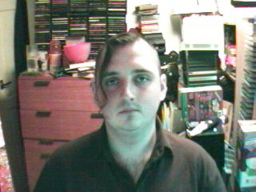
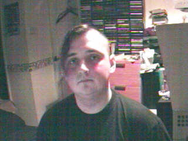

December 1999
=============

Fri, 31 Dec 1999
----------------

12:51
^^^^^

Got up too early today. I could quite possibly be working until 8 tomorrow
morning, but I was up at 8 today. Oh well, at least I have plenty of pro-plus
at the office.

.. raw:: html
   
   

   
   12:34 - Irksiza jamainso testion.
   
   
Infrequent updates. Train not busy, but very bouncy. Chatting constantly
   for a couple of days and I always drag the subject back to me. I have been told I'm cute -
   that I cannot believe. I've been called a freak. That I can. Fun fun fun. 2000 is already
   beginning elsewhere. For most of the people I have been chatting with it will be in about
   15 mins. I'll have to get on the news sites as soon as I get into the office... And ICQ of
   course - can't live without it now. The wheel won't turn tonight - a good omen perhaps?

   
   

   
Tue, 28 Dec 1999
----------------

.. raw:: html

   

   
   21:11 - Demorill pitaunde reunivervient.
   
   
Back from my sister's and back in the saddle. I'm getting back into
   the depressed state of mind. Christmas will tend to do that. Lot's of
   happyjoykissfucklove on TV, staying with my younger sister and her two beautiful kids and
   seeing her with her boyfriend. And not being called at all. Not that I blame
   her - she would have to be insane to want to call me. I have to give up. To
   sit back and let life go on. Something will happen sooner or later. Something.
    Such as death. More likely than love... Nothing will change. Do I
   never learn? No I don't. Stubborn as a mule. I allow myself to be sucked
   into the hope that something is finally going right in my personal life when I know I am
   not ready. I am not a good catch - I am a shit. I am lazy, messy, impolite,
   unobservant, forgetful. I would be loving and loyal - but those are traits best
   found in a dog, sure they should be at the core of a relationship, but other things are
   needed as well. There is also the shell that I have built around myself.
    No-one and nothing gets in or out. I am not fully convinced of my lack
   of worth and that is where my problem lies. If I were fully convinced then I could
   either give up all hope of a relationship and get on with the other parts of my life, or I
   could kill myself now and do the world a favour. Or do the other parties in any
   possible future relationships a favour anyway... But I persist in the notion that perhaps
   there is something that someone could see in me. Sure there's the money, but I would
   never want a relationship based on that. I'd be better off just visiting a whore.
    My self esteem is low enough, without giving myself proof that the only way I
   can get laid is to pay for it. It's probably the truth though. There are very
   few subjects I can actually talk about, especially with strangers. Computers and my
   lack of a relationship are the two that seem to come up most often. I get very
   disillusioned with computers though and like to keep the conversation away from them
   unless things get desperate. Computers are so close to the core of all that's fucked
   up in my life. Maybe if I'd never found out about computers my life would have gone
   differently and I would have been forced to interact with others more often, causing me to
   have more self confidence. Not likely though - I probably would have just found the
   joys of double entry book keeping and become an accounts clerk or something. I
   should stop blaming the job. Plenty of computer geeks find love. It's nothing
   to do with that and everything to do with the fact that I am a social misfit. No
   that's wrong too. Plenty of people don't fit in with society. I just don't fit
   with people fullstop. The only social activity I take part in is getting pissed,
   which is hardly a good way to meet people. I'm usually too pissed to remember my own
   name without having to really concentrate. No-one seems to believe that I am worse
   at chatting in real life than I am online. I am though. My online chat skills
   are pretty dire - I can hold my own in the insane babblings of the KK, but when things
   turn serious it's back to either computers, alcohol or my lack of a love life. And
   it's me that starts it every fucking time. I think I enjoy telling people how shit I
   am. Even more proof that I'm a total fuck up - as if any was needed. Yup, I'm
   definitely on a downturn again...

   
   

   

Image of me
^^^^^^^^^^^

.. image:: images/19991228.jpg
   :class: center

Sat, 25 Dec 1999
----------------

.. raw:: html

   

   
   19:41 - Belativa hioning foots unted skiled.
   
   
Christmas day and the first time I've watched soaps in ages - I think I
   know why. Few happy relationships - many bad relationships but virtually no-one above the
   age of consent with nothing. I just don't empathise.

   
   

Thu, 23 Dec 1999
----------------

.. raw:: html

   

   
   14:35 - Honos confouse squets.
   
   
Tired mind is not creative mind.

   
   

   
   

   
   08:14 - Regests bothunct benchanging roughtis.
   
   
Morning after. No hangover. Nice. And I didn't even remember to drink lots
   before bed. Smooth. Got the mattress in the spare room at the Catford doss house. Great.
   For those of you that don't work with me - that was a reference to Dave, Tracy and Dan's
   place. Marvellous. All sat around in Dave and Tracy's room and watched the Ali G video.
   Fucking hilarious. Gareth has quite possibly the loudest snore ever. It was quite funny
   trying to get him to stop - I have memories of Tracy trying to wake him using a talking
   Furby alarm clock. At least I think it was an alarm clock 'cause I heard it going off at
   about 7 this morning.

   
   

Wed, 22 Dec 1999
----------------

.. raw:: html

   

   
   17:39 - Discounting access multicalp rationstor hableair.
   
   
My God! It's Swiss Tony. &quot;Getting to Greenwich is very much like
   making love to a beautiful woman...&quot; heh. Getting withdrawal symptoms from lack of
   email already... Booze will sort that out. Plenty of booze. Yay!

   
   

   
   

   
   16:50 - Territy iateri clowni knucking jasium.
   
   
Is the writing less frequent because I am more happy? Because I am writing
   other stuff too which is creative instead of introspective. I'll have to link to it soon,
   even though many people will find it sad. Many people find me sad anyway though. Another
   night lost in booze.

   
   

   
   

   
   15:13 - Partness leasintal king aned.
   
   
Blocked. Interesting. Oh well, it's happened before and it's
   gone soon after starting to write utter bollocks. Hard to concentrate when there's
   messages flying in from all over the place. It's fun though. Not been feeling
   myself for ages. Feeling too up at the minute. No reason, just am. 
   Bizarre. Need to finish up - time to go out for drinkies. Yay!

   
   

   

Image of me
^^^^^^^^^^^

Tue, 21 Dec 1999
----------------

.. raw:: html

   

   
   20:31 - Wiveazila capacosi siturer ideducted moustwei.
   
   
Cooold fingers. Drunk. Mucho pisto. No updates means
   readers are not happy campers.

   
   

   
   

   
   08:37 - Pres knesatio shing icinged.
   
   
Cold. Fingers numb. Brain numb. Will have time to rest
   soon. To sleep. To write. To shop. To wallow in self hatred.
    The phone will not ring - it's all a big misunderstanding. Need focus. 
   Get blur. Hair in the gate. Blood on the lens. Carrion fodder. My true
   vocation.

   
   

   
   

   
   08:29 - Waits lightier scencia ity.
   
   
Terse. The people you know are the ones you hate. People like
   my writing. Bizarre.

   
   

   
   

   
   07:52 - Whities oacknes anis reprolete.
   
   
Headache. Not thinking straight. Ribs hurt - why?

   
   

   
Fri, 17 Dec 1999
----------------

.. raw:: html

   

   
   08:47 - Owidenne ling assiati enes.
   
   
Not gonna be as late as I thought. Except for the fact that the 8:52
   is as late as ever...

   
   

   
   

   
   07:57 - Slamencli sintronaught recepond.
   
   
I am going to be totally late. Was up in plenty - dressed quick - no email
   checking. Just before I left my arse decided to explode - on the ivory throne for 15
   minutes and my train is missed. Bugger. Channel9esque ICQ conversation yesterday - didn't
   have a clue what any of it was about until about the sixth or seventh message. Well wahepa
   wehapa I suppose. Nichto moppa. Chestnuts roasting on an open fire, entrails steaming in
   the snow. Can't get into the Christmas spirit - bah, humbug. Mmmm, humbugs...

   
   

   
Thu, 16 Dec 1999
----------------

.. raw:: html

   

   
   19:18 - Poipai dedushe cator nes.
   
   
Oh boy. This is the week. Pissed out of my skull last night. Still in the
   same clothes and I smell the part. Slept on the floor. No need to mention which one.
   Another drink after leaving the office - got side-tracked - I meant to go get my comics -
   won't get a chance for a while now. Saturday - give me something to do between the work do
   and Gareth's party. Do I go home? I suppose it depends on how early I get up. Whether it
   will be worth it. Probably will be actually - should be able to fit four or five hours
   sleep in. Why do I get spots when I'm tired? Star. Ascendant. Sleep? Yes please... Packed
   train. Bloody Christmas shoppers. Email first though. And ICQ as well probably. Got myself
   a virtual life.

   
   

   
Wed, 15 Dec 1999
----------------

.. raw:: html

   

   
   08:02 - Joinage dessergy millidor.
   
   
Wednesday already - where does the bloody time go? Trains back to normal
   today it seems. Not quite as crowded as usual though. The pavement repairs in St Albans
   came at the wrong time - nice smooth tarmac. Perfect for ice formation. Was slipping and
   sliding all over the place this morning. Not good for my ankle, bloody thing has started
   twinging again. The half hour stand at the beginning of the train journey doesn't help
   either. At least I am sitting now. Don't want to get up in fact - but I have to - it's my
   stop next. *yawn*

   
   

   
   

   
   07:52 - Recipation werveness kins.
   
   
I am sure meeting some weird people online - I was actually called
   handsome last night. Bizarre. I'll have to make sure no-one has hacked my site and
   replaced all of my pictures... Lol. My webstats are going to be through the roof today -
   the master plan is working! Bwahahahaha!

   
   

   
Tue, 14 Dec 1999
----------------

.. raw:: html

   

   
   19:41 - Anlitati twinfan behoolon.
   
   
Fast train on the slow tracks. Wobbly. Now that people know we
   are going the right way they have all shut up. Things back to the usual insularity.
    Fear brings people out of their shells. I wish I could share my fear with
   someone - but all my fears are internal. Blackfriars. Usual journey time: 5
   mins. Tonight's time: 50 mins. Hope there aren't problems finding a slot on
   the rails on the way back. Getting withdrawal symptoms. Been having too much
   fun online recently - not good for my material - I'm supposed to be lonely and brooding.
   Actually I still am, but now I have company - and misery loves that... Listening to
   a heavyweight song on a lightweight album. Splendid. Light rock, but with one
   song that pulls no punches. Come clean. Fucking really fucking matters. True.
    Well the thought of fucking anyways - I survive well enough without the physical
   reality of it. Or do I? This site was called &quot;truly diseased&quot;
   earlier today... I guess it's just not my lucky millennium. Maybe the next one
   will be better. I don't really feel able to open up tonight - usually I would just
   rant on in that vein for ages - but I know there are a few new arrivals here who aren't
   used to my ways. It would be nice to break them in slowly, but this site isn't
   supposed to be about the reader. I'm leaving the point. If there is one.
    I guess missing the point is the point really - if anything the point is
   psychological. The need to rant. Heh, I had a random ICQ from an American
   psych student a week or so ago. She said she was going to read my diary, and then I
   never heard back. That should frighten me, but instead it amuses. I do have
   some cool regulars though. Can be a bit bizarre talking to people who have seen that
   deep into my psyche... The women who have fed back on the site are pretty cool - but
   the ones to feed back make up less than 10% of those I have sent here - most of them have
   never said a word to me again... The funniest feedback comes from the blokes though.
    I've had &quot;Have you tried Prozac?&quot;, &quot;You should get yourself a whore.
    They're just girls doing a job, there's nothing dirty about it&quot; and now I've
   had &quot;Your site is truly diseased&quot;. All comments were made with the best
   intentions though and I love them all.

   
   

   
   

   
   19:16 - Hesorre elaborato reeast flagation undered.
   
   
This is fun. The train has been diverted miles out of the way.
    We are going the way that the driver announced, but everyone is panicking. 
   Hehe, delicious. Lucky I've got nowhere to go. The driver has just switched
   ends of the train. Hassled as he walks through the carriage. He has just given
   us the same announcement as earlier, but they can't have been listening as they have all
   breathed a sigh of relief. Hopefully we shouldn't be too much longer before getting
   back on course. I probably should have gone out on my own for a drink tonight -
   they'll probably have the signals fixed at London Bridge long before we get back to
   Blackfriars. Still - it's saving my phone bill I suppose - if I wasn't stuck on a
   train I'd be back at home on ICQ by now...

   
   

   
   

   
   18:30 - Phattuit corein foruman hast.
   
   
God I'm knackered. Second day in a row I've left the office hardly
   able to think. Could really do with a drink tonight, but no-one seemed to be up for
   it. At least I got the news server sorted today. One thing to cross off the
   list. Got the... I've completely forgotten what I was going to say. 
   Arse. I hate when that happens.

   
   

   
   

   
   07:45 - Eversfigur tomodulte ordin toiletsi ness.
   
   
Was totally spent when I got home last night. Too many things to do all at
   the same time. Still so much to do. I keep getting wacky crossover ideas. Twin Stakes. Two
   parts - a surreal comedy with gallons of DAMN fine coffee, followed by a gritty rematch
   when Cooper returns to Sunnydale post Bob. The nigh invulnerable Tick hears tell of the
   demons in Sunnydale and figures he should lend a hand. Myndi could come too. Add them to
   the stack of ideas that I will probably never do. The other crossovers: Miyu, the Marx
   Brothers, Father Ted (Dougal the Vampire Slayer? Watcher Ted?) 

   
   

   
Mon, 13 Dec 1999
----------------

.. raw:: html

   

   
   07:52 - Thermina wes sinizi moderatura attention.
   
   
I keep getting hit by flashes of inspiration. I'm going to have to decide
   which way to go soon - I think I'm pretty much there though. Too much coffee seems to make
   me creative.

   
   

   
   <h2>Sun, 12 Dec 1999</h2>
   

   
   11:20 - Reconsto profiting intively fontainali.
   
   
Wearing a T-shirt featuring Delirium of the Endless - kinda on topic, what
   with me joining the <a href="/web/20050419173532/http://homes.acmecity.com/buffy/ghoul/51/">Krazy Kult </a>last
   night... Caffeineated Buffy fans - don't know why I haven't joined before now - it's
   so totally my bag, baby.

   

   
   

   

Image of me
^^^^^^^^^^^

Thu, 09 Dec 1999
----------------

.. raw:: html

   

   
   07:56 - Itators sitartl aplai.
   
   
Am I ready to lose yet?

   
   

   
   

   
   07:32 - Storehen quargulati sublaneous ibes tainten.
   
   
Was only one scare yesterday in the end - must be losing my touch. The new
   girl thinks people who are over 20 and big sci-fi fans are scary and sad. Can't really see
   the conversation going very far... Especially after the email I wrote last night - I was
   very, very tired and ended bibbling like an idiot. Still, she does think Britney Spears is
   Satan - so maybe there is some mileage there. I might have another look around the
   celebrity graveyard site again later - that is a fun site in a fucked up kind of a way...
   Listening to fluffy American pop rock - am I going soft? Mmmm, pop rocks. Blasting powder.
   I want to fill my mouth with exploding candy and then take a swig of something fizzy -
   messy but fun. In a juvenile sort of a way. My head isn't working very well at the moment
   - yesterday I went to get my phone from my office before going to lunch - I ended up
   getting a can of tango and was half way to the door before I realised I had the wrong
   thing...

   
   

   
   <h2>Wed, 08 Dec 1999</h2>
   

   
   21:54 - Rudenall emsitan anting steabipara.
   
   
Late. Concealment. Thought I'd scared three pen-pals today - only two in
   the end though. Should have known that it would take more than that to get rid of des - I
   guess I need to try harder... :) should be home in another 45 mins. If I wasn't such a tit
   I wouldn't have just missed the Greenwich train... I've only been getting these trains for
   3 years - how would I know what time they are? Oh FUCK. It's a stopper. Probably be closer
   to 11 than quarter to by the time I get home...

   
   

   
   

   
   07:52 - Eni redonize intervie.
   
   
Chin itches. If only hair growth could be consciously controlled... It's
   hot in here. Feeling rather moist. There are a couple more stops until enough people get
   off to allow the temperature to return to bearable levels. Only 20 mins standing this
   morning - not bad. Mind not working yet - need more coffee. Made an online proposal last
   night, she said I should speak to her Sicilian father first - it all went horribly quiet
   after I offered to kiss his ring... I wonder if the double entendre made it through the
   export process... I am half expecting to get home to find a horses head in my bed. God, I
   must be really short of material this morning - shamelessly stealing it from last night's
   email conversation... The Poutine experiment went quite well last night - next time I'll
   do a smaller portion, and less gravy. If I still had my goatee it would have been a
   real mess - lucky I shaved it off really...

   
   

   
   <h2>Tue, 07 Dec 1999</h2>
   

   
   21:17 - Sters defindes winer collanti socible.
   
   
Network busies again. I wish this Vivao service allowed sms to email as
   well as email to sms. Bloody Multi-mail keeps disconnecting every time I send as well.
   Bleeding edge technology... Mind empty. No caffeine buzz remains. At least I'll sleep
   tonight... After sampling poutine... Every time I think of it I hear Paul Whitehouse at
   the back of my head &quot;If you like cheese, and you like peas - then you'll love these -
   they're cheesy peas! (also available - new squeezy cheesy peas in a handy squeezable
   container)&quot;

   
   

   
   

   
   07:55 - Autop puls preheigh olizes.
   
   
I really should get something more substantial than an Espresso with a
   queue that long, but as the song goes &quot;I need a bomb, I need a caffeine bomb, I need
   a bomb I need a caf caf caf caf caf caf caffeine bomb&quot;

   
   

   
   

   
   07:23 - Idified recious sile.
   
   
Well isn't this just spiffy. Too hot. Too crowded. Too far. Too long. I am
   not listening to any music this morning - I wonder if that has anything to do with my
   weird mood this morning. More to do with online conversations last night I think - one
   with someone far away and very different, one with someone closer to home in more ways
   than one (no fair! I don't feel as unique anymore). Much more fun way of getting stuff off
   of my chest than this - soloing at the keyboard has been taking me to some pretty dark
   places recently... My mind is bizarre. Can pour out almost anything without hesitation
   online - but find it impossible in person. The Nov 19th cartoon on userfriendly.org is
   just so me it's scary. Is it the fear of eye-contact thing?

   
   

   
   

   
   07:02 - Spinari amplana kartaperio susions breart.
   
   
Damn clunky trains - can't drink my coffee because it is shaking too much.
   Have to wait until it has cooled enough to take a big swig - will be OK when it isn't as
   close to the brim.

   
   

   
   <h2>Mon, 06 Dec 1999</h2>
   

   
   19:23 - Imminate damental ress strark.
   
   
Network is too congested to get a call out. I'll just have to wait until I
   get home to read the rest of the message. Guess the technology just isn't good enough for
   me yet.

   
   

   
   

   
   19:05 - Locass despeiest facing.
   
   
Clawing my way out from my pit of despair. Lots of encouragement from
   others - that hasn't really helped though - my apathy has just taken over and killed the
   rage. Knowing people care enough to offer meaningless platitudes like &quot;that sort of
   thing happens to everyone&quot; and &quot;one day you'll meet someone you're not nervous
   around&quot; is nice. I don't have to believe what they say to appreciate the sentiment. I
   have got to give up on things for now. I am not ready. Maybe with a few more years of life
   experience under my belt. God, I wish that thought didn't fill me with dread - I've been
   alone for more than two decades - what is a few years more? Well it's a few years less to
   spend with the right person for a start... This unified messaging is going to play havoc
   with my phone bill - time to check my messages... 

   
   

   
   

   
   08:41 - Benesplann stoningent spinons apperwri.
   
   
Sharing meaningless platitudes with a colleague on the train: 
   &quot;Have a good weekend?&quot; 
   &quot;So-so.&quot; 
   &quot;Do anything interesting?&quot; 
   &quot;Nothing much.&quot; 
   If I had told things straight it would have been: 
   &quot;Have a good weekend?&quot; 
   &quot;Fucking diabolical.&quot; 
   &quot;Do anything interesting?&quot; 
   &quot;Laid in bed all weekend wallowing in self hatred.&quot;

   
   

   
   

   
   08:02 - Qua pancyclima rong.
   
   
There's not enough inside to fuel a white hot rage. Has subsided to a dull
   seething - the embers not even glowing enough to warm me. Cold. Engulfing despair is
   closing in. Soon no light will remain and my heart will once more be engulfed in darkness.
   Better than I deserve. Self absorbed wanker. Wallowing in self pity. Pity the sadness. The
   picture I took this week shows a hint of a smile. Just goes to show I'm only happy when
   I'm sad. I must enjoy fucking my life up. Twisted. At least my conscious and sub-conscious
   mind are in agreement - they both hate me. Trains are fucked up, I have no coffee. This
   sucks.

   
   

   
   

   
   07:26 - Accumberga undsce mated disss.
   
   
It's good to talk - kinda essential when you're relating with anyone who
   isn't you. Incomplete. Incompetent. Verbally constipated. In desperate need of a laxative.
   Words flow like glass - takes several millennia for each word to drip out. I think just
   about the worst thing I can imagine happening to me is some freak accident granting me
   immortality. At least when I think eternal loneliness I know it is only another 60 years
   tops - God that seems a long time. I'd wish that I had someone to share it with if it
   wasn't pointless. Even if I met her I'd be too shit scared to talk to her. At best I would
   bore her - at worst insult or upset her by giving the impression I was ignoring her. I am
   such a monumental fuck-up.

   
   

   
   

   
   07:06 - Tousions meric virgian seechinat concemeri.
   
   
I just want to get so drunk that I lapse into a coma and never wake up. Or
   to be the only victim of a freak earthquake - swallowed whole by the earth. Pathetic loser
   fuckwit arsehole tit bastard. There are no words that cut deep enough. I keep hoping that
   if I hate myself enough maybe something will snap and I will change. It's not happening
   though. Still just as bad as I've ever been. One of the numerous freaks inflicted on the
   world by a fucked-up society. Is it genetic? Was it my upbringing? My sister had the same
   upbringing, but she turned out ok. A fault in the centres of social function in my brain.
   No good for anything but my work - which I enjoy - but is not enough to fill the void I
   feel in my chest. I just wish I could be myself when I am with others - but apparently
   that is too much to ask - my mind won't allow it. I have to restrict it to these hours of
   lonely boredom on the train. Pathetic.

   
   

   
   <h2>Sun, 05 Dec 1999</h2>
   

   
   20:00 - Dents dischiest christicali abadger.
   
   
Wasting so much good material on inner dialogue this weekend - time to get
   some of it down. I am in a new place at the moment. Usually when I go off on a
   self hate binge I get all depressed - this time is different - I feel detached somehow.
    A cold rage at my inadequacy. All mouth and no trousers. I go on and on
   about how no-one loves me - but can I really be surprised? I am a total loser.
    I can't get over this fear of doing something wrong. I know on a theoretical
   level that nothing lasting can happen if I do something wrong - yet the fear is there.
    My fear of saying or doing something wrong leads me to say and do nothing just to
   be on the safe side. I am pathetic. Why do I do it? What am I afraid of?
    Is it rejection? I've been rejected before, and I know it only hurts for a
   while - nothing permanent. Is it because I don't want to impose? That could
   explain why I can say things online that I would never say in person - if I put something
   up here that no-one wants to read, then they just don't read it. If I'm saying
   something in person then it's only polite to stick it out. People will generally
   tend to pretend that it isn't an imposition rather than cause hurt feelings. I only
   want to speak if the other person wants to listen - I find it hard to believe that anyone
   would though. �, en �murlegt. Apparently that means &quot;Oh, how
   pathetic&quot;, but in a sympathetic way. Cool language - gotta dig any language
   which can tell you you're pathetic while showing empathy. I wonder how babelfish
   would translate it? It doesn't translate Icelandic though, so no way to tell...
    The thought of eternal loneliness still causes me pain, but knowing that it is my
   fault rather than that of fate is oddly comforting. I am fucking weird. 
   Bigtime yo-yoing of my insides at the moment. Up then down. 
   Topsy-turvey. I wish I was someone else. I guess someone's got to be me
   though, and I wouldn't want to inflict it on anyone else. I just hope that if there
   is someone up there watching I am giving him a chance to get a good belly laugh in at my
   expense. Laugh it up beardy boy - I won't last forever, then you'll have to
   find some other pathetic sap to pick on. Somebody shoot me - I haven't got the guts
   to do it myself. Forever lays before me. I guess I take it one step at a
   time... Curling up in a ball and wanting to die doesn't help though. It's
   passed some time over the weekend though... Didn't get dressed at all today - 
   only strayed downstairs a couple of times to get food. Most of the day in front of
   the TV. As usual. Lot's of online time while I've downloaded stuff. 
   No-one around to chat to though. Not that I'm even vaguely comparable to good
   company at the moment. It helps to rant at someone every now and then though. 
   I don't know if this is helping or not. Usually this helps me get the feelings out -
   to calm me. Today though it is just as bad as when I brood on this stuff
   internally. I wish I wasn't so obsessive. I wish I could just put the past
   behind me and move on. Learn from my mistakes and face tomorrow. The scary
   thing though is that even with all of the reconstruction I have done in my head over the
   past two days I still wouldn't do anything different if I had the time again. I
   don't know how to do things different. It's not in my nature. At least my line
   will end here and my genes will never be inflicted on future generations. Trying so
   hard to find the glass half full - but it ever remains half empty. God I wish I
   could just collapse into bed and sleep - I'm not tired though - spent too much time
   sleeping this weekend already. The thought of leaving the house fills me with dread.
    What right do I have to inflict myself on society when I'm so obviously
   dysfunctional. I'm like some bizarre semi-autistic freak. Someone new comes
   along and I just freeze up totally - go all inwards and say nothing. Open up
   eventually - to an extent anyway. But by that time the damage is done. It's
   not like I always say the wrong thing either - I do sometimes, but when I start I can
   generally keep on topic, and sometimes even be relevant or funny. But when I freeze
   I am lost - my mind goes empty and I can't find any thoughts to string together. OK,
   this is officially not helping. I'm gonna call it a night as far as the writing is
   concerned. G'Nite.

   
   

   

Images of me
^^^^^^^^^^^^

Sat, 04 Dec 1999
----------------

08:28
^^^^^

Choked utterly. I'm going to be even more one-track than normal this morning. A
paraphrased quote hangs in my mind &quot;When I'm with a girl I like I find it
hard to say anything cool, or witty... Or at all. I can usually make a few
vowel sounds, then I have to go away&quot;. It's not even that there were words
there that I couldn't get out - my mind just went totally empty. I am going to
be alone forever and I deserve it because I am such a pathetic fuckwit.

08:04
^^^^^

I am fucking hopeless. There is no hope for me. Totally choked. God. I feel ill
when I think back on it. How can I be such a fucking tit? I don't deserve to
live - somebody please shoot me. Waiting for five weeks and then barely say a
word all night.
