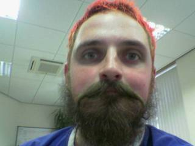
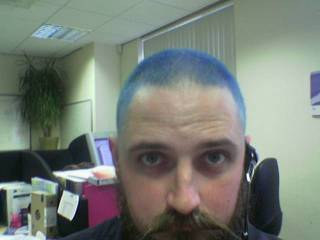

Random Meanderings of a Twisted Soul
====================================

.. warning::

   This page is very out of date.  For more recent posts see
   `My random meanderings`_

.. _My random meanderings: http://meanderings.s8n.net/

Here I am, sitting alone on a Sunday morning. I have decided to create
this page as a sort of stream of consciousness journal. I won't be
filling it in every day (although some days I'll add a half dozen
entries), it won't be a catalogue of what I do (except when it is). If
you want to read other diaries/journals then try :ref:`these
links<diaries>` at the bottom of this page. For a general background
on me try :doc:`../mynameis`. If you're brave you may want to `email
the author`_

.. _email the author: mailto:chewtoy@s8n.net

The most recent entry will be at the top, so if you're new here then
start at the :ref:`archives` (if you're not new here - what on Earth
possessed you to come back?!?)...

When you're done, go back to the :doc:`main page</index>`...

I've had to split things up - the page was bigger than most of the
images on the site, the current week will be on this page, but past
weeks will be archived elsewhere, use the list of links at the
:ref:`bottom<archives>` of the page to get to the old stuff:

Mon, 06 Mar 2006
----------------

17:28 - Extension
^^^^^^^^^^^^^^^^^

Got my 46" pintail sliding this afternoon. Was trying last Thursday, but the
Khiro Yellow barrels I had on there had far too much rebound; couldn't get my
hand down reliably, kept bouncing back to a straight line...

I need to order a job lot of Khiro red and blue barrels and blue bottom
inserts.

Sliding the pin was definitely a different feeling from the Globe 38". Dropping
the rear knee was much more important to get the tail to whip around. Not sure
how much was to do with the crappy Krypto Hawaii wheels (finally scrubbed off
the seam line today). They ride harder than the 78A they're supposed to be, but
they seem to have more grip than my other 78s. The flat deck on the pin was a
definite disadvantage too.

Oh, and since I started working on upper body strength I've managed to gain
about 5 kg. So much for trying to drop below the 100kg mark...

Mon, 27 Feb 2006
----------------

14:21 - Barking Wheels
^^^^^^^^^^^^^^^^^^^^^^

To an onlooker I probably haven't progressed at all over the past week. To
myself though I have come on leaps and bounds. Still nowhere near where I'd
like to be, but I am making a number of gradual improvements. Upper body
strength: mine is abysmal. Working on improving it is helping me keep my body
under control during the rotation. Lower body strength: again abysmal. Not
doing anything specific to work on it, but I can feel the workout in my abs
when I cool down. Again should help with control. Finally lower body
flexibility: This one is really holding me up. Need to be more comfortable
rotating my hips to force the drop of my rear knee and to keep my backside
closer to the board during rotation; am often finding myself with my weight too
far forward causing me to push the board out behind me at the end of the 180.
Intentionally taking it slowly, the more reps I do the more comfortable I am
dropping weight onto the gloves which hopefully helps things to flow :)

Fri, 24 Feb 2006
----------------

15:09 - Lather, Rinse, Repeat...
^^^^^^^^^^^^^^^^^^^^^^^^^^^^^^^^

Heh, two days of rain/snow and I completely lost my technique... At least for
the first half dozen or so runs. Spent most of the session just doing 180
colemans again to drill the technique into my subconscious. Being able to do
these at a moments notice is much more important than moving on to pendulums
and 360s. I did spend about 10 minutes trying to do toeside 360s at the end of
the hour. Managed about 250-260 on most attempts before losing too much speed
and the wheels regripped (still on the soft wheels). Going to keep on the soft
wheels until they cone to uselessness then I'll move back to the Tsunamis.
Doubt I'll actually manage any 360s on the softies, but won't stop me trying ;)

Tue, 21 Feb 2006
----------------

16:22 - Cones
^^^^^^^^^^^^^

Spent another hour doing nothing but Colemans to a standstill on soft wheels. A
lot of fun, and I'm getting more confident and fluid at laying them down.
Playing havoc on the wheels though, noticable coning on the back already and
I've only been sliding them for a couple of hours :)

Mon, 20 Feb 2006
----------------

14:10 - Practise makes perfect
^^^^^^^^^^^^^^^^^^^^^^^^^^^^^^

Decided to practise with soft wheels rather than moving on to getting the board
to pendulum. It's kinda cool how when you have the technique the wheels don't
seem to matter. I was running with some 70mm 78A wheels that came as part of a
complete today (mainly because they are centre set. I have some 83A kryptos but
they're side set so I can't rotate if they cone...). I was expecting to hit
tarmac a few times in a hip slide while I got used to the grip; but actually
managed to keep it pretty much under control for the whole session with only a
couple of bails to my knee pads.

Working on technique now. I've noticed that as I have started to get the hang
of the balance I've stopped dropping my rear knee all the way down. Am now
trying to get my knee down while still keeping balance and spinning 180
heelside. Hopefully when I've got the technique down with the soft wheels I can
move back to the hard wheels and work on getting extra rotation :)

Fri, 17 Feb 2006
----------------

14:32 - Image of me
^^^^^^^^^^^^^^^^^^^

14:25 - Finally got the Coleman!
^^^^^^^^^^^^^^^^^^^^^^^^^^^^^^^^

Woohoo! I finally got my heelside Coleman slide down today. I've been
practising an hour a day during my lunch break for the past two weeks. It took
me about half an hour to get my toeside shutdown under control; my heelside
Coleman shutdown has taken me about 7 hours of solid practise to get under
control.

Guess it's time to move onto trying pedulums :)

Tue, 13 Dec 2005
----------------

22:20 - Give me an iPod
^^^^^^^^^^^^^^^^^^^^^^^

Warning: link to site with potential scam affilliations ahead. The "Free" iPods
on offer at ipods.freepay.com aren't as free as they'd like to make out. But
you can get one for a lot less outlay than it'd otherwise cost if you're
careful.

Basically you have to sign up for some additional service (along the lines of a
rental service subscription, or a dvd club type service). You will have to
spend, but you can qualify by spending under 100 quid, which is a damn site
less than you'd pay for the iPod.

Some of the promotions have a distinct scam-like whiff, so be careful to read
the small print.

Here's the link again

21:31 - Image of me
^^^^^^^^^^^^^^^^^^^

Wed, 22 Sep 2004
----------------

23:03 - A blosxom plugin to allow links to a kwiki
^^^^^^^^^^^^^^^^^^^^^^^^^^^^^^^^^^^^^^^^^^^^^^^^^^

I've done away with the writebacks plugin on my blosxom installs, and have
instead written a plugin that uses the Kwiki module to insert links to new
pages based on the filename of the post.

Needs to be pointed at a basic kwiki config file with the "script_name" and
"database_directory" settings defined.

.. code-block:: perl

   package kwikilink;
   use strict;
   use warnings;
   use Kwiki;
   
   #-------------------
   # Begin Local Config
   
   my $configdir = "/home/heillingr/blosxom/plugins";
   
   # End Local Config
   #-------------------
   
   our $hub = Kwiki->new->load_hub("$configdir/kwikilink.yaml");
   $hub->load_class('pages');
   our $kwikilink;
   
   sub start {
       return(1);
   }
   
   sub story {
       my ($path, $file) = @_[1,2];
       my $fullname = "$path/$file";
       $fullname =~ s{(?:^|/)([a-z])}{\U$1}g;
       my $page = $hub->pages->new_from_name($fullname);
       $kwikilink = $page->kwiki_link;
   }
   
   1;

Sun, 19 Sep 2004
----------------

23:51 - Another day, another website
^^^^^^^^^^^^^^^^^^^^^^^^^^^^^^^^^^^^

Well I thought I'd pretty much retired this site, and then lo and behold my
hosting ran out on ccie.org.uk, so I find this is my primary again.

Working on packaging some modules for CPAN at the mo. Got my PAUSE account, but
have buggered up the version numbers on the modules I uploaded. I think I'm
getting the hang of subversion now, but I really should have thought things
through more before publishing a file to CPAN with a version number taken from
the subversion revision number... Version 23 of a module doesn't really look
right.

Have now come to the conclusion that having to manually specify the version
number when you build the distribution isn't such a bad thing. I'll keep $ Id:$
in my files, but I won't be using it to build version strings automagically any
more.

Am making a start on getting my POE Jabber bot ready for publication to CPAN
too. Too many hours gone into it to just leave it running in the background on
my jabber server. Not that it's really ready for heavy use, but at least if it
gets in the index I might have a chance of some feedback ;)

.. _archives:

Archives
--------

.. toctree::
   :glob:
   :maxdepth: 2

   archives

.. _diaries:

Diaries of Note
---------------

* `syren1`_
* `Dan's diary`_
* `Bluemoon Jaded`_

.. _syren1: http://www.chickpages.com/rants/syren1/index.html

.. _Dan's diary: http://diary.logicbomb.net/

.. _Bluemoon Jaded: http://www.angelfire.com/ms/blumoon/index.html
