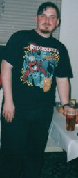
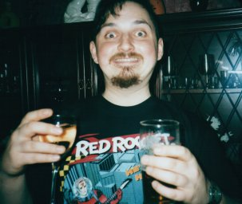

.. index:: Russell Heilling, About me

Just who is this cHeWtOy freak anyway?
======================================

February 1975, the screams of a new-born child pierce the night in Watford.
Who could have known what evil had been unleashed upon the world.

.. container:: carousel

   .. image:: images/me/russell3.jpg
      :alt: Martian

   .. image:: images/me/russell1.jpg
      :alt: Bogbrush

   .. image:: images/me/russell2.jpg
      :alt: Space

   .. image:: images/me/russell5.jpg
      :alt: Invaders

After some close calls with the fashion police about dodgy hand
knitted cardigans, the young cHeWtOy realised he was different.&nbsp;
School brought the taunts of fashion conscious fellow adolescents,
prompting the teenage freak to write poetry (as you do...), examples
of which are published on what he likes to call the :doc:`hhjj`
page. It was early in this period of his life that he discovered that
the charts weren't the only source of music, there was decent stuff to
be found out there too! He started slowly with bands such as
Iron Maiden and Whitesnake, but swiftly moved onto bands such as
Metallica, Anthrax, Pantera and Annihilator. He also began his love of
electronic music with Depeche Mode.

By the 6th form he was finally coming to terms with being alone and
settling down with the only companion he has ever been comfortable
with, his computer. One day at University everything changed. He
walked into a computer room and discovered his true love: The
Internet. Unlike many of the freaks who found the Internet he was not
interested in interacting with other intelligent life forms using the
computer as a mere interface, his interests lay purely with gathering
information. His weight began to increase...

.. container:: carousel

   .. image:: images/me/russell8.jpg

   .. image:: images/me/russell4.jpg

   .. image:: images/me/russell6.jpg

Musically he began to enjoy the sounds of electronic instruments mixed
with guitars, he began to discover bands such as Cubanate, Die Krupps,
Nine Inch Nails, Pop Will Eat Itself, Prodigy and White Zombie.&nbsp;
Bands without synthesisers were still a staple of his musical diet
though, especially bands such as Machine Head, Sepultura and
Korn. University also saw the start of his comic collecting, starting
with a few Batman titles, but swiftly growing to include mature
readers titles such as Sandman, Doom Patrol and Preacher he also
started reading Independent titles such as Strangers in Paradise and
Cerebus.

After University he cut his hair and started looking for a job, and he
was found by NetDirect. He swiftly passed through the helpdesk ranks
to the exhalted position of Systems Administrator, and then Technical
Manager. Now the only thing to match the growth of his computer
knowledge is the growth of his stomach.

December 1997 brought on the discovery of Jack Off Jill, a Florida
band whose "Sexless Demons and Scars" album touched the darkest depths
of his twisted soul. He took a new identity from the lyrics of the
song "Swollen" ("Hey chewtoy head you're swollen, and disfigured"). He
became cHeWtOy. Their songs of hate, self-mutilation and perversions,
especially "Swollen", "Poor Impulse Control" and "Horrible", are the
perfect companion to his battered psyche.

Proud to be different, Freaks Rule OK!

For some of his recent ramblings go read the `random meanderings`_ page.

.. _random meanderings: http://meanderings.s8n.net/

:doc:`Back to the madness...<index>`

`GET AWAY FROM ME YOU FREAK`_!!!

.. _GET AWAY FROM ME YOU FREAK: http://www.yahooligans.com/
