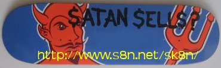

.. index:: Skating

Rolling on by.
==============

This is my new skating section.  I am primarily a longboard skater I also
own a popsicle stick and will shortly be getting a mini.

Subsections
-----------

.. toctree::
   :maxdepth: 1

   quiver
   protection
   shoes/index
   links

.. container:: carousel

   .. image:: images/kisiwa+globe38grip.jpg
      :alt: Kisiwa and Globe

   .. image:: images/kisiwa+globe38.jpg
      :alt: Kisiwa and Globe

   .. image:: images/rollingblur.jpg
      :alt: Rolling

   .. image:: images/rolling2.jpg
      :alt: Rolling

   .. image:: images/rolling3.jpg
      :alt: Rolling

My Skating Biography.
---------------------

When I was about 10-15 skateboards were a huge part of my life.  Every
weekend and most evenings during the summer I would be skating around the
streets of Abbotts Langley where I grew up; tic-tacing around, ollieing up
kerbs, waxing and grinding kerbs. I skated for quite a while; I never went
to a skatepark, and wasn't particularly good really, but I had a hell of a
lot of fun.

Peer pressure, other interests and exams meant that I gave up skating,
thinking that I'd grown out of it.

Fast forward about 17 years.

I got myself a set of inline skates (fruit boots) which I used to cut
down the amount of time it took me to get to and from the station when going
to work.  I really enjoyed this; the pavements in St Albans are crap though,
and I ended up taking quite a few knocks when the wheels went down the cracks
between pavement slabs, etc.  A few friends from work also skated, and we'd
sometimes go down to Hyde Park at the weekend for a skate.  I started
thinking back to how much I enjoyed skateboarding when I was younger.

I got myself a Shorty's Chad Muska Green Banzai popsicle stick (new school
skateboard); however shortly after getting this I moved to a different office
and was driving instead of using the train.  The new board sat around
gathering dust for a few years.

New job, new location, still driving.  Decided to give the train a go to
avoid the hours of sitting in traffic (with associated growth in waist-line).
Thoughts returned to the board gathering dust at home.

Having great fun on the Muska; but the fun was limited by the juddering
ride of the tiny, rock-hard wheels along with the constant pushing and
frequent flying leaps when hitting fairly small obstacles (St Albans still
has pavements with gaps large enough for small wheels to fit between).

One day a colleague at work toots his horn and pulls up at the side of the
road when he sees me rolling down the hill; it turns out he's a keen skater
at the weekends and stoked to see there was another skater in the office.  He
mentions that the ride would be a lot easier with big soft wheels on a
longboard.  A couple of days later he presents me with a 44" Fibreflex
Kicktail board with big Kryptonics wheels and Randall R180 trucks and says I
can borrow it for as long as I need to.  I give an experimental push and roll
almost the full length of the carpark; needless to say I'm hooked.

Unfortunately he was made redundant a couple of months later, so he had to
take the board back; but by that time I was already hooked.  Within a week
I had ordered myself a cheap complete longboard set-up and made the first
step towards having my own quiver.
