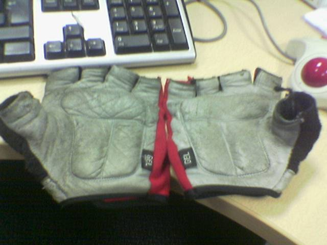
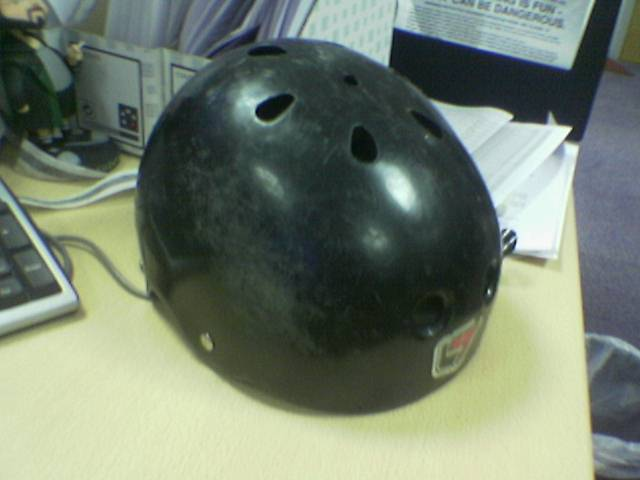
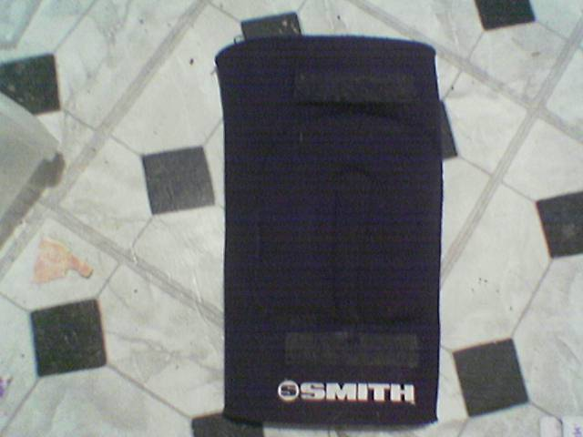

sk8n.net: Protection
====================

Skate protection may not look cool to non skaters, but it saves lives.

Wear your gear.

Gloves
------

I wear different gloves based on the situation.  For general purpose
riding I use a simple pair of fingerless bike gloves with a leather palm.

A more specialised glove with higher protection is the slide glove.  I
have a pair of Lush slide gloves v1

.. container:: carousel

   .. image:: images/lushglovepalm.jpg
      :alt: Slide Gloves

   .. image:: images/lushglovetop.jpg
      :alt: Slide Gloves

These gloves have a slick plastic plate on the palm that can be used to
allow you to transfer weight to your hands and bring the board round into a
slide or to allow you to assume a 3 point stance while cornering at speed
for additional stability.

Helmet
------

Essential.  Wear it always.  I often forget mine on short flatland cruises
but am gradually training myself to wear it everywhere.  I use a triple-8
helmet that I bought about 5 years ago for inline skating.  Helmet technology
has progressed so I am considering an upgrade to a modern pro-tec helmet.

Shoes
-----

Shoes get their own section.  I was recently involved in a thread at
Silverfish discussing resoling shoes.  I'm going to use my :doc:`shoes/index`
section to track the progress of several shoe experiments.

Pads
----

When cruising I generally don't wear much in the way of Knee or Elbow
pads.  I usually wear Knee Gaskets under my jeans, but more for support than
for protection.

When practising new techniques (board walking, sliding) I wear external
knee and elbow protection in addition to the helmet and gloves.
